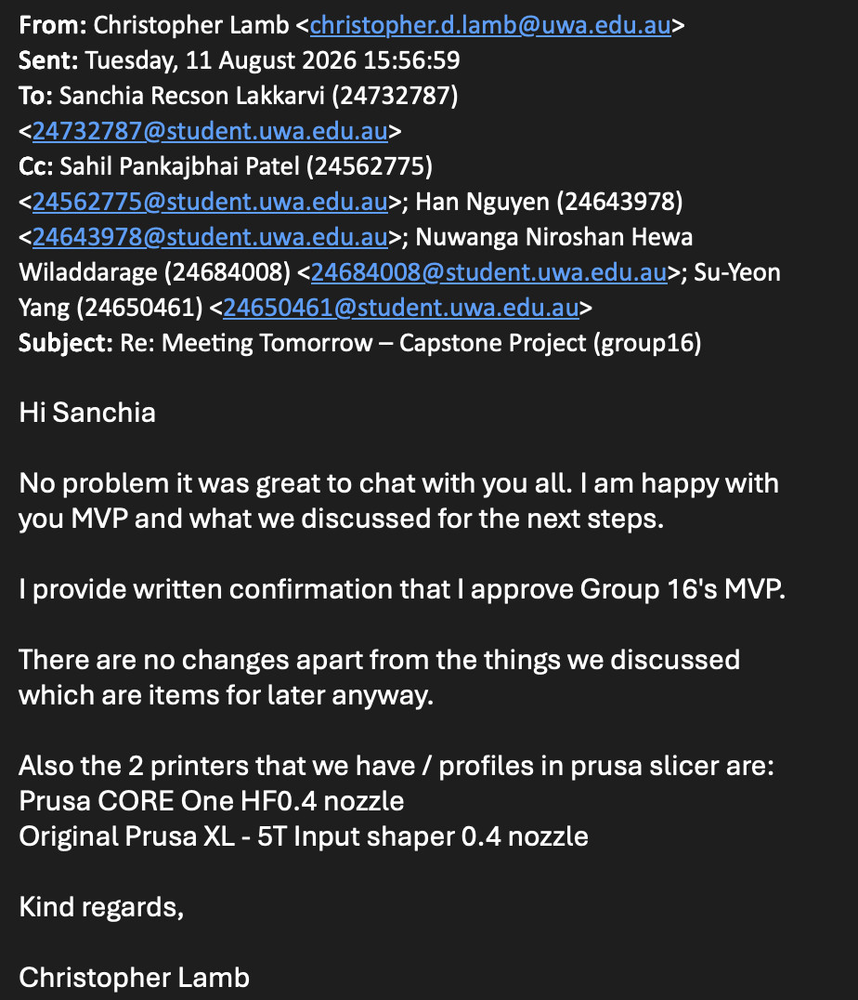

# Section 1: Problem Statement: What Are We Going to Build and Why?

## 1.1 Background and Current Problem

UWA Mechanical Engineering currently operates two web-connected 3D printers through PrusaConnect. The client’s initial vision is to develop a web-based system similar to print.uwa.edu.au and PrusaConnect, allowing students and staff to access a shared 3D printer farm, submit print files, select an appropriate printer, and monitor their print jobs. The system is initially intended to support the Prusa XL and Prusa CORE One printers available at UWA, while providing a foundation for future expansion of the printer farm.

The current PrusaConnect-based process does not scale effectively to a larger number of users. Print jobs are submitted directly to individual printers, and users must be invited separately to each printer before they can access it. This approach is manageable for a small number of users but becomes impractical when supporting approximately 50–200 students in a semester. The current system also lacks account-level history and centralised usage tracking.

The core problem is therefore the absence of a centralised and scalable web-based system for managing access to the printer farm, validating print jobs, assigning jobs to suitable printers, managing print queues, tracking print activity, and reducing the manual effort required to operate the service.

Current-state workflow:

User → Individual invitation to a specific printer → Direct submission to that printer → Printer access and jobs managed individually

## 1.2 Client Need and Project Value

The client wants students and staff to access the printer farm through a common system rather than being manually added to individual printers. The initial project brief proposed access through a UWA identity, but the refined requirements allow a simpler authentication mechanism for the initial system. The key requirement is to provide convenient user access with role-based access control while minimising printer-level administration. The client described this objective as “minimal admin interaction.”

The system is also expected to improve visibility of printer-farm usage. The client requires tracking of material used per print, lifetime usage by students or staff, usage by unit code, and long-term statistics by printer and material. Cost accounting is also part of the project requirement, although the final pricing values and staff billing arrangements have not yet been confirmed.

The primary users are students and staff who submit and track print jobs, Farmers who manage printers and completed jobs, and Administrators who require access to overall usage information and reports.
By centralising these activities, the proposed system will reduce repetitive administration, improve visibility of printer usage, support organised queue and collection management, and provide a more scalable approach to managing a growing printer farm.

## 1.3 Proposed System

The project will develop a web-based 3D Print Farm Management System that provides a central interface for authenticating users, validating print files, identifying compatible printers, submitting and queueing print jobs, tracking print status, supporting collection, and recording basic usage information.

Proposed-state workflow:

Login → Upload G-code → Initial validation and metadata extraction → Display compatible printers → Select printer → Confirm compatibility → Submit → Queue → Print → Notify → Collect

Users will upload a standard pre-sliced G-code file. The system will first perform initial validation and extract relevant metadata from the uploaded file before displaying compatible printers. The user will then select a printer, and the system will confirm compatibility against the target printer’s locked configuration, including relevant machine settings such as material, bed size, and printer profile. Files that do not match the required configuration will be rejected or flagged before being sent to a printer.

The default queue approach will be first come, first served. Users will be able to view basic print-job tracking and basic job status and will receive notifications when a print starts, completes, or stops because of an error. After a print is completed, the Farmer will manage the collection workflow so that the completed print can be removed and the printer made available for the next job. The system will also record relevant print and usage information to support basic usage reporting and long-term monitoring.

## 1.4 Key MVP Deliverables

The key MVP deliverables are:

* Authentication and role-based access control
* Upload of standard G-code print jobs
* Initial G-code validation and metadata extraction
* Validation of uploaded G-code against the target printer’s locked configuration
* Identification and display of compatible printers
* Printer selection and compatibility confirmation
* Print-job submission and queue management
* Basic print-job tracking and status information
* Notifications for job start, completion, and error/stopped states.
* Farmer collection workflow for completed print jobs
* Basic usage reporting

The client confirmed that the minimum successful outcome for the semester is a system that supports authentication and role-based access control, G-code upload and validation, compatible printer selection, queue management, print-job tracking, basic notifications, and the Farmer collection workflow.

Online slicing, live-camera integration, automatic remaining-filament tracking, multi-material printing, and multi-colour printing are not required for the core MVP. Detailed MVP functionality and evidence of client agreement are presented in Section 2: Client Communication and MVP Agreement.

## 1.5 Scope and Major Constraints

The project scope is focused on delivering the core workflow required to submit and manage 3D printing jobs using the existing web-connected printer environment. The initial system will primarily support standard pre-sliced G-code files and will treat each print job as a single-toolhead job. Multi-material and multi-colour printing are outside the core MVP.
Uploaded G-code must be validated against the locked configuration of the selected printer. Relevant settings such as material, bed size, and printer profile will be checked, while filament colour will not be used as a validation condition because available colours may change.

Physical printer testing is constrained during development. The client has requested that routine testing use simplified G-code containing only start and end operations, without actual extrusion. A full physical print test will be performed near project completion with the client present. Online slicing, live-camera integration, automatic remaining-filament tracking, multi-material printing, and multi-colour printing are optional or future extensions rather than core MVP requirements.

# Section 2: Client Communication and MVP Agreement

## 2.1 Client Information

**Project:** 3D Printer Farm Interface  
**Client:** Dr Christopher Lamb  

---

## 2.2 Client Communication Approach

### Communication Channels

The team and client agreed to use the following communication channels:

| Channel | Purpose |
|---|---|
| Email | Formal communication, requirement clarification, and sharing important project updates |
| Microsoft Teams | For meetings, urgent questions, and project discussions |
| In-person meetings | Requirement discussions and progress reviews when required |

The client requested progress updates at least **fortnightly**. Meetings may be held in person or through Microsoft Teams.

---

### Meeting Schedule

| Meeting Type | Frequency |
|---|---|
| Client progress meeting | Fortnightly |
| Requirement clarification | As required |
| MVP validation meetings | At major development milestones and on every client meeting |

---

## 2.3 Summary of Initial Client Meeting

The initial client requirements meeting was conducted on:

**Date:** 30 July 2026  
**Meeting Type:** Initial client requirements meeting  
**Project:** 3D Printer Farm Interface  

The meeting covered the project objectives, the limitations of the current system, the MVP scope, technical flexibility, communication expectations, and immediate action items.

During the meeting, the team discussed the requirements for a university-wide 3D printer farm management platform.

The client explained that managing printers through Prusa Connect is not suitable for the university environment because:

- Admin must currently be manually invited to individual printers.
- There is no centralised printer farm queue.
- Usage and billing tracking are limited.
- University-wide user management is not supported.
- Printer material, colour, and filament availability are difficult to manage.

The proposed system is intended to make the printing workflow simpler. It will allow students and staff to upload print files, select suitable printers, submit jobs, track progress, receive notifications, and collect completed prints.

---

## 2.4 Client Priorities

The client confirmed the following as the highest-priority requirements:

1. User login system
2. Multiple user access levels- Student/Staff, Farmer, Admin
3. File upload
4. G-code validation
5. Printer selection
6. Print queue management
7. Sending files to printers
8. Printer status tracking
9. User and farmer notifications
10. Farmer collection workflow
11. Basic usage tracking and indicative cost information, subject to confirmation of the pricing model
12. Administrator reporting

These priorities form the core workflow for the first working version of the system. The final pricing values and the staff billing model remain unconfirmed. Indicative cost information may therefore be displayed only after the client confirms the pricing model.

---

## 2.5 Agreed Minimum Viable Product (MVP)

The following features were agreed with the client for the MVP.

### 1. User Authentication

The system will allow users to log in.

Required information:

- User email address
- Name
- Student/staff number

Either a custom authentication system or email-based passwordless login is acceptable.

---

### 2. User Roles and Permissions

The MVP will include three user roles:

### Student/Staff User

Users can:

- Upload print files
- Select printers
- Submit print jobs
- View job status
- Receive notifications

### Printer Farmer / Operator

Farmers can:

- View printer status
- Manage completed or failed jobs
- Remove completed prints
- Mark prints as ready for collection
- Respond to printer errors
- Record maintenance actions

### Administrator

Administrators can:

- Manage users and printers
- Manage permissions
- View all jobs
- Generate reports
- Monitor usage and indicative cost information, subject to confirmation of the pricing model

---

### 3. File Upload and Validation

The MVP will allow users to upload standard G-code files generated by PrusaSlicer.

The system will treat validation conditions separately from information extracted from the G-code.

**Validation conditions**

- Printer/profile compatibility
- Material compatibility
- Build-volume or bed-size compatibility
- Required configuration and safety settings

**Information extracted or displayed**

- Estimated printing duration
- Estimated filament required
- Other available G-code metadata

The client agreed that approved slicer configurations can be used initially to simplify validation.

---

### 4. Printer Selection and Queue Management

Users will be able to see:

- Printer model
- Current status
- Recorded material and filament colour
- Queue length
- Availability

Initially, the queue will use a first-come, first-served approach.

---

### 5. Printing Workflow

The agreed MVP workflow is the same as that presented in Section 1:

1. The user logs in to the system.
2. The user uploads a G-code file.
3. The user selects a printer and material.
4. The system validates the chosen settings and compatibility.
5. The user submits the print job, which is added to the queue.
6. The printer processes the print job.
7. The system notifies the user when the job is complete.

---

## 2.6 Features Outside the MVP

The following features were identified as non-essential for the core MVP:

| Feature | Reason |
|---|---|
| Online slicing | Additional complexity; users will initially upload pre-sliced G-code |
| Advanced queue optimisation | First-come, first-served is the agreed queue approach for the MVP |
| Live-camera integration | Not required for the core workflow and can be considered later |
| Automatic remaining-filament tracking | Recorded material and filament colour are sufficient for the MVP |
| Real payment processing | Indicative cost information is acceptable until the pricing model is confirmed |

The client identified these features as possible extensions once the core workflow is complete.

---

## 2.7 Optional / Stretch Features

Possible future enhancements include:

- Online slicing
- Advanced queue optimisation
- Live-camera integration
- Automatic remaining-filament tracking
- Real payment processing
- Automatic failed print detection
- Advanced analytics dashboards

---

## 2.8 Acceptance Criteria

The MVP will be considered successful when it meets the following criteria:

| Requirement | Acceptance Criteria |
|---|---|
| Authentication | Users can securely log into the system |
| File upload | Users can upload valid G-code files |
| Validation | System detects incompatible printer settings |
| Printer selection | Users can select available compatible printers |
| Queue system | Jobs are managed correctly across printers |
| Notifications | Users and farmers receive status updates |
| Farmer workflow | Farmers can mark completed prints as collected |
| Reporting | Administrators can view the usage information |

---

## 2.9 Requirement Change Management

Any changes to requirements after the MVP agreement will follow this process:

1. Any requested change to the scope or requirements is documented in the dated meeting notes.
2. The team evaluates the impact on:
   - Development effort
   - Timeline
   - MVP scope
   - Existing functionality
3. A written summary is then emailed to the client for confirmation.
4. Client approval is required before implementation.
5. Approved changes are added to the updated requirements document and the team's backlog.

All email confirmations are retained in a dated change log.

---

## 2.10 Client Confirmation and Agreement Evidence

During the Secong meeting on August 11, the client reviewed and confirmed the team's interpretation of the requirements.

Evidence includes:

- Confirmed MVP priorities.
- Agreement on required user roles.
- Agreement on printer workflow.
- Agreement on communication frequency.
- Confirmation of future extension features.

below is the attached email which confirmed the client is statisfied with the MVP draft and all of the requirements that we finalised.

---
# Section 3: Project Planning and Management

## 3.1 Team Structure and Responsibilities

The project is being completed by a team of five students. Primary responsibilities have been allocated according to each member’s interests and technical strengths, while all members will contribute to planning, development, testing and documentation.

| Team member | Primary project responsibility | Assignment 1 responsibility |
| --- | --- | --- |
| Sanchia Recson Lakkarvi | Frontend development, user-interface design and project-planning coordination | Project Planning and Management |
| Nuwanga | Backend development and implementation of the system’s internal and external interfaces | Problem Statement and Gantt chart |
| Sahil Pankajbhai Patel | Requirements analysis, MVP definition and testing coordination | Client Communication and MVP Agreement |
| Su-Yeon Yang (Jesse) | Database design, data management and GitHub Project-board maintenance | Risk and Technology Assessments |
| Han Nguyen | Supporting research, documentation, meeting-minute coordination and development assistance | Executive Summary and research into existing systems and resources |

These responsibilities establish accountability without preventing collaboration. Authentication, available Prusa-interface integration, queue management and end-to-end testing affect several components and will therefore be completed collaboratively. The allocation will be reviewed during weekly meetings and adjusted if workloads become uneven or technical requirements change. Changes to ownership will be recorded in the meeting minutes and GitHub Project board.

## 3.2 Project Management Approach

The team will use an adapted Agile approach with weekly iterations. This is appropriate because access to Prusa Connect, the precise interfaces available for integration and the format of the client’s sample G-code still require investigation. Weekly iterations allow the team to test assumptions, obtain feedback and adjust the implementation without delaying the entire project.

GitHub Projects will be the central task-management tool. GitHub Projects integrates issues and pull requests into adaptable board, table and roadmap views for planning and tracking work [1]. Each work item will be represented by an issue or task with an owner, priority, due date and status. The workflow is:

1. **Backlog** — identified work that has not yet been selected.
2. **Ready** — sufficiently defined and prioritised for development.
3. **In Progress** — actively being completed by the assignee.
4. **In Review** — implementation or documentation awaiting peer review.
5. **Testing** — reviewed work undergoing verification against its acceptance criteria.
6. **Done** — work that satisfies the Definition of Done in Section 3.8.

At the beginning of each iteration, the team will select the highest-priority ready items and confirm their acceptance criteria. Progress, blockers and workload will be reviewed at the weekly meeting. Incomplete work will be re-estimated and rescheduled rather than marked complete.

- **Project board:** [3D Printer Farm Project Board](https://github.com/users/SanchiaLakkarvi/projects/1)
- **GitHub repository:** [3D Printer Farm Interface](https://github.com/SanchiaLakkarvi/3D-printer-farm-interface)

## 3.3 Communication, Meetings and Access

Microsoft Teams will be used for team discussions, meeting invitations, shared documents and communication with the facilitator. GitHub will be used for source code, issues, technical documentation and evidence of development activity.

The team will meet internally each week to review completed work, discuss blockers and allocate the next tasks. Additional technical sessions may be arranged for integration and testing. Client progress meetings are planned approximately fortnightly, subject to availability, and the team will attend scheduled facilitator meetings.

Each formal meeting will have an agenda and minutes recording the date, duration, attendees, discussion points, decisions, actions, owners and due dates. Han will coordinate meeting minutes, while the chair of each meeting will check their accuracy. Important decisions made through informal messages will be transferred to the relevant minutes or GitHub issue.

- **Teams group chat:** [CITS5206 Capstone Project](https://teams.microsoft.com/l/chat/19:6ac1f08bbe3842ac9482806611f8d65c@thread.v2/conversations?context=%7B%22contextType%22%3A%22chat%22%7D)
- **Teams channel:** [Group 16 — CITS5206](https://teams.microsoft.com/l/channel/19%3ArHO415s3NliOh0Xvy5c56TTmpTiefwlMZl0XpurCo3E1%40thread.tacv2/Group%2016?groupId=4259f431-6994-4e09-90b6-cac70831356a&tenantId=05894af0-cb28-46d8-8716-74cdb46e2226&ngc=true)
- **Meeting minutes:** [Meeting Minutes folder](https://github.com/SanchiaLakkarvi/3D-printer-farm-interface/tree/main/Meeting%20Minutes)
- **Gantt chart:** [3D Printer Farm Gantt Chart](https://uniwa-my.sharepoint.com/:x:/r/personal/24684008_student_uwa_edu_au/Documents/Microsoft%20Teams%20Chat%20Files/3D%20Printer%20Farm%20Gantt%20Draft%20.xlsx?d=w051a67770a5b42218d517edcfc95b31f&csf=1&web=1&e=O2KhUP)

Before submission, the team will test these links using the facilitator’s account or a non-owner account. The facilitator will be granted access to the repository, Project board, Teams channel, meeting minutes and Gantt chart. An accessible copy of the Gantt chart will also be committed to the GitHub repository so that project evidence is not dependent on a personal SharePoint link.

## 3.4 Initial Product Backlog

The backlog aligns with the confirmed MVP described in Sections 1 and 2: authentication and role-based access control, G-code submission and validation, compatible-printer selection, queue management, job tracking, notifications, the farmer collection workflow and basic usage reporting. Items that depend on unconfirmed pricing, approval or integration rules are explicitly recorded as open decisions rather than guaranteed MVP functionality.

| Priority | Backlog item | Expected outcome |
| --- | --- | --- |
| **Must have** | Email-based authentication and role-based access control | Approved users can sign in, and student/staff, farmer and administrator permissions are separated. |
| **Must have** | Printer list | Users can view available printers, status, supported material, colour and availability. |
| **Must have** | Pre-sliced G-code upload | Users can upload an accepted, human-readable G-code file. |
| **Must have** | G-code validation | The system checks the file against the approved printer and slicing constraints available to the team. |
| **Must have** | Print-duration and filament-use estimation | Before submission, the system displays the estimated duration and filament required using information available in the G-code or approved parsing rules. |
| **Must have** | Compatible-printer selection | A user can select a compatible printer or printer group. |
| **Must have** | Compatibility-aware queue management | Jobs follow first-come, first-served ordering within a compatible printer queue or printer group. An incompatible job does not block another compatible job from using an available printer. |
| **Must have** | Job tracking | Users can view the current status and relevant progress information for their jobs. |
| **Must have** | Farmer collection workflow | Farmers can record printing, completion, removal and readiness for collection. |
| **Must have** | Basic notifications | Relevant users receive email notifications for major status changes, including completion or readiness for collection. |
| **Must have** | Administration and basic usage reporting | Administrators can manage relevant users, printers and jobs and view basic usage information. |
| **Must have** | Printer integration layer | The application communicates through the available Prusa interfaces where access permits, while remaining testable through an internal mock printer service. |
| **Open decision / Should have** | Indicative price estimation | An indicative cost is displayed only if the client confirms pricing inputs and staff/student billing rules. |
| **Open decision / Should have** | Approval rules and limits | Approval is applied only if the client confirms thresholds for duration, filament, cost or configuration. |
| **Future / Stretch** | Automatic remaining-filament tracking | The system estimates remaining spool quantity from recorded spool data, job consumption and manual corrections. This is distinct from estimating the filament required by an uploaded job. |
| **Could have** | Expanded analytics | Detailed printer, user, teaching-unit and cost reports are available. |
| **Future** | STL upload and online slicing | Users can upload STL files and slice them through the web platform. |
| **Future** | Camera monitoring | Authorised users can view printer images or a live camera feed. |
| **Future** | Real payment processing | Personal payments can be processed through an approved external payment service. |

### Queue Rule

Jobs will follow first-come, first-served ordering within a compatible printer queue or printer group. A job that is incompatible with an available printer will not prevent another compatible job from using that printer.

For example, if an earlier job can run only on a Prusa XL while a later job is compatible with an available Prusa CORE One, the later compatible job may use the CORE One without changing the earlier job’s relative position in the XL-compatible queue.

## 3.5 Initial User Stories

The following user stories describe the main outcomes expected from the MVP and its recorded open decisions:

1. As a student or staff member, I want to sign in using my email so that I can securely access the printing service.
2. As a user, I want to upload a pre-sliced G-code file so that I can submit a print without manually accessing Prusa Connect.
3. As a user, I want the system to validate my file so that incompatible or unsafe settings are identified before printing.
4. As a user, I want to view the estimated print duration, filament required and, where pricing rules are available, the indicative cost before submitting the job.
5. As a user, I want to select a compatible printer or printer group so that my job enters an appropriate compatibility-aware queue.
6. As a user, I want to track my job status so that I know whether it is submitted, queued, printing, completed, removed or ready for collection. An approval status will be included only if approval rules are confirmed.
7. As a farmer, I want to update printing, completion, removal and collection statuses so that users and administrators have accurate job information.
8. **Open decision:** As an administrator, I want to review jobs exceeding confirmed limits so that long, costly or material-intensive jobs can be controlled. This story will enter the committed scope only if the client confirms the approval thresholds and process.
9. As an administrator, I want to view basic usage information so that printer utilisation and filament use can be monitored and reported.
10. As a developer/tester, I want a mock printer service that simulates printer states and responses so that the system can be tested when physical printers are unavailable.

Acceptance criteria will be added to the relevant GitHub issues before development begins. User Story 4 must be accepted even when no cost is displayed if pricing rules remain unavailable; in that case, duration and filament-use estimates remain mandatory. User Story 8 must not be treated as a Must-have item until the client’s decision is documented in meeting minutes.

## 3.6 Milestones and Schedule

| Dates | Main activities | Expected milestone |
| --- | --- | --- |
| **27 July–16 August 2026** | Client consultation, problem definition, MVP agreement, risk assessment and initial planning | Project scope and Assignment 1 completed |
| **17–30 August 2026** | Architecture, database schema, interface wireframes, investigation of available Prusa interfaces and development-environment setup | Technical foundation reviewed by the team |
| **31 August–13 September 2026** | Authentication, roles, printer list, G-code upload, validation, duration and filament-use estimation | First usable vertical prototype |
| **14–27 September 2026** | Compatible-printer selection, compatibility-aware queue management and job tracking; investigate price and approval rules if confirmed | Core job-submission workflow completed |
| **28 September–11 October 2026** | Farmer collection workflow, notifications, administration, basic reporting and integration | Feature-complete MVP |
| **12 October–1 November 2026** | Unit, integration, end-to-end and usability testing; available physical-printer testing; client feedback; defect correction and documentation | Validated system and project handover |

The detailed Gantt chart records task owners, dependencies, start and end dates and milestones. If unit deadlines or client availability change, the chart and corresponding GitHub issues will be updated together.

## 3.7 Git and Pull-Request Workflow

Development will take place in the shared GitHub repository. The `main` branch will contain stable, reviewed work. Members will create a separate branch for each feature, defect or documentation task, using names such as `feature/gcode-upload`, `fix/queue-status` or `docs/setup-guide`.

When work is ready, the contributor will open a pull request explaining the change, testing completed and related issue. GitHub issues, pull requests and Projects provide linked mechanisms for assigning responsibility, discussing work and tracking implementation progress [1].

At least one other team member will review each pull request before merge. Review will consider functionality, readability, security, tests and compatibility with the existing system. Significant work will not be merged directly into `main`. The contributor will resolve merge conflicts in consultation with the owner of the affected component. Commits, reviews and pull requests will provide evidence of individual contribution.

## 3.8 Testing and Definition of Done

Mocked and simulated printer behaviour is the team’s testing approach; it is not presented as a client-approved requirement unless that approval is later documented in meeting minutes. The team will build a mock printer service that can reproduce relevant printer states, successful responses and failure conditions when physical printers or integration access are unavailable. Testing against a physical printer and the available Prusa interfaces will be performed when access is provided.

Testing will include unit tests for individual functions, integration tests across the frontend, backend, database and printer-integration boundary, end-to-end tests for the main user workflows, and manual usability testing for students/staff, farmers and administrators. Sahil will coordinate the test plan and testing evidence, while feature owners remain responsible for tests relating to their work.

A backlog item is **Done** only when it satisfies the team’s agreed quality criteria. Specifically:

1. Its agreed acceptance criteria have been met.
2. The work has been committed to the correct branch.
3. Relevant tests have passed and evidence is recorded.
4. Invalid inputs and important error cases have been considered.
5. Another team member has reviewed the pull request.
6. The change has been merged without breaking existing functionality.
7. Related technical and user documentation has been updated.
8. The GitHub issue and Project-board status have been updated.
9. The feature has been demonstrated to the team and, where appropriate, the client.

## 3.9 Contribution and Project-Control Tracking

Individual contributions will be recorded through assigned issues, commits, pull requests, reviews, meeting attendance, minutes, design files, testing evidence and documentation. Each member must provide regular progress updates and raise blockers early.

Jesse will maintain the GitHub Project board and check that issues have owners, priorities, dates and correct statuses. Han will coordinate meeting minutes and action records. Sahil will coordinate testing activities and the test-evidence summary. Sanchia will coordinate the overall planning documents and verify that the schedule, repository evidence and Section 3 remain consistent.

The team will review workload distribution weekly, and collaborative issues will record each participant’s contribution for transparent peer evaluation.

## 3.10 Managing Delays and Requirement Changes

Potential delays will be raised during weekly meetings or through Teams as soon as they are identified. The team will assess the affected item’s priority, dependencies and remaining effort and may divide, reassign or reschedule it. The agreed MVP will take priority over optional work.

If access to Prusa Connect, a physical printer or another expected integration route is delayed, development and testing will continue through the mock printer service and an abstraction around the available Prusa interfaces. The wording “Prusa Connect API” will not be used as a guaranteed dependency until the team confirms the specific interface and receives the required access. Prusa’s documentation distinguishes the cloud-based Prusa Connect service from locally accessed PrusaLink [2]. Therefore, the final technical route remains subject to access and investigation.

If the client is temporarily unavailable, questions and assumptions will be grouped, documented and sent for confirmation. New requirements will first be recorded in a GitHub issue or change log with their purpose, priority, effort and schedule effect. A material change to the MVP will require client confirmation and supporting meeting minutes.

If time becomes limited, online STL slicing, live-camera integration, automatic remaining-filament tracking, real payment processing and expanded analytics will remain outside the MVP. Unconfirmed price estimation and approval rules will also remain open decisions.

This protects the guaranteed core workflow: sign in; upload and validate G-code; estimate print duration and filament use; select a compatible printer or printer group; submit to a compatibility-aware queue; track the job; notify the user of major status changes; support the farmer completion and collection process; and provide basic usage reporting.

## References

[1] GitHub, “About Projects,” *GitHub Docs*. [Online]. Available: https://docs.github.com/en/issues/planning-and-tracking-with-projects/learning-about-projects/about-projects. [Accessed: Aug. 15, 2026].

[2] Prusa Research, “Prusa Connect and PrusaLink explained,” *Prusa Knowledge Base*. [Online]. Available: https://help.prusa3d.com/article/prusa-connect-and-prusalink-explained_302608. [Accessed: Aug. 15, 2026].

# 4. Risk and Technology Assessment

This section evaluates the technology options for the 3D farm printer interface and identifies the risks associated with the proposed implementations. This evaluation is based on the Minimum Viable Product (MVP) agreed with the client and project team. The MVP includes the following core features:

1. User authentication
2. User authorisation
3. File validation
4. Printer selection and queue management
5. Printing workflow and notification

## 4.1 Technology Assessment

### 4.1.1 Main Frontend Framework

#### Technology Options

| Option                   | Advantages                                                                                       | Disadvantages                     |
| ------------------------ | ------------------------------------------------------------------------------------------------ | --------------------------------- |
| **Next.js + TypeScript** | Strong React ecosystem, Built-in routing, High developer productivity, Easy deployment to Vercel | Higher learning curve             |
| **React + JavaScript**   | Flexible, Large community                                                                        | No compile-time type checking     |
| **Vue.js**               | Simple and lightweight                                                                           | Smaller ecosystem within the team |

The team selected **Next.js + TypeScript** as the frontend stack for smooth integration with FastAPI and to reduce runtime errors through built-in static typing.

### 4.1.2 Main Backend Framework

#### Technology Options

| Option      | Advantages                                                | Disadvantages                  |
| ----------- | --------------------------------------------------------- | ------------------------------ |
| **FastAPI** | Async support, Easy integration with validation libraries | Smaller ecosystem than Node.js |
| **Node.js** | Large ecosystem, Lightweight                              | More manual configuration      |
| **Django**  | Strong admin features                                     | Overengineered for the MVP     |

The team selected **FastAPI** as the backend stack for smooth integration between REST APIs, Message broker, database system, and PrusaConnect Printer API. Moreover, the proposed technology aligns well with the team’s overall technical preference and experiences.

### 4.1.3 Database and Message Queue Management

#### Technology Options

| Option         | Advantages                                                                             | Disadvantages                 |
| -------------- | -------------------------------------------------------------------------------------- | ----------------------------- |
| **PostgreSQL + RabbitMQ**  | JSON support, open source, supports asynchronous processing, reliable message delivery | More administration, requires management of two infrastructure components           |
| **PostgreSQL** | Simpler architecture, fewer dependencies | Less suitable for asynchronous workflows, Tighter coupling between services           |
| **MongoDB + RabbitMQ**  | Flexible schema, Asynchronous processing | Weaker relational consistency for entities such as users, roles, printers, print jobs |

The combination of **PostgreSQL + RabbitMQ** was chosen because PostgreSQL provides reliable relational database system and integrates well with the proposed backend stack. Both **SQLModel** and **SQLAlchemy** are the viable options. The integration of RabbitMQ as the message broker allows asynchronous processing for printer jobs and status updates and communication between backend services. These published events are processed as notifications and an update of database.

### 4.1.4 Authentication and Authorisation

UWA Single Sign-On is excluded from the methodology due to a demand of external development. Hence authentication and authorisation will be implemented in FastAPI. MVP does not include a centralised SSO server therefore private data such as passwords will be hashed using a secure password-hashing library such as **bcrypt** and Authenticated users will receive access tokens for their session. Authorisation will be enforced through **role-based access control (RBAC)** for administrators, students, and farmers.

### 4.1.5 Payment Portal

Real payment processing is strictly out of project scope. During development, **Stripe test/sandbox mode** will be used to simulate payments to avoid financial, legal, or compliance obligations. 

### 4.1.6 Printer API

The system will use **PrusaConnect API** as the external interface between the appliation and printer infrastructure. It provides printer management, monitoring, and statistics allowing the system to interact with Prusa printers without low-level hardware printer network communication. The integration will be placed under FastAPI backend to prevent API credentials exposure. 

### 4.1.8 Testing

The technology choices will be validated through several layers of testing including:

1. Unit testing
2. API integration testing
3. PrusaConnect integration testing
4. RabbitMQ integration testing
5. End-to-end testing

The tests will be conducted mainly through pytest + mock settings.

---

## 4.2 Open Decisions

1. Staff billing model
2. Final pricing values
3. Buddy camera for real-time monitoring
4. Leftover filament statistics and notification
5. Exact threshold for long print jobs

---

## 4.3 Risk Assessment

Below is a table of identified risks given a corresponding ID, likelihood, impact, score, and priority:

| ID  | Risk                         | Likelihood (1–3) | Impact (1–3) | Score | Priority |
| --- | ---------------------------- | ---------------- | ------------ | ----- | -------- |
| R1  | PrusaConnect API limitations/Unavailability | 2                | 3            | 6     | High     |
| R2  | G-code validation failures   | 2                | 3            | 6     | High     |
| R3  | Queue concurrency bugs       | 2                | 3            | 6     | High     |
| R4  | Hosting configuration issues | 2                | 2            | 4     | Medium   |
| R5  | Weak authentication controls | 2                | 3            | 6     | High     |
| R6  | Unauthorised role access     | 2                | 3            | 6     | High     |
| R7  | Malicious file upload        | 2                | 3            | 6     | High     |
| R8  | Team member absence          | 2                | 2            | 4     | Medium   |
| R9  | Delayed client feedback      | 2                | 2            | 4     | Medium   |
| R10 | Underestimated workload      | 3                | 3            | 9     | High     |
| R11 | Git merge conflicts          | 2                | 2            | 4     | Medium   |
| R12 | Backup loss                  | 1                | 3            | 3     | Medium   |
| R13 | Data integrity alteration    | 1                | 3            | 3     | Medium   |

Where Queue concurrency bugs include RabbitMQ failure that may cause message loss, duplicate print jobs, and database inconsistency.

---

## 4.4 Risk Matrix

Below is a risk management heatmap/matrix:

| Severity          | Rare     | Unlikely | Possible               | Likely | Almost Certain |
| ----------------- | -------- | -------- | ---------------------- | ------ | -------------- |
| **Catastrophic**  |          |          |                        |        |                |
| **Major**         | R12, R13 |          | R1, R2, R3, R5, R6, R7 | R10    |                |
| **Moderate**      |          |          | R4, R8, R9, R11        |        |                |
| **Minor**         |          |          |                        |        |                |
| **Insignificant** |          |          |                        |        |                |

**Probability scale:** Rare → Unlikely → Possible → Likely → Almost Certain

# 5.1 Summary

The project aims to develop a web-based 3D printer farm management system for UWA students and staff. The current printer-by-printer process using Prusa Connect requires users to be managed at the individual printer level and does not provide the centralised access, queue management, validation and usage visibility required for a larger shared printer farm.

The proposed system will provide a central management layer around the existing Prusa printer infrastructure. It will support role-based access, pre-sliced G-code upload and validation, compatible printer selection, queue management, job tracking, notifications and print collection. The system will support three roles: Student/Staff User, Printer Farmer/Operator and Administrator.

The agreed MVP focuses on the complete print-job workflow: login, G-code upload,  compatible printer selection, validation, queue submission, printing, status monitoring, notification and collection. Basic usage information will also be recorded. Final pricing values and the staff billing model have not yet been confirmed and are therefore not treated as fixed MVP requirements. Online slicing, advanced queue optimisation, camera integration, real payment processing and automatic remaining-filament tracking are outside the core MVP.

The project will use short Agile iterations supported by GitHub Projects, weekly team reviews and fortnightly client communication. The selected technology direction uses Next.js with TypeScript for the frontend, FastAPI for the backend and PostgreSQL for relational data management. A mock printer server and controlled physical-printer testing will support development where direct access to printers or printer interfaces is limited.

Key project risks include limitations of available Prusa interfaces, G-code validation failures, queue concurrency issues, authentication and authorisation weaknesses, malicious file uploads and underestimated workload. These risks will be managed through early integration investigation, approved G-code configurations, testing, role-based access control, file validation, mock printer simulation and prioritisation of the agreed MVP.

# 5.2 Research on Existing Projects and Resources

## 5.2.1 UWA UniPrint

UWA UniPrint provides a useful reference for a central university printing workflow, where users submit jobs through a shared service rather than interacting directly with individual printers (The University of Western Australia, n.d.). The proposed system applies this concept to 3D printing, where printer compatibility, material requirements and G-code configuration must also be considered.

## 5.2.2 Prusa Connect

Prusa Connect provides the existing web-connected environment for accessing and managing the UWA Prusa printers (Prusa Research, n.d.-a). However, UWA's current printer-by-printer process does not scale efficiently to a larger user group because users must be managed at the individual printer level and the current process does not provide the central printer-farm queue or university-level usage management required by the project.

Rather than replacing the existing printer infrastructure, the proposed system will provide a university-specific management layer around it. This layer will support role-based user access, central queue management, G-code validation, job and usage tracking, notifications, collection management and reporting. Final pricing values and billing arrangements remain subject to client confirmation.

## 5.2.3 Prusa Connect Printer SDK

The Prusa Connect Printer SDK is an important resource for investigating communication between printers and the Prusa ecosystem (Prusa Research, n.d.-b). It provides a basis for understanding printer events, communication and possible integration methods.

The SDK does not provide the complete university-level management functionality required by the project. The team will therefore investigate the SDK and available Prusa interfaces to determine how they can support the printer-integration layer, while implementing the required user, queue, validation and management functionality within the proposed system.

## 5.2.4 PrusaSlicer

PrusaSlicer converts 3D models into printer-ready G-code and provides printer and filament configuration profiles.

For the MVP, users will upload pre-sliced G-code generated using an approved PrusaSlicer configuration. The system will validate relevant printer, material and configuration information before allowing a job to proceed. Information such as estimated print duration and filament usage may be extracted from the G-code for job and usage information rather than treated as validation conditions.

This approach reduces the risk of incompatible files being submitted to physical printers while keeping the initial implementation manageable. Filament colour may be displayed to users but will not be used as a G-code validation condition because available colours may change.

## 5.2.5 Research Conclusion

The reviewed resources each support part of the proposed system but do not provide all of the university-specific management functionality required by the project.

| Resource | Contribution to the Project |
| --- | --- |
| UWA UniPrint | Reference for a central university printing workflow |
| Prusa Connect | Existing web-connected printer management environment |
| Prusa Connect Printer SDK | Resource for investigating printer integration |
| PrusaSlicer | Method for generating configured, printer-ready G-code |

The proposed system will therefore use the existing Prusa infrastructure and available resources while adding the role-based access, queue management, G-code validation, job and usage tracking, notifications, collection management and reporting functions required for the UWA 3D printer farm.

# 5.3 Other Project Resources

## 5.3.1 Hardware

The project will use the UWA-provided Orginal Prusa XL- 5T Input shaper 0.4 nozzel and Prusa CORE One HF0.4 nozzel printers. Access to physical printers will be controlled, so simulated printer behaviour will support development and testing when direct printer access is unavailable.

The Buddy3D camera image is used only as a visual reference in the prototype (Prusa Research, n.d.-c). Live-camera integration is outside the core MVP and may be considered as a future extension.

## 5.3.2 Software and Development Resources

Key software and development resources include:

- Next.js with TypeScript for frontend development;
- FastAPI for backend development;
- PostgreSQL for users, printers, jobs and usage data;
- Prusa Connect and available printer interfaces;
- Prusa Connect Printer SDK;
- PrusaSlicer and approved printer/material profiles;
- notification services;
- a mock printer server for development and testing; and
- GitHub for source control, issue tracking and project collaboration.

The client has not prescribed a specific technology stack. The team has selected technologies based on the MVP requirements, team capability, integration needs and development constraints. The technology assessment and associated risks are detailed in Section 4.

## 5.3.3 Client-Provided Resources

The client will provide:

- read-only Prusa Connect access;
- a sample G-code file;
- the approved PrusaSlicer configuration;
- guidance on required validation settings; and
- controlled access to physical printers for testing.

Read-only Prusa Connect access will support investigation and monitoring. The availability and capabilities of interfaces required for job submission and other printer-control operations will be investigated during development.

## 5.3.4 Testing Resources

A mock printer server will be developed to simulate the behaviour of the physical Prusa printers during development. It will provide simulated printer states and responses, allowing normal workflows and failure conditions to be tested when direct access to physical printers is unavailable.

Development testing will also use simplified G-code where appropriate. Controlled end-to-end testing with a physical printer will be performed near the end of development to validate the complete print-job workflow.

# References

Prusa Research. (n.d.-a). Prusa Connect and PrusaLink explained. Prusa Knowledge Base.
https://help.prusa3d.com/article/prusa-connect-and-prusalink-explained_302608?product=prusa-connect

Prusa Research. (n.d.-b). Prusa Connect SDK for Printer. GitHub.
https://github.com/prusa3d/Prusa-Connect-SDK-Printer

Prusa Research. (n.d.-c). Buddy3D camera printer view [Photograph]. Prusa Research.
https://www.prusa3d.com/cdn-cgi/image/width=750,format=auto,quality=85/content/wysiwyg/fotky/snapshot-Buddy3D%20Camera-1732719528.jpg

The University of Western Australia. (n.d.). UWA printing service.
https://print.uwa.edu.au

## AI-Use Acknowledgement

OpenAI ChatGPT was used during the preparation of this report to provide ideas and suggestions relevant to the project. 

The use of ChatGPT was undertaken in accordance with the University of Western Australia's guidance on the appropriate use of artificial intelligence in study and assessment.
