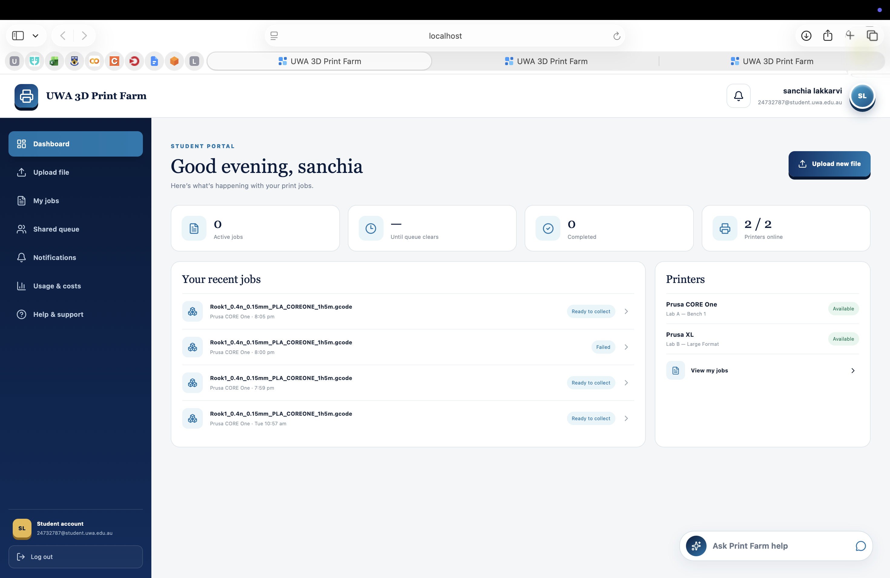
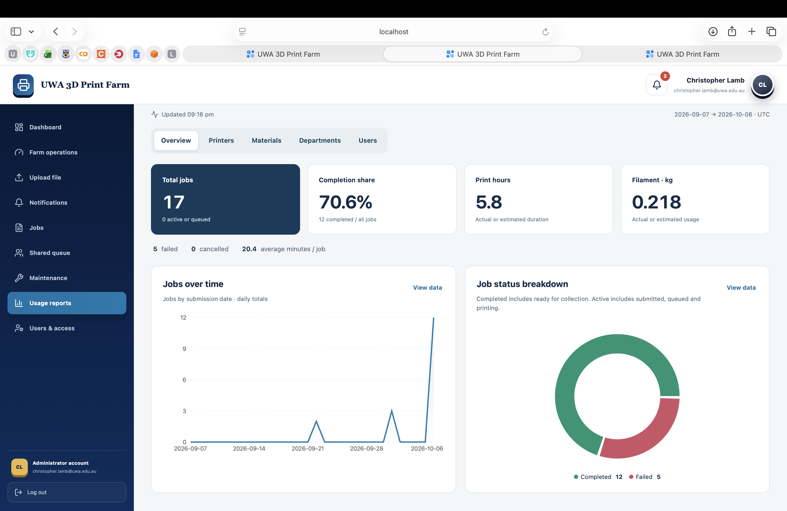

# Client Handover Summary

**UWA 3D Printer Farm Interface | Group 16**

## 1. Document control and handover overview

| Field | Record |
| --- | --- |
| Document | 01 — Client Handover Summary |
| Document version | 1.3 |
| Review date | 6 October 2026, Australia/Perth |
| Branch reviewed | `main` |
| Reviewed commit | `019cc9945961afd3ef90e3568c7a1409b7b995a8` |
| Repository | [SanchiaLakkarvi/3D-printer-farm-interface](https://github.com/SanchiaLakkarvi/3D-printer-farm-interface) |
| Document status | MVP approval recorded on 11 August 2026. Final handover and access transfer to be recorded. |
| Evidence basis | Implementation code, configuration and repository contents at the reviewed commit. |

The UWA 3D Printer Farm Interface allows students to submit pre-sliced print files and track their jobs. Printer Farmers and Administrators can monitor queues, pause and resume jobs, confirm removal of completed prints and view usage reports. The portal also provides in-app notifications and a student help chatbot.

This handover describes the implementation at the commit recorded above. The supplied configuration uses simulated printers. Physical-printer integration, client deployment and access transfer remain to be confirmed. Testing evidence and client acceptance records are covered in [Testing and Acceptance Report](06-testing-and-acceptance-report.md).

### Purpose and intended users

The project centralises print-job submission, queue visibility and staff operations for a UWA print farm. Users prepare files in an external slicer; the portal does not slice 3D models.

| User | Intended use in this version |
| --- | --- |
| Student | Register using a student UWA email, verify the account, submit compatible sliced files, follow their own jobs, read notifications and ask general help questions. |
| Printer Farmer | View farm jobs and printer states, submit jobs, pause/resume printing, confirm removal of completed prints and review usage reports. |
| Administrator | Use the staff workflows and reporting; administer printer/material records through protected backend endpoints. The user-management screen is not a completed administration workflow. |

Public self-registration creates student accounts. Staff access requires an existing authentication account and matching role/profile; selecting a staff card does not grant that role. See evidence E01–E02.

## 2. Delivered features and scope

**Connected** means the frontend calls implemented backend functionality. Runtime results and client acceptance are recorded separately from this feature inventory.

### 2.1 Connected user workflows

| Feature | Delivered behaviour and boundary |
| --- | --- |
| Authentication | Student registration, six-digit signup verification, resend code, password sign-in, role matching, session restoration and local sign-out. Real email verification depends on the selected Supabase configuration; the demo uses fake authentication. |
| Dashboard | Polls queue, history and printer data to show active work, recent jobs, printer availability and estimated queue timing. Student data is restricted by the backend to their own jobs. |
| Validate and submit | The main interface accepts `.gcode` and `.bgcode`, displays validation stages and errors, then offers compatible printers and matching material. Submission revalidates the file server-side and stores an accepted job as queued. The default size limit is 50 MiB. |
| Queue and history | Displays job state, printer, estimated start/completion, duration, material, filament and indicative cost. Farmers/Admins see farm jobs. The student “Shared queue” screen still receives only that student's jobs, although estimates account for other queued work. |
| Staff job controls | Pause/resume sends printer commands. “Collect” confirms print removal and changes a completed job to ready for collection. The backend blocks a new job on a printer while any job on that printer remains completed and unremoved. |
| Notifications | Database-backed in-app start, pause, resume, completion, failure and ready-for-collection updates; unread badge and individual/all mark-as-read. Completed prints generate removal notifications for Farmer-role accounts. |
| Usage reporting | Farmers and Admins have Overview, Printers, Materials, Departments and Users tabs, charts, tables, date/printer/material/department/status filters, user drill-down, user search/sort/pagination and CSV export. |
| AI help chat | Available on authentication screens and in the student portal. Provides general troubleshooting using a repository help document and an external Anthropic model; it has no account/job inspection or control tools. |

Evidence: E01–E08. Validation is limited to the implemented checks and configured profiles; passing validation is not a guarantee of physical print safety.

*Figure 1. Student dashboard in the local mock environment. Displayed printer and job information is demonstration data.*

### 2.2 Backend-only capabilities

- Protected printer endpoints can create, update and delete records, including status, material, location, profile and connection settings. Material endpoints support listing, creation and updates. There is no complete matching management interface in this version. [E09]
- The separate `POST /api/jobs/upload` endpoint accepts `.gcode`/`.gco` and creates a `pending_selection` record, but does not perform content validation. The main frontend uses the separate validated submission workflow. [E03]
- The low-level printer adapter includes a stop command, but the inspected public job routes and staff interface expose pause, resume and removal confirmation, not a complete user-facing stop/cancel workflow. [E04]

### 2.3 Screens and workflows not completed

Maintenance and Users & access are introductory screens with a “View details” button and no connected management action. Student Help & support is also introductory, although the separate chat works through the help API. Student Usage & costs shows a pricing explanation, not a personalised spending report. Packing, student pickup confirmation, integrated payment, online slicing and a complete reprint workflow are not exposed by the inspected user workflows. [E01, E03–E04]

## 3. Student and staff printing workflow

| Step | User action or system behaviour |
| --- | --- |
| 1. Access | A student registers, verifies the emailed code in Supabase mode, then signs in. Farmers/Admins use already provisioned accounts and the matching access card. |
| 2. Prepare | The user exports a pre-sliced file matching a supported printer profile. The frontend accepts `.gcode` or `.bgcode`; it does not accept an STL as a printable job. |
| 3. Validate | The portal calls the validation API. Checks include format/integrity, slicer metadata, executable compatibility commands, configured printer/build-volume/temperature constraints and end-of-file checks. Binary validation requires the Prusa converter. |
| 4. Select and submit | A compatible printer and matching material are selected. The backend revalidates, enforces the selected profile/material and stores the queued job. The submission service currently allows PLA and PETG. |
| 5. Dispatch and track | For each configured printer, the poller reads PrusaLink state and dispatches the oldest eligible submitted/queued job. The UI refreshes job state and timing estimates. Students receive lifecycle notifications. |
| 6. Finish or fail | A finished print becomes completed and generates notifications for its owner and Farmer-role users. Fault/stop states can mark a running job failed. Staff handle the physical condition of the printer. |
| 7. Remove and release | Farmer/Admin physically removes a completed print, then selects “Collect”. The system records the staff action, marks the job ready for collection and notifies the owner. The next job can then dispatch when the printer is eligible. |

**“Completed” means printing has finished. “Collect” means staff have confirmed removal and readiness for the student. Neither records that the student has picked up the object.** The removal confirmation is a staff declaration, not a physical sensor check. Failure handling does not provide the same completed-print removal gate; clearing failed prints needs a separate operating procedure and validation before physical use. [E04]

### Estimates and reporting interpretation

- The implemented cost formula is $2.00 for up to the first hour of positive duration, plus $0.50 per additional hour, prorated and rounded to two decimals. A 90-minute duration gives $2.25. These are calculated figures, not payment receipts. [E06]
- Backend cost fields are named with `_usd`, while the interface displays a generic `$`. Confirm the intended billing currency before using these figures as official charges. [E06]
- Queue estimates use durations and submission order; the scheduler does not explicitly reserve time for staff removal or paused/offline recovery. Estimates are guidance rather than guaranteed start or pickup times. [E05]
- Report dates use job submission timestamps in UTC. Print-hour share is a share of the selected workload, not uptime or available-capacity utilisation. Live queue figures include running jobs and do not follow the report's date/material/department/user/status filters. [E07]
- Hours/filament use available recorded values with estimate fallback. On successful completion the sync service copies estimated filament into the actual-filament field, so that figure is not a measured spool-consumption reading. [E04, E07]

## 4. Architecture, dependencies and printer integration

### 4.1 Components and data flow

The browser calls the FastAPI backend for authentication, validation, jobs, notifications and reports. The backend stores application records in PostgreSQL through SQLAlchemy, manages schema changes with Alembic, and stores accepted print files on disk. Its polling loop communicates with configured printers through the PrusaLink adapter. Help requests follow a separate path from the backend to Anthropic. [E02–E04, E08, E10]

| Component | Implementation and handover significance |
| --- | --- |
| Web interface | React/TypeScript with Next-style application files, Vinext/Vite and Recharts for analytics. Docker publishes port 5173; the browser API URL is configured for localhost:8000 in the base stack. |
| Backend | Python/FastAPI on port 8000. Authenticated endpoints enforce profile roles. API reference routes are `/docs` and `/redoc`; `/health` is a basic service response, not a database/printer readiness test. |
| Records and authentication | PostgreSQL, SQLAlchemy and Alembic. A Supabase Auth adapter is implemented; database/Auth selection depends on environment settings. The settings default to fake authentication, so Supabase mode must be explicitly configured. |
| File storage | Base Compose bind-mounts `backend/storage`. Removal confirmation attempts to delete the successful job's stored file after recording readiness; cleanup is best effort. Database records and local files have separate backup/retention needs. |
| Mock printers | A separate simulator on port 8080 exposes PrusaLink-compatible endpoints, a live monitor and operator controls for faults/reset. |
| Binary G-code support | The backend Docker build compiles the pinned official Prusa converter used for executable validation of `.bgcode`. Build dependencies and network availability matter when reproducing the image. |

### 4.2 Included operating configurations

The base `docker-compose.yml` starts frontend, backend and mockserver, reads backend environment settings, enables two-second polling and enables demo-data seeding. It disables automatic migrations. It is a local stack with localhost URLs, not evidence of a client production deployment.

The `docker-compose.demo.yml` overlay adds a PostgreSQL 16 demo database, forces fake authentication, enables migrations/seeding and supplies demo accounts. It is intended for disposable demonstration data. **A mock-printer demonstration still needs a valid Anthropic key and network access if live AI answers are required.** [E08, E10]

### 4.3 Mock status and transition to physical printers

The configured demo profiles represent a CORE One HF0.4 nozzle and an XL 5-tool Input Shaper 0.4 nozzle. Locations, identities, credentials and spool data in the demo are synthetic. The committed simulator speeds are 60× for CORE One and 120× for XL; simulated durations are not physical performance evidence. [E11]

The same HTTP Digest PrusaLink adapter can target printer records with real connection URLs. Compatibility with the installed client firmware remains unverified in this handover baseline. Before physical operation, confirm inventory/toolheads, firmware/API support, approved slicer/material profiles, backend-to-printer network access, authorised credentials and supervised lifecycle/failure tests. Do not substitute the demo inventory for the actual installed fleet. [E04, E11]

## 5. Chatbot purpose, dependencies and limitations

The “Ask Print Farm help” chat supports general questions about registration, verification, uploads, estimates, queues and collection. The backend reads `Docs/help/student-help.md` and instructs the model to answer from that reference or direct unsupported questions to the Print Farm team. Changes to this help document affect the chatbot's guidance. Restart the backend after updating it so the cached content is reloaded. [E08]

The service sends the reference/system prompt, the current question and supplied recent history to the Anthropic Messages API. It is stateless at the application-service level and has no database or printer-control tool in the help route. It cannot look up a student's job, inspect an uploaded file, change an account or operate a printer. Provider retention arrangements and institutional approval require client confirmation.

| Dependency or control | Implemented behaviour |
| --- | --- |
| Provider/key | Server-side `ANTHROPIC_API_KEY`; network access to Anthropic is required for answers. The configured default model is `claude-haiku-4-5-20251001`. |
| Request bounds | Default limits: 1,000 characters per message, six history messages, 400 output tokens and a 10-second provider timeout. |
| Rate limit | Default ten requests per 60 seconds per observed client IP, held in one backend process. It is not a shared deployment-wide limiter or a billing cap. |
| Sensitive-input checks | Regular-expression patterns detect some passwords, tokens, confirmation links and OTP disclosures and return a refusal. Detection is partial; users must not submit secrets or confidential files. |
| Unavailability | Missing key, provider errors or unreadable/empty help content produce an unavailable-service response. The help entry remains visible. |
| Content maintenance | The help document is mounted read-only into the container and cached in the service. After editing the host copy, restart the backend to reload it; review examples against the changed application. |

These controls limit inputs and guide responses; they do not guarantee answer accuracy, complete secret detection or resistance to every adversarial request. A client-nominated owner should maintain the reference, define a support contact, review representative answers and manage the API account, spending and permitted data use. API-account ownership, the support contact and privacy arrangements remain to be confirmed. [E08]

### External-service responsibilities

- **Supabase:** choose the client-owned project, database connection and authentication settings; confirm email delivery/templates and authorised staff profiles. The code does not prove a particular SMTP provider is currently configured. [E02, E10]
- **Anthropic:** decide whether to enable the feature, establish API-account/billing ownership and review the intended information flow. [E08]
- **Prusa tools and printer access:** maintain approved slicer exports and converter build inputs; arrange authorised physical-printer connectivity and credentials. [E03–E04, E10–E11]
- **Hosting/network:** select the target host, URL, HTTPS/network policy and operating responsibility. The supplied localhost stack does not establish a hosted deployment or service level. [E10]

## 6. Known limitations and recommended next steps

The table below summarises the main handover limitations. Detailed risks, proposed controls and ownership responsibilities are documented in [Risk Assessment and Known Limitations](05-risk-assessment-known-limitations.md).

| Limitation at the reviewed commit | Handover implication / next action |
| --- | --- |
| Physical integration unverified | Keep mock and physical evidence separate. Validate real network access, printer firmware/profile compatibility and the complete `.gcode`/`.bgcode` lifecycle before routine use. |
| Introductory and API-only functions | Maintenance/User access screens are not operational tools; printer/material management requires backend access. Agree whether these gaps are accepted or scheduled for development. |
| Collection boundary | “Collect” records removal/readiness, not final pickup. Agree handling, storage, failed-print clearing and pickup procedures; do not infer packing or pickup confirmation from the button label. |
| Indicators and estimates | Staff delays are not explicitly built into timing. The dashboard Completed card counts only `completed`, so jobs marked ready for collection leave that count; analytics groups both states as successful completion. Interpret those displays separately and review the label/count behaviour. |
| Costs and filament | Currency must be confirmed; no connected payment workflow is delivered. Filament statistics include copied estimates, not verified physical stock or consumption. |
| Notifications | The inspected lifecycle implementation creates in-app records. Email job-event delivery is not established; email signup verification is a separate function. |
| Alternate upload API | The `pending_selection` endpoint has a no-op content-validation hook. Keep its contract distinct from the validated frontend submission path and assess whether to retain/restrict it. |
| Operations and evidence incomplete | Backup/restore, target-host configuration, access transfer, support ownership, client acceptance and physical testing require confirmation. Record the decisions and execution evidence in the remaining pack. |

Evidence: E01, E03–E08, E10–E12. These are code/configuration findings and evidence gaps, not claims that particular operational incidents have occurred.

*Figure 2. Staff usage-report overview showing filters, summary figures and charts based on demonstration data.*

### Recommended sequence

1. **Confirm the handover version:** select the exact commit/release, align the six documents to it and label older guidance as historical where needed. Recheck this summary if code changes.
2. **Reproduce and record the demonstration:** execute the relevant automated tests and role-based scenarios against an isolated mock environment, including invalid uploads, pause/resume, completion blocking, removal notifications, reporting/CSV and chatbot unavailability. Record actual outcomes in document 06.
3. **Complete access and operating decisions:** nominate the receiving owner, provision staff access, decide Supabase/Anthropic ownership and billing, confirm currency and support contact, and verify backup/restore for records and required files.
4. **Validate the physical environment:** reconcile actual inventory with configured profiles, confirm firmware/network access and run supervised success/failure/removal tests. Demonstration success alone is insufficient for this step.
5. **Record client acceptance:** review delivered scope and known gaps, record any conditions, and authorise the agreed operating environment through the client's normal process.

## 7. Deliverables and document index

The repository contains frontend/backend source, mock-printer code/configuration, database migrations, dependency/build files, sample print files and test sources. Existing guides remain supporting material and should be checked against this version before reuse.

The handover pack consists of six documents. Store them together under `Docs/handover/`.

| Document | Purpose |
| --- | --- |
| [01 — Client Handover Summary](01-client-handover-summary.md) | Delivered scope, dependencies, limitations and handover responsibilities. |
| [02 — User Manual](02-user-manual.md) | Instructions for Students, Printer Farmers and Administrators. |
| [03 — Installation, Operations and Maintenance Guide](03-installation-operations-maintenance.md) | Setup, configuration, database administration, troubleshooting, backups and updates. |
| [04 — Mock Printer and Chatbot Guide](04-mock-printer-and-chatbot-guide.md) | Simulator operation, demonstration steps and chatbot configuration. |
| [05 — Risk Assessment and Known Limitations](05-risk-assessment-known-limitations.md) | Known risks, implementation gaps and proposed controls. |
| [06 — Testing and Acceptance Report](06-testing-and-acceptance-report.md) | Reported testing results, outstanding checks and client acceptance records. |

### Ownership and access-transfer checklist

Each item below is **pending confirmation**. Record the receiving owner and completion evidence when access is transferred. Transfer secrets through an agreed secure channel, never through this document or the public repository.

| Item | Required confirmation |
| --- | --- |
| Receiving owner | Named client representative, technical maintainer and authorised support contact. |
| Source/access | Repository access, agreed final commit/archive, dependency/licence review and any future repository-ownership arrangement. |
| Database/Auth | Client-authorised Supabase project or alternative PostgreSQL arrangement; admin access, staff profiles and verification-email settings. |
| AI account | Anthropic account/key custodian, billing responsibility, spending controls, permitted inputs and option to disable chat. |
| Printer/network | Inventory, approved profiles, connection credentials, backend network route and staff operating responsibility. |
| Host and data | Hosting account/URL, configuration custodian, database/file backup locations, retention and demonstrated restore. |
| Closure | Successful recipient access checks, secure configuration transfer, removal of unnecessary team access, completed documentation and recorded acceptance. |

## 8. Acceptance status and implementation evidence

Christopher Lamb approved Group 16’s MVP in writing on 11 August 2026. See the [Testing and Acceptance Report](06-testing-and-acceptance-report.md) for the approval evidence. Record the final handover release, receiving owner, operating environment and any conditions separately.

| Item | Evidence/status for this summary |
| --- | --- |
| Source baseline | Current `main` reviewed at the full commit in section 1. |
| Feature inventory | Frontend call paths, backend services and configuration inspected. |
| Automated tests | Results, failures and blocked checks are documented in [Testing and Acceptance Report](06-testing-and-acceptance-report.md). Execution logs should accompany any results presented as verified evidence. |
| Live mock demonstration | Simulator code and configuration are supplied. Record completed demonstration scenarios and their actual outcomes in document 06. |
| Physical-printer test | Unverified for this handover baseline; results required before physical operation. |
| Client deployment / access transfer | Confirmation and receiving-owner details pending. |
| Acceptance / sign-off | Not verified; to be recorded in document 06. |

The repository contains tests for authentication, submission, reporting, printer sync, collection controls, notifications and help, as well as frontend and mock tests. Their presence establishes available test assets, not their current execution result.

### Evidence index

All links below point to the reviewed commit, not a moving branch. The source review supports the implementation statements in this summary; it is not a substitute for runtime evidence.

| ID | Pinned implementation evidence |
| --- | --- |
| E01 | [UI shell, role navigation and placeholder rendering](https://github.com/SanchiaLakkarvi/3D-printer-farm-interface/blob/019cc9945961afd3ef90e3568c7a1409b7b995a8/frontend/UWA-3D-Print-Farm/app/page.tsx). |
| E02 | [Authentication/profile service](https://github.com/SanchiaLakkarvi/3D-printer-farm-interface/blob/019cc9945961afd3ef90e3568c7a1409b7b995a8/backend/app/services/auth_service.py) and [role dependencies](https://github.com/SanchiaLakkarvi/3D-printer-farm-interface/blob/019cc9945961afd3ef90e3568c7a1409b7b995a8/backend/app/api/deps.py). |
| E03 | [Frontend upload](https://github.com/SanchiaLakkarvi/3D-printer-farm-interface/blob/019cc9945961afd3ef90e3568c7a1409b7b995a8/frontend/UWA-3D-Print-Farm/components/farm/live-upload.tsx), [validated submission](https://github.com/SanchiaLakkarvi/3D-printer-farm-interface/blob/019cc9945961afd3ef90e3568c7a1409b7b995a8/backend/app/services/submission_service.py), [validator](https://github.com/SanchiaLakkarvi/3D-printer-farm-interface/blob/019cc9945961afd3ef90e3568c7a1409b7b995a8/backend/app/validation/gcode_validator.py) and [alternate upload](https://github.com/SanchiaLakkarvi/3D-printer-farm-interface/blob/019cc9945961afd3ef90e3568c7a1409b7b995a8/backend/app/services/upload_service.py). |
| E04 | [Printer sync/dispatch](https://github.com/SanchiaLakkarvi/3D-printer-farm-interface/blob/019cc9945961afd3ef90e3568c7a1409b7b995a8/backend/app/services/printer_sync_service.py), [staff removal service](https://github.com/SanchiaLakkarvi/3D-printer-farm-interface/blob/019cc9945961afd3ef90e3568c7a1409b7b995a8/backend/app/services/job_control_service.py), [public job routes](https://github.com/SanchiaLakkarvi/3D-printer-farm-interface/blob/019cc9945961afd3ef90e3568c7a1409b7b995a8/backend/app/api/v1/jobs.py) and [PrusaLink adapter](https://github.com/SanchiaLakkarvi/3D-printer-farm-interface/blob/019cc9945961afd3ef90e3568c7a1409b7b995a8/backend/app/adapters/printer/prusalink.py). |
| E05 | [Queue scheduling and user-filtered history](https://github.com/SanchiaLakkarvi/3D-printer-farm-interface/blob/019cc9945961afd3ef90e3568c7a1409b7b995a8/backend/app/services/job_service.py) and [staff queue interface](https://github.com/SanchiaLakkarvi/3D-printer-farm-interface/blob/019cc9945961afd3ef90e3568c7a1409b7b995a8/frontend/UWA-3D-Print-Farm/components/farm/live-queue.tsx). |
| E06 | [Pricing formula](https://github.com/SanchiaLakkarvi/3D-printer-farm-interface/blob/019cc9945961afd3ef90e3568c7a1409b7b995a8/backend/app/services/pricing_service.py) and [currency/status display](https://github.com/SanchiaLakkarvi/3D-printer-farm-interface/blob/019cc9945961afd3ef90e3568c7a1409b7b995a8/frontend/UWA-3D-Print-Farm/lib/api/format.ts). |
| E07 | [Reporting interface/export](https://github.com/SanchiaLakkarvi/3D-printer-farm-interface/blob/019cc9945961afd3ef90e3568c7a1409b7b995a8/frontend/UWA-3D-Print-Farm/components/reports/usage-reports.tsx) and [report aggregation](https://github.com/SanchiaLakkarvi/3D-printer-farm-interface/blob/019cc9945961afd3ef90e3568c7a1409b7b995a8/backend/app/services/report_service.py). |
| E08 | [Chat service/source cache](https://github.com/SanchiaLakkarvi/3D-printer-farm-interface/blob/019cc9945961afd3ef90e3568c7a1409b7b995a8/backend/app/services/help_service.py), [Anthropic adapter](https://github.com/SanchiaLakkarvi/3D-printer-farm-interface/blob/019cc9945961afd3ef90e3568c7a1409b7b995a8/backend/app/adapters/help/anthropic.py), [public help route](https://github.com/SanchiaLakkarvi/3D-printer-farm-interface/blob/019cc9945961afd3ef90e3568c7a1409b7b995a8/backend/app/api/v1/help.py) and [configured limits](https://github.com/SanchiaLakkarvi/3D-printer-farm-interface/blob/019cc9945961afd3ef90e3568c7a1409b7b995a8/backend/app/core/config.py). |
| E09 | [Printer administration API](https://github.com/SanchiaLakkarvi/3D-printer-farm-interface/blob/019cc9945961afd3ef90e3568c7a1409b7b995a8/backend/app/api/v1/printers.py) and [material administration API](https://github.com/SanchiaLakkarvi/3D-printer-farm-interface/blob/019cc9945961afd3ef90e3568c7a1409b7b995a8/backend/app/api/v1/materials.py). |
| E10 | [Base Compose](https://github.com/SanchiaLakkarvi/3D-printer-farm-interface/blob/019cc9945961afd3ef90e3568c7a1409b7b995a8/docker-compose.yml), [demo overlay](https://github.com/SanchiaLakkarvi/3D-printer-farm-interface/blob/019cc9945961afd3ef90e3568c7a1409b7b995a8/docker-compose.demo.yml), [backend image/converter](https://github.com/SanchiaLakkarvi/3D-printer-farm-interface/blob/019cc9945961afd3ef90e3568c7a1409b7b995a8/backend/Dockerfile) and [frontend dependencies](https://github.com/SanchiaLakkarvi/3D-printer-farm-interface/blob/019cc9945961afd3ef90e3568c7a1409b7b995a8/frontend/UWA-3D-Print-Farm/package.json). |
| E11 | [Mock profiles and simulation speeds](https://github.com/SanchiaLakkarvi/3D-printer-farm-interface/blob/019cc9945961afd3ef90e3568c7a1409b7b995a8/mockserver/config/printers.yaml) and [demo database inventory](https://github.com/SanchiaLakkarvi/3D-printer-farm-interface/blob/019cc9945961afd3ef90e3568c7a1409b7b995a8/backend/app/scripts/seed_printers.py). |
| E12 | [Dashboard completion counter](https://github.com/SanchiaLakkarvi/3D-printer-farm-interface/blob/019cc9945961afd3ef90e3568c7a1409b7b995a8/frontend/UWA-3D-Print-Farm/components/farm/live-dashboard.tsx) and [notification interface](https://github.com/SanchiaLakkarvi/3D-printer-farm-interface/blob/019cc9945961afd3ef90e3568c7a1409b7b995a8/frontend/UWA-3D-Print-Farm/components/farm/live-notifications.tsx). |
