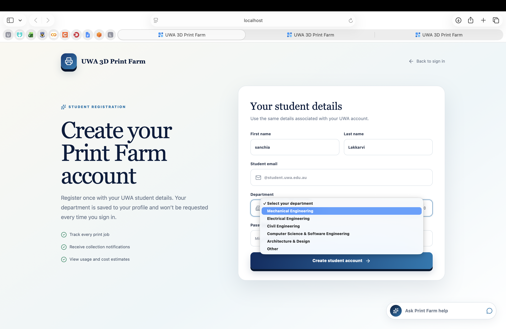
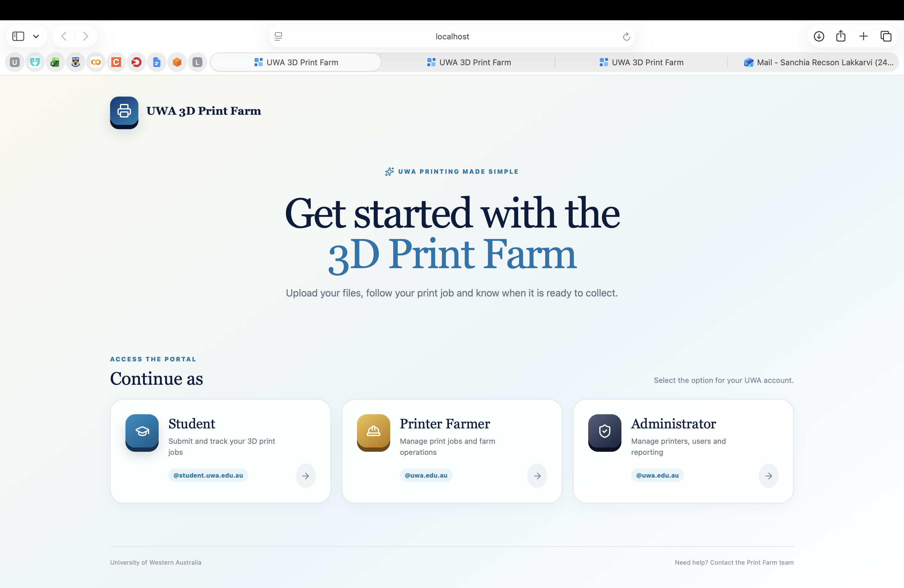
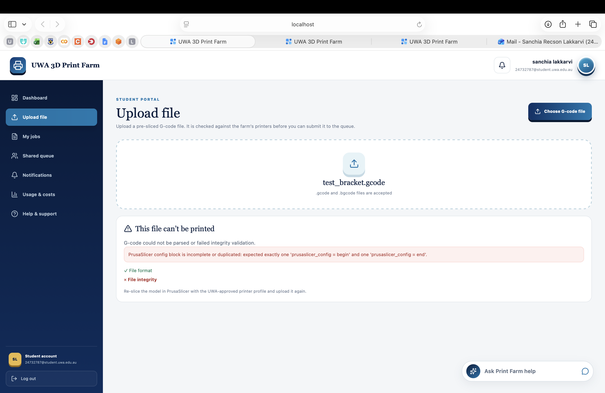
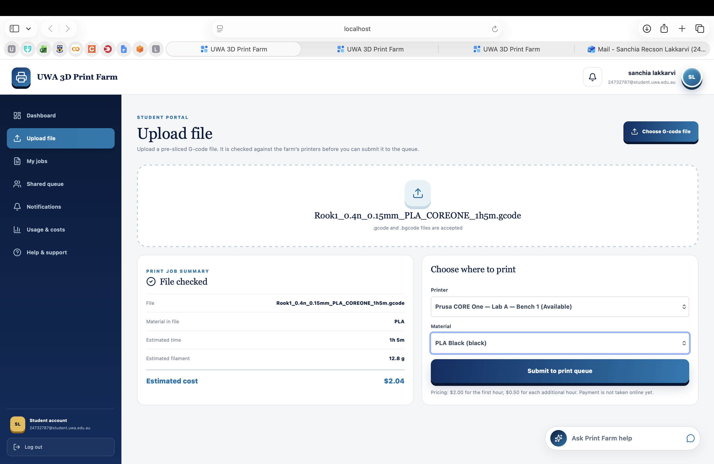
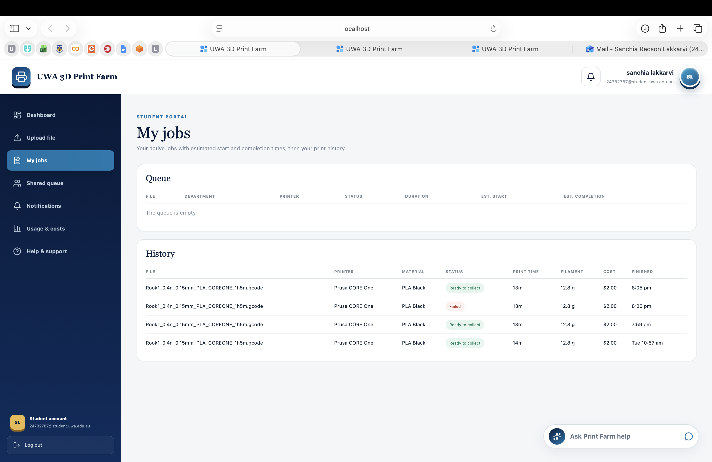
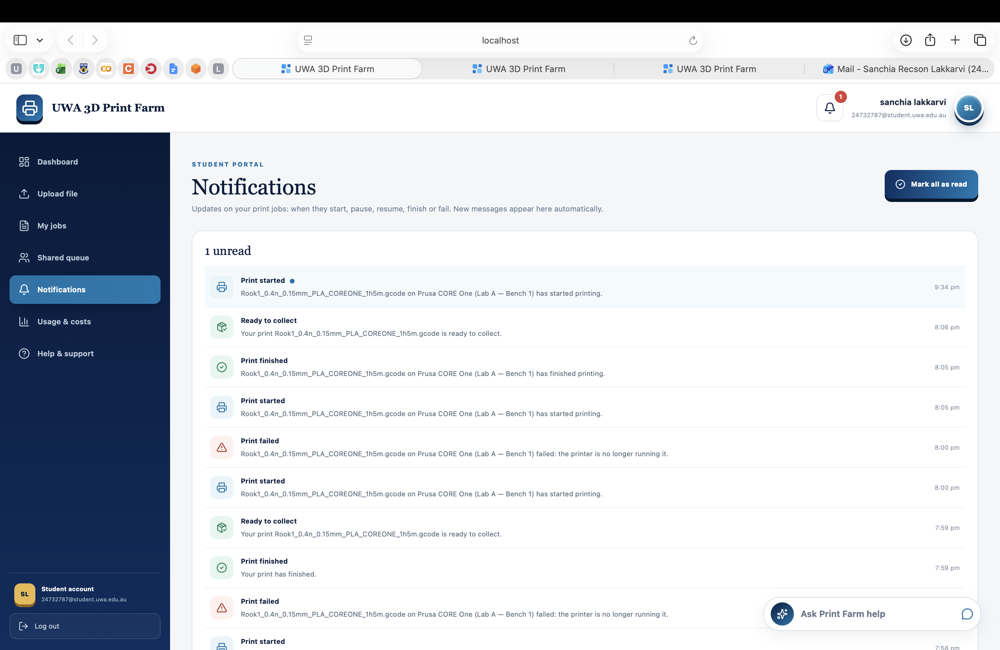
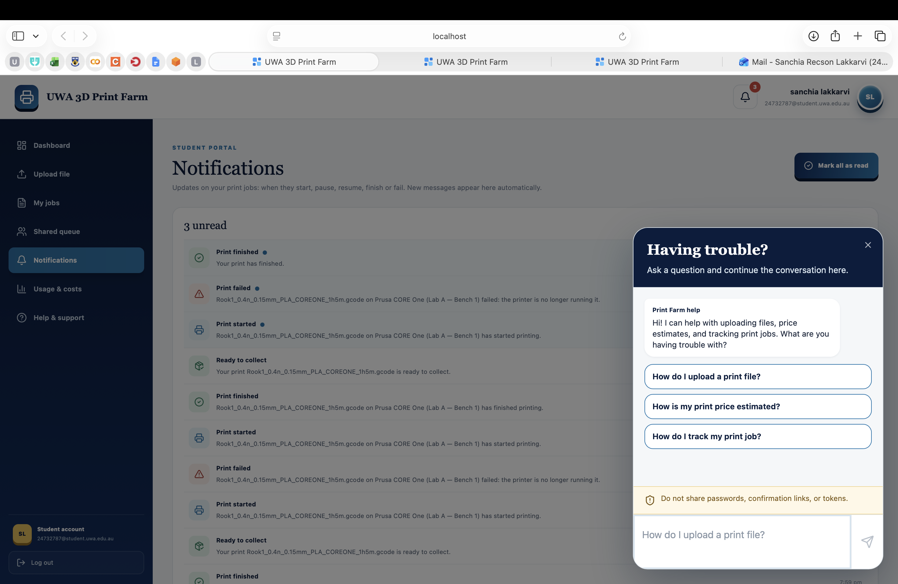
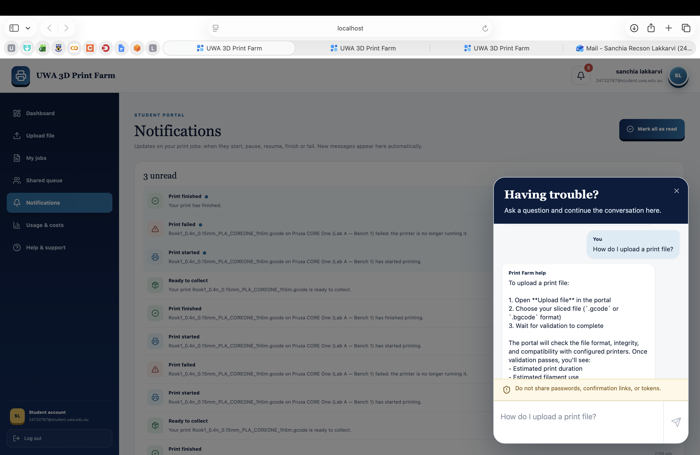
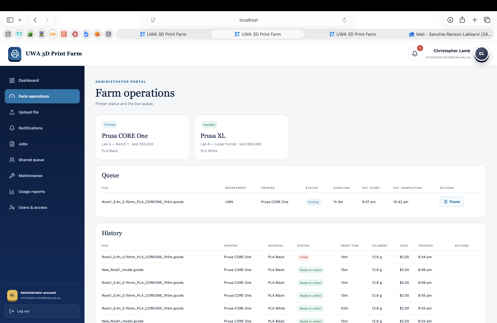
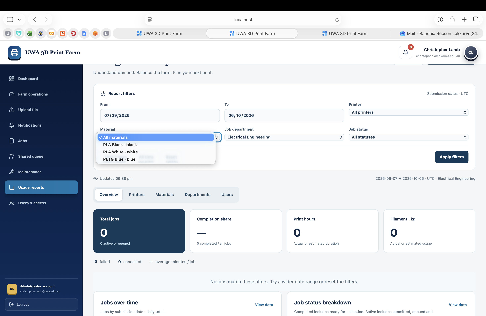

# UWA 3D Printer Farm Interface — User Manual

| Document control | Details |
| --- | --- |
| Project team | Group 16 |
| Document | 02 — User Manual |
| Version | 1.2 |
| Document date | 6 October 2026 |
| Repository review date | 6 October 2026 |
| Reviewed branch | `main` |
| Reviewed commit | `019cc9945961afd3ef90e3568c7a1409b7b995a8` |
| Repository | [SanchiaLakkarvi/3D-printer-farm-interface](https://github.com/SanchiaLakkarvi/3D-printer-farm-interface) |

## Contents

1. [About the portal](#1-about-the-portal)
2. [Student](#2-student)
3. [Printer Farmer](#3-printer-farmer)
4. [Administrator](#4-administrator)
5. [Troubleshooting](#5-troubleshooting)
6. [Demo environment only](#6-demo-environment-only)
7. [Screenshot index](#7-screenshot-index)
8. [Implementation references](#8-implementation-references)

## 1. About the portal

The UWA 3D Printer Farm Interface lets students submit supported, pre-sliced print files, review estimates, follow their jobs and receive collection updates. Printer Farmers and Administrators can monitor jobs across the farm, pause or resume printing, confirm print removal and inspect usage reports.

Open the portal address supplied by the Print Farm team. For the local demonstration address and demo accounts, see [Section 6](#6-demo-environment-only).

### 1.1 Access and responsibilities

| Access option | Intended use | Job visibility |
| --- | --- | --- |
| **Student** | Register a student account, upload a sliced file, track jobs and check collection updates. | The signed-in student's own queue and history. |
| **Printer Farmer** | Monitor the farm, operate supported job controls, confirm removal and review usage. | Jobs across the farm. |
| **Administrator** | Use the staff monitoring, job controls and reporting functions. | Jobs across the farm. |

Selecting an option under **Continue as** does not assign that role to an account. The selected option must match the account's existing role. Printer Farmer and Administrator accounts are issued through authorised account administration; there is no staff self-registration form.

Normal use requires a running portal and backend. Email verification requires the configured email service. Printer controls require a working printer connection, or the mock connection in a demonstration. Help chat also depends on its external service being available.

### 1.2 Printing, removal and pickup are separate

| Stage | What it means | What happens next |
| --- | --- | --- |
| **In queue** | The submission has been accepted and is waiting on its selected printer. | It can start when that printer and the dispatch service are ready. |
| **Printing** | The printer has started the job. | Staff monitor printing; supported pause and resume controls are available. |
| **Completed** | Printing has finished. The portal has not yet received staff confirmation that the print has been physically removed. | Staff remove the print and select **Collect** in **History**. |
| **Ready to collect** | Staff have confirmed removal and made the print available for the student. | The student arranges pickup with Print Farm staff. |
| Student pickup | The student receives the physical item. | The current portal has no separate pickup confirmation action or pickup-completed status. |

**A “Print finished” notification is not a “Ready to collect” notification.** A completed print blocks automatic dispatch of the next job on that printer until staff confirm removal. The staff **Collect** button records removal and readiness together; it does not record the student's pickup.

This manual covers portal actions. Physical printer handling, fault response and print removal require the appropriate lab procedures and trained staff.

## 2. Student

### 2.1 Create an account

1. On **Continue as**, select **Student**.
2. Select **Create a student account** below the sign-in form.
3. Under **Your student details**, complete **First name**, **Last name**, **Student email**, **Department** and **Password**.
4. Use your UWA student email in the form `{student_id}@student.uwa.edu.au`.
5. Export the sliced file. The default upload limit is 50 MiB, approximately 52.4 MB. Follow the limit configured by your operator.
6. Enter a password containing at least eight characters.
7. Select **Create student account**. The button shows **Creating account…** while the request is processing.

When registration is accepted, the portal opens **Let's verify your email** and displays the email address used. Registration alone does not sign you in. Your department is saved with your profile; it is not requested on each login.

Select **Back to sign in** to return without completing the form. If an account already exists for your email, use that account rather than registering another one. There is no password-reset screen in the current portal; ask the team responsible for account administration if you cannot regain access.

> **Screenshot S01** Current Student registration form, including the department selector and **Specify department** when **Other** is selected. Capture using demonstration details.

*Student registration form showing the details required to create an account.*

### 2.2 Verify your email and resend a code

1. Check the mailbox shown on **Let's verify your email**, including spam or junk folders.
2. Enter the six-digit code in **Verification code**. Only numeric digits are accepted; **Verify email** is enabled after six digits are entered.
3. Select **Verify email**. The button shows **Verifying…** while the request is processing.
4. On successful verification, the portal returns to sign-in with a confirmation message. Sign in with the email and password you registered.

For a missing or expired code, wait for **Resend code in …s** to become **Resend code**, then select it. The interface starts a 60-second wait after registration and after a successful resend. Check the latest email and enter its code; email delivery time and code expiry depend on the configured authentication service.

If the displayed email is wrong, select **Change email**. This returns to the registration form so you can correct and submit your details. It does not rename an existing registered account.

Verification codes are for confirming registration. Subsequent sign-ins use your password. Enter a verification code only in the verification form, never in the help chatbot.

### 2.3 Sign in and log out

1. Select **Student** on **Continue as**.
2. Enter **Email address** and **Password** on **Welcome back**.
3. Use the eye icon beside the password if you need to show or hide it.
4. Select **Sign in**. The button shows **Signing in…** while the request is processing.
5. After successful sign-in, the portal opens **Dashboard**.

**Back** returns to the access choices. If you see **“This account does not match the access option you selected.”**, return and choose the option assigned to your account.

When you reload a page with a stored session, **Restoring your session…** may appear while the portal checks access. If restoration fails, sign in again. Select **Log out** in the sidebar when finished, particularly on a shared computer. Logout ends your local portal session; it does not cancel submitted jobs.

> **Screenshot S02** Access choices and the current sign-in form. Keep passwords hidden.

*Access options for Students, Printer Farmers and Administrators. Select the option matching your account's assigned role.*

### 2.4 Dashboard and navigation

On a narrow screen, use the header menu icon to open the sidebar. Select a menu item to open its view. The header bell opens **Notifications**; its badge indicates unread messages.

| Student menu label | What you can use it for |
| --- | --- |
| **Dashboard** | Review recent jobs, printer states and summary counts; select **Upload new file** or **View my jobs**. |
| **Upload file** | Validate a sliced file, select a compatible printer and material, then submit it. |
| **My jobs** | View your active **Queue** and finished **History**. |
| **Shared queue** | View printer cards and your own queue and history. Despite its name, it does not show other students' jobs to a Student account. |
| **Notifications** | Read job updates and mark messages as read. |
| **Usage & costs** | Read the pricing explanation. This is a static explanation, not a personal usage report or payment screen. |
| **Help & support** | Placeholder page with introductory text and **View details**; the button has no connected action. Use **Ask Print Farm help** for the connected chatbot. |

The Dashboard figures mean:

| Dashboard label | Interpretation |
| --- | --- |
| **Active jobs** | The number of jobs in your returned active queue. |
| **Until queue clears** | Time until the latest estimated completion among the queue entries visible to you. It is not a guarantee that the entire farm will then be empty. |
| **Completed** | Jobs currently recorded specifically as **Completed**. Jobs that become **Ready to collect** are no longer counted in this card. |
| **Printers online** | Printers recorded as **Available** or **Printing**, compared with the total returned printer count. This does not guarantee immediate bed availability. |

**Your recent jobs** displays a small selection of active and finished jobs. Open **My jobs** for the queue and history tables. Queue and printer information normally refresh about every five seconds while the view is open; history refreshes about every fifteen seconds. Network and service delays can extend this.

### 2.5 Prepare a supported sliced file

Prepare the model in PrusaSlicer before uploading. The portal accepts exported **`.gcode`** and **`.bgcode`** files; it does not slice STL, OBJ or 3MF models for you.

1. Obtain the appropriate farm printer profile from Print Farm staff.
2. Select the intended printer and nozzle profile in PrusaSlicer. The reviewed validator supports the following configurations:

   | Supported profile | Configured build volume |
   | --- | --- |
   | **Prusa CORE One HF0.4 nozzle** | 250 × 220 × 270 mm |
   | **Original Prusa XL - 5T Input Shaper 0.4 nozzle** | 360 × 360 × 360 mm |

3. Slice for **PLA** or **PETG**, the two material types accepted by the current submission workflow. Confirm the intended filament with staff.
4. Check the model, supports, dimensions and sliced preview. Keep the printer and material metadata produced by PrusaSlicer, including the estimated printing time.
5. Export the sliced file. The default upload limit is **50 MB** as shown by the server's error message; an operator can configure a different limit.
6. Keep your original model and exported file for later correction or resubmission.

These profile definitions describe software compatibility; they do not establish which physical machines are installed or available. Printer choices come from the running farm configuration.

Binary `.bgcode` validation requires the server's Prusa conversion tool. If the portal reports that full binary validation is unavailable, export ordinary text `.gcode` or ask the operator to restore that dependency. Renaming a model file or a binary file to `.gcode` does not convert it. Re-slice using the correct settings rather than editing metadata to bypass a rejection.

### 2.6 Upload and interpret validation

1. Open **Upload file**, or select **Upload new file** on Dashboard.
2. Select **Choose G-code file**, or the central **Choose a G-code file** button, and choose your exported file in the file picker.
3. Wait while **Checking your file…** is displayed.
4. Read the result before submitting.

Selecting a file performs validation only. It does not add a job to the queue.

If validation fails, **This file can’t be printed** appears with the reported reason. The displayed checks can include:

| Check label | What it concerns |
| --- | --- |
| **File format** | A supported file format and recognisable contents. |
| **File integrity** | A complete, readable file and required structural information. |
| **Slicer settings** | Required printer, material and build metadata. |
| **Printer commands** | Compatibility declarations and executable command checks. |
| **Printer compatibility** | Matching configured printer settings, build and temperature checks. |
| **Supported printer match** | Identification of one supported printer profile. |

A failed check can prevent later checks from being completed. Use the detailed reason to correct the source settings, export a fresh file and select it again. A validation pass checks the implemented file rules; it does not certify print quality or replace staff inspection of a physical printer.

On a pass, **File checked** appears under **PRINT JOB SUMMARY**, with **File**, **Material in file**, **Estimated time**, **Estimated filament** and **Estimated cost**. A dash means the value is unavailable. Check these values against your sliced preview. File names may be normalised when stored, so some characters can appear as underscores.

> **Screenshot S03 ** A real validation rejection with its reason and checks, followed by a passing **File checked** summary. Use actual files; do not manufacture a successful result.

*Validation rejection showing the reported reason. Correct the slicing settings or file issue before uploading again.*

*Successful validation showing the print-job summary. Passing validation does not submit the job; printer and material selection must be completed next.*

### 2.7 Select a printer and material, then submit

1. Under **Choose where to print**, check the **Printer** selection. The first compatible printer that can accept jobs may already be selected.
2. Select the intended compatible printer and location. **Available** and **Printing** printers can accept queued submissions. **Error**, **Offline** and **Maintenance** choices are disabled.
3. Select **Material**. Only records whose material type matches **Material in file** are offered. A single matching record may already be selected; otherwise choose from the list.
4. Confirm the material name and colour. Selecting a record does not load filament into a printer or prove sufficient physical stock; staff must confirm the machine is prepared correctly.
5. Review the estimated time, filament and cost.
6. Select **Submit to print queue**. It is disabled until both selections are present, and shows **Submitting…** while processing.

The server checks the file and selections again at submission. A printer becoming unavailable, a material mismatch, unsupported material or missing printing-time estimate can still prevent acceptance after **File checked**.

When accepted, **Added to the queue** displays the file name, approximate start and finish times and estimated cost. Select **View my jobs** to track the submission, or **Upload another file** to begin a new one.

If submission fails or the connection drops, check **My jobs** before submitting again: the server may have accepted the first request even if the response did not reach your browser. A second submission can create a second job.

### 2.8 Queue, history and status

Open **My jobs**. The same queue and history tables are also used in **Shared queue**, with printer cards added above them.

**Queue** contains **File**, **Department**, **Printer**, **Status**, **Duration**, **Est. start** and **Est. completion**. Waiting jobs are scheduled in submission order for their assigned printer. Different printers can work in parallel. Your visible estimates account for earlier farm jobs even though other students' job rows are hidden from you.

**History** contains **File**, **Printer**, **Material**, **Status**, **Print time**, **Filament**, **Cost** and **Finished**. Finished records include completed, failed, ready-for-collection and removed jobs. This view does not provide a G-code download or a one-click reprint.

| Visible label | Meaning and action |
| --- | --- |
| **Submitted** | An active submitted record. The normal validated upload workflow usually creates **In queue** directly. |
| **In queue** | Waiting to print. Monitor the estimated times. |
| **Printing** | The job is running. Students cannot pause or resume it. |
| **Paused** | The queue has received a paused state for the printing job. Staff must decide when to resume. |
| **Completed** | Printing has ended; wait for staff removal and readiness confirmation. |
| **Ready to collect** | Contact staff about receiving the print. The portal does not record your eventual pickup. |
| **Failed** | Printing did not finish successfully. Read the failure notification and ask staff before arranging another attempt. |
| **Removed** | A separate stored job status, labelled **Cancelled** in staff reports. It is not the confirmation that staff removed a successful print from the bed; that confirmation produces **Ready to collect**. There is no connected student cancellation action. |

**Awaiting printer** means no assigned printer is recorded. A duration marked **(assumed)** indicates the schedule used a default duration, currently 30 minutes, rather than a file estimate. Do not treat it as a measured duration.

Job times are displayed using the browser's local date/time settings. Start and completion values are estimates, not appointments: pauses, faults, overruns, material preparation and the time required to remove a completed print can delay them. The schedule does not explicitly add a removal interval or fully compensate for pauses.

An **Available** printer card can therefore coexist with a waiting queue when a **Completed** print still requires removal confirmation. Contact staff rather than repeatedly uploading the same file.

> **Screenshot S04** Student **My jobs**, showing Queue estimates and History examples of **Completed** and **Ready to collect**.

*The My jobs view displays the student's queue and job history, including available status and timing information.*

### 2.9 Estimates and costs

The upload estimate is calculated from the printing time in the sliced file:

| Duration | Current calculation |
| --- | --- |
| More than zero and up to one hour | $2.00 |
| Longer than one hour | $2.00 plus $0.50 for each additional hour, prorated for part-hours and rounded to two decimal places. |

For example, a 90-minute estimate gives **$2.25**. The **Usage & costs** page explains the same first-hour and additional-hour pricing.

History uses a reported printing duration when available, otherwise the file estimate, so its **Cost** can differ from the initial estimate. **Filament** similarly uses a recorded actual value where available, otherwise an estimate. The current completion process can copy estimated filament into the recorded value; grams shown are not a weighed or audited consumption total.

The portal does not take online payment, issue a payment receipt or confirm that a cost has been paid. The interface displays amounts with a **$** symbol without identifying the currency.

### 2.10 Notifications and collection

Open **Notifications** from the sidebar or header bell.

| Notification title | What to expect |
| --- | --- |
| **Print started** | The job has started printing. |
| **Print paused** | A paused printer state has been recorded. |
| **Print resumed** | Printing has resumed after a recorded pause. |
| **Print finished** | Printing has finished; staff removal may still be outstanding. |
| **Print failed** | The job failed; the message can describe the reported reason. |
| **Ready to collect** | Staff have confirmed removal and readiness for collection. |

Select a notification to mark it read. This does not open a job-detail page or change the job's status. **Mark all as read** marks all your notifications read, including older records outside the displayed list. The current screen requests the latest 50 messages and has no history pagination; the bell's total unread count can therefore exceed the unread messages visible on the page.

Notifications normally refresh about every five seconds. Job updates are delivered inside the portal; do not rely on a separate email message for printing or collection. Registration verification email is a separate function.

After **Ready to collect**, confirm the pickup location, hours and any payment arrangements with staff. The current screen does not establish these arrangements or supply a pickup booking form.

> **Screenshot S05** Notifications with **Print finished**, **Ready to collect**, an unread badge and **Mark all as read**, using demonstration records.

*In-app job notifications and read controls. Students use these updates to follow printing progress and collection readiness.*

### 2.11 Use the help chatbot

**Ask Print Farm help** appears on sign-in, registration and verification screens. It also appears inside the signed-in Student portal. It is separate from the placeholder **Help & support** page.

1. Select **Ask Print Farm help** to open **Having trouble?**.
2. Select a suggested question, or enter your own question in the text area.
3. Select the send icon, labelled **Send question**.
4. Wait for **Finding an answer…**, then read the response. You can ask a follow-up question.

Before sign-in, suggestions concern signing in, creating an account and missing verification codes. Inside the Student portal, suggestions include **How do I upload a print file?**, **How is my print price estimated?** and **How do I track my print job?**.

The chatbot provides general guidance from the configured student-help reference using an external Anthropic service. It cannot inspect your account, uploaded file or live job, verify a payment, change a printer state or collect a print. Use the actual queue, notifications and staff guidance to establish your job's status. Answers can be incomplete or incorrect, particularly if the reference has not kept pace with the application.

Questions are limited to 1,000 characters. Only the recent six messages are retained for the continuing conversation; this is not a permanent support-ticket record. Reloading or leaving the relevant portal session can clear the conversation.

The question and recent conversation are sent to the external help service. Follow the displayed instruction **“Do not share passwords, confirmation links, or tokens.”** Do not include verification codes, credentials or confidential information. If help is unavailable or a request is refused, use the relevant instructions in this manual and contact Print Farm staff. Chatbot availability does not determine whether an otherwise connected printing workflow can operate.

> **Screenshot S06** **Having trouble?** with its suggested questions, question field, send icon and security instruction. Use a non-sensitive example.

*The help dialog provides suggested questions and a field for general Print Farm questions.*

*An example chatbot response. The chatbot provides general guidance and cannot inspect or change a student's live job.*

## 3. Printer Farmer

### 3.1 Sign in and navigate

Select **Printer Farmer** on **Continue as** and sign in with the account issued to you. Use **Email address**, **Password** and **Sign in** as described in [Section 2.3](#23-sign-in-and-log-out). There is no staff registration form. Select **Log out** when finished.

| Printer Farmer menu label | Current behaviour |
| --- | --- |
| **Dashboard** | Farm-wide active jobs and history summaries, printer states, **Upload new file** and **View all jobs**. |
| **Farm operations** | Printer cards followed by the farm-wide Queue and History, including staff actions. |
| **Upload file** | The connected validation and submission workflow. |
| **Notifications** | Notifications addressed to your account. Printer Farmers also receive completed-print messages requesting removal. |
| **Jobs** | Farm-wide Queue and History with staff controls. |
| **Shared queue** | The same farm-wide tables, with printer cards. |
| **Maintenance** | Placeholder screen. **View details** does not open a maintenance form or save service notes. |
| **Usage reports** | Connected **Usage & analytics** reporting and CSV export. |

The Dashboard **Completed** card counts the **Completed** status only. The report completion metrics also count ready-for-collection jobs, so these values need not match.

The signed-in staff shell does not include the Student help chatbot. Authentication help remains available on sign-in screens.

### 3.2 Monitor and submit jobs

Open **Farm operations**, **Jobs** or **Shared queue**. The queue and history columns are described in [Section 2.8](#28-queue-history-and-status); staff additionally see **Actions**.

Printer cards show a model, location, configured bed size, state and current recorded material, or **No material recorded**. A stored material record is not a sensor confirmation of what is loaded. Check physical setup before operating a real machine.

Staff can use **Upload file** with the same steps and restrictions as students. A staff upload is owned by the signed-in staff account; the form has no student-owner selector. On the success screen, the button still reads **View my jobs**, but for staff it opens **Jobs**, which shows the farm-wide tables.

The interface does not provide manual queue reordering, reassignment to another printer, a connected cancel button or a separate manual “start next job” control. Dispatch is performed by the backend when its conditions are met.

### 3.3 Pause and resume a printing job

1. Open a staff queue view and identify the file and printer carefully.
2. For a **Printing** row, select **Pause** in **Actions**.
3. Wait for the command and subsequent printer-state update. Action buttons are temporarily disabled while a request is in progress.
4. When the queue displays **Paused**, its action becomes **Resume**.
5. After checking that continuation is appropriate, select **Resume** and wait for **Printing** to return.

These actions send commands to the connected printer. A command being accepted is not itself the final state confirmation; the queue updates after the backend reads the printer again. The job owner receives pause/resume notifications when those state changes are observed.

Controls require a printing job with an assigned printer, a usable connection and a known printer job identifier. A disconnected printer or a printer that refuses the command produces an error. Recheck the physical and displayed state before trying again. **Pause** is an operational control, not a substitute for the lab's emergency response procedure.

> **Screenshot S7** The same actual staff job before pause and after a confirmed paused state, showing **Pause** changing to **Resume**.

*Staff queue showing a printing job and its Pause action in the mock environment.*

*Staff queue showing a paused job and its Resume action in the mock environment.*

### 3.4 Remove a completed print and mark it ready

1. Locate the job in **History** and confirm its file and printer. It must show **Completed**.
2. Physically remove the completed print using the lab's handling procedure. Confirm the printer bed is clear and the item can be made available for its owner.
3. Select **Collect** in that job's **Actions** column. Its tooltip is **Confirm the print has been removed**.
4. Wait for History to reload and confirm **Ready to collect**. The **Collect** action is no longer shown for that row.

**Collect acts immediately; there is no second confirmation dialog. Select it only after physical removal.** It records the staff member and removal/readiness timestamps, changes the status and sends the owner a **Ready to collect** notification.

The next waiting job can then be dispatched on a subsequent backend poll if the printer and connection are ready. It does not require the student to pick up the previous print. If another **Completed** record still blocks that printer, or the printer is unavailable, dispatch remains held.

There is no separate packing-complete action, undo-removal button or student pickup recording form. Do not use **Collect** to mean “the student has picked it up”. For a failed print, this action is not available: staff must inspect and clear the machine through the appropriate operational process. **Failed** jobs do not create the same completed-print removal hold, so another queued job can be dispatched when the printer reports a ready state. If the bed or machine is unsafe, arrange with the operator to keep the printer out of service; the placeholder **Maintenance** page cannot do this.

### 3.5 Open reports and apply filters

Select **Usage reports** to open **Usage & analytics**. Both Printer Farmers and Administrators have access. The tabs are **Overview**, **Printers**, **Materials**, **Departments** and **Users**.

The initial selection covers the latest 30 calendar days, including today, using UTC dates. The filters are:

| Filter label | Use |
| --- | --- |
| **From**, **To** | Include jobs submitted during the selected dates. Both end dates are inclusive, in UTC. The basis is submission time, not completion time. |
| **Printer** | Select a configured printer or **All printers**. |
| **Material** | Select a material record or **All materials**. |
| **Job department** | Select the department recorded on a job, or **All departments**. |
| **Specify job department** | Appears after **Other department…**; enter the exact recorded department name. |
| **Job status** | Limit the report to a stored job status, or **All statuses**. |

To change the report:

1. Edit the required filters.
2. Select **Apply filters**.
3. Wait for **Loading selected reports…** to finish.
4. Check the applied range and selections in the status line before interpreting or exporting values.

**Last 7 days** changes the draft dates; **All time** clears the draft date limits. Both still require **Apply filters**, and neither clears the other filter selections. **Reset** immediately reloads the default 30-day selection with the other report filters cleared.

**Refresh** reloads the currently applied filters. It does not apply edits still sitting in the filter fields. Reports do not refresh on the queue's five-second interval; use **Refresh** to obtain a new snapshot. **Updated** indicates when this report data was loaded.

**Job department** refers to the department stored on submission. It can differ from the current profile department shown in **Users**. The **General** reporting group also includes jobs with missing department values; entering `General` as an exact department filter only matches records literally stored with that name.

> **Screenshot S08** The full **Report filters** area, **Apply filters**, **Refresh**, export action and applied-filter status line.

*Report filters allow staff to select the required reporting scope. Select Apply filters to load results for the chosen settings.*

### 3.6 Read the report metrics

Open **How these metrics are calculated** for the definitions also provided inside the interface.

| Metric or label | Current meaning |
| --- | --- |
| **Total jobs** | All jobs matching the applied filters, including waiting, printing, failed and cancelled records where selected. |
| **Completion share** | Completed plus ready-for-collection jobs divided by all matching jobs. Waiting and failed records remain in the denominator. A selection with no jobs displays a dash. |
| **Print hours** | Sum of reported actual durations where available, with estimated duration as fallback, divided by 60. It includes all selected statuses. |
| **Filament · kg** | Recorded actual grams where available, with estimates as fallback, divided by 1,000. It is not an audited inventory or measured consumption total. |
| **average minutes / job** | Summed duration divided by all matching jobs, not only successful jobs. |
| **failed**, **cancelled** | Matching failed records and matching `removed` records respectively. The report labels `removed` as **Cancelled**, while job History labels it **Removed**. |
| **Share of farm print hours** | A printer's matching print hours divided by the filtered farm total. It measures workload share, not uptime or use of available machine capacity. |
| **Failure rate by printer** | Failed jobs divided by all matching jobs for that printer. Printers without matching jobs are omitted from this chart. |
| **Live queue & running jobs** | Current submitted, queued and printing jobs for each selected printer. These counts ignore date, material, department, user and status filters; refresh to update them. |

Printer **Current state** is also a current machine snapshot, not a historical state for the selected date range. Hours and filament can include estimates for queued or failed jobs, depending on the filters; do not describe these totals as exclusively successful production.

**Overview** provides the four main totals, summary figures, **Jobs over time** and **Job status breakdown**. The breakdown's completed group includes ready-for-collection jobs; active includes submitted, queued and printing jobs.

*Figure 1 — Existing repository screenshot of Overview. Its visible labels and layout match the reviewed implementation. The displayed values and dates are illustrative records from that image, not current farm totals or an acceptance result.*

The remaining tabs provide:

| Tab | Contents |
| --- | --- |
| **Printers** | Workload share, failure rate, current queue charts and **Printer detail · filtered job metrics and current machine state**. |
| **Materials** | **Material consumption**, **Filament usage over time** and **Material detail**. Time-series values are grouped by job submission date, not the day filament was physically used; daily grams are rounded by the API. |
| **Departments** | **Department demand** and the department usage table, based on the department stored on each job. |
| **Users** | **User & student usage**, including identity/profile fields and matching job, duration and filament totals. |

Select **View data** on a chart to see its values in a table; **Show chart** returns to the chart. Categorical bar charts show the top ten categories, while their data tables retain all categories. Long time ranges can display monthly totals; CSV time-series exports retain the daily records returned by the API.

These reports do not provide revenue, payment totals or remaining filament stock. Do not derive a payment or stock balance from their charts.

### 3.7 Search and inspect user usage

1. Open the **Users** tab.
2. Use **Search users** to match a name, email, student number, profile department or role. This search affects the Users table and its CSV export, not the other report tabs.
3. Choose **Sort by**: **Most jobs**, **Most hours**, **Most filament** or **Name A–Z**.
4. Use **Previous** and **Next** for tables longer than 20 users.
5. Select **View usage** beside a user to open **Overview** with that user's filter applied, retaining the other applied filters.
6. To return to all users' jobs, select **Clear user filter**, then **Apply filters**. Alternatively, **Reset** clears the user filter and all other report restrictions immediately.

The profile department in this table is distinct from **Job department** in the filters. The Users tab displays information; it does not edit profiles or access permissions.

### 3.8 Export a CSV

1. Apply the intended filters and check the applied-filter status line.
2. Open the required tab.
3. Select its export action: **Export overview**, **Export printers**, **Export materials**, **Export departments** or **Export users**.
4. Open the downloaded `.csv` in a spreadsheet application or text editor.

Each export covers the selected tab and includes report metadata, its update time in UTC and the applied filters. **Export users** includes all matching searched users across pages, in the selected sort order, rather than only the visible 20 rows.

Edits not yet applied are not included. The export action is disabled while reports load or when that tab's data is unavailable. If one report fails, another successfully loaded tab may still be usable. Use **Refresh** for the failed report; an error is not evidence of zero activity.

## 4. Administrator

### 4.1 Sign in and use the staff functions

Select **Administrator** under **Continue as** and sign in with your issued account. **Email address**, **Password**, **Sign in** and **Log out** work as described in [Section 2.3](#23-sign-in-and-log-out).

Administrators have the same connected farm-wide Dashboard, upload, queue/history, pause/resume, removal confirmation and usage-report workflows described in [Section 3](#3-printer-farmer). The additional sidebar item is **Users & access**.

Administrator notifications are still those addressed to that account. Completion alerts requesting removal are sent to Printer Farmer accounts; do not assume every Administrator receives that group alert. Administrators can check **History** for **Completed** jobs directly.

### 4.2 Administration screens and current limits

| Screen or task | Current position |
| --- | --- |
| **Users & access** | Placeholder text and **View details** only. There is no connected account creation, role assignment, approval or profile-editing form. |
| **Maintenance** | Placeholder text and **View details** only. It cannot record service notes, downtime or maintenance schedules. |
| Creating staff accounts or changing access | Requires authorised administration outside these portal screens. Backend administration capabilities do not constitute a working user-interface workflow. |
| Configuring printers, connections or materials | Requires operator/backend administration. The displayed printer cards and upload selectors are not configuration editors. |
| Payment administration | No connected payment, receipt or reconciliation workflow in the current portal. |

Use the [Installation, Operations and Maintenance Guide](03-installation-operations-maintenance.md) for operator configuration and account administration.

## 5. Troubleshooting

When reporting a problem, provide the page/action, file name if relevant, visible error, approximate time, account role and printer shown. Keep passwords, verification codes and tokens out of messages and screenshots. Ask the Print Farm team or deployment operator through the contact channel supplied for your installation.

### 5.1 Account and help problems

| Symptom or message | Practical action |
| --- | --- |
| **An account with this email already exists** | Return to sign-in and use the existing account. Ask account administration for assistance if you cannot access it. |
| Student email is rejected | Check the complete UWA student email and spelling of `@student.uwa.edu.au`; use your actual student account. |
| Password is rejected during registration | Use at least eight characters. Complete all other required fields, including **Specify department** when choosing **Other**. |
| No verification email arrives | Check the displayed address and spam/junk folder. Wait for the countdown, select **Resend code** and use the latest received code. If delivery still fails, ask the operator to check email configuration. |
| A verification email contains a link but no six-digit code | Ask the operator to check the signup email template against the current code-entry screen. Do not paste a confirmation link into the chatbot. |
| **Invalid or expired verification code** | Recheck all six digits and request a new code after the countdown. A verified account should sign in with its password. |
| **Invalid email or password** | Check the email and password, then confirm registration verification was completed. There is no current **Forgot password** workflow. |
| **This account does not match the access option you selected.** | Use **Back** and choose your assigned Student, Printer Farmer or Administrator option. Selecting another role cannot upgrade access. |
| **Something went wrong. Please try again.** | Check the connection, retry once, then report the action and time if it persists. The deployment operator may need to check the backend or authentication service. |
| A reload returns to sign-in | The session could not be restored. Sign in again; contact the operator if the problem repeats. |
| Help chat is unavailable | Try later. The operator must check the help reference, service configuration and external provider. Use this manual and staff support meanwhile. |
| **Too many requests. Please try again shortly.** | Wait before another help request; avoid repeatedly sending the same question. |
| The chatbot refuses sensitive information | Do not send credentials or verification details. Ask a general procedural question instead; seek account help through staff if needed. |

### 5.2 Upload and job problems

| Symptom or message | Practical action |
| --- | --- |
| **Please choose a .gcode or .bgcode file.** | Slice the model and export a supported file. Do not upload the STL/OBJ/3MF model or merely rename its extension. |
| **Uploaded file is empty.** | Export again and check the file contains data before selecting it. |
| File exceeds the upload limit | The default limit is 50 MiB, approximately 52.4 MB. Ask staff about reducing the export or checking the configured limit. |
| **This file can’t be printed** | Read the failed check and detailed reason. Re-slice for the configured printer/nozzle, material and build limits; upload the new export. |
| Binary conversion or full `.bgcode` validation is unavailable | Export text `.gcode`, or have the operator restore the Prusa conversion tool. |
| **No printer in the farm is set up for this file’s slicer profile.** | Confirm the correct profile with staff. A valid file can still have no matching configured farm printer. |
| **Compatible printers are currently unavailable.** | Wait or ask staff to check **Offline**, **Error** or **Maintenance** states. Reopen or revalidate the file after availability changes. |
| **No … filament is set up yet. Ask a farmer or admin to add it.** | Ask authorised staff to check the material configuration. Adding material is not available through the current portal screens. |
| **Submit to print queue** remains disabled | Ensure validation passed and both **Printer** and **Material** are selected. Wait for any pending request to finish. |
| **G-code has no estimated printing time.** | Re-export from the correct slicer profile with its printing-time metadata intact. |
| Material or printer mismatch at submission | Recheck the exported profile and **Material in file** against your selections. Re-slice if changing material or printer; changing a selector does not alter the file. |
| Submission response is lost or unclear | Check **My jobs** or staff **Jobs** before retrying, to avoid duplicate submissions. |
| A queued job does not start | Ask staff to check connectivity, machine readiness and earlier **Completed** prints awaiting removal confirmation. Estimated start time does not force dispatch. |
| A finished print still says **Completed** | Staff must physically remove it and select **Collect**. Wait for **Ready to collect** before arranging pickup. |
| History cost or filament differs from the upload summary | History can use recorded values instead of initial estimates. Ask staff about billing; there is no online payment confirmation. |

### 5.3 Staff controls and reports

| Symptom or message | Practical action |
| --- | --- |
| **Cannot reach the printer.** | Check the machine and connection with the operator. Do not assume a failed request changed its state. |
| The printer refuses a pause/resume command | Recheck the current printer state and correct job. Wait for a fresh state before retrying; use the lab procedure for physical faults. |
| Only a printing job can be paused/resumed | Confirm it is still an active printing job. The operator may also need to check whether its printer job identifier has been obtained. |
| **This printer has no PrusaLink connection.** | Ask the operator to configure or restore the connection. Printer cards cannot edit connection settings. |
| **Only a completed print can be marked ready for collection.** | Check the latest History state. Do not use **Collect** for a running or failed job. |
| **Collect** was selected but the next job has not started | Confirm the row now says **Ready to collect**, the printer is ready and no other completed print blocks it. Allow for backend polling, then investigate connection or dispatch errors. |
| Report fields changed but results did not | Select **Apply filters**. **Refresh** uses the already applied selection, not draft edits. |
| **Start date must be on or before end date.** | Correct **From** and **To**, then apply again. Dates concern submission in UTC. |
| No jobs match report filters | Widen the range, remove restrictions or select **Reset**. Check for a retained user filter. |
| A live queue count differs from a filtered report total | Expected: live queue counts ignore the historical filters except the printer selection. They include running jobs. |
| Reports fail or take too long to load | Select **Refresh**. If the error remains, report the affected tab and applied filters to the operator. Do not substitute zeroes for unavailable figures. |
| **Export users** contains more rows than the visible page | Expected: it includes all searched matching users across pages. |
| **View details** does nothing on an administration/help page | **Maintenance**, **Users & access** and Student **Help & support** are placeholders in the reviewed interface. |

## 6. Demo environment only

**Use this section only when the operator has started the local demo configuration with fake authentication and mock printers. These details do not apply to normal UWA authentication or physical-printer operation.**

### 6.1 Sign in to the local demonstration

The repository's default combined demo configuration exposes the frontend at [http://localhost:5173](http://localhost:5173) on the machine running it. If the demonstration is hosted elsewhere, use the address and demonstration accounts supplied by its operator.

Default synthetic accounts in `docker-compose.demo.yml` are:

| **Continue as** option | Demo email | Demo password |
| --- | --- | --- |
| **Student** | `00000002@student.uwa.edu.au` | `demo-password-1` |
| **Printer Farmer** | `farmer.demo@uwa.edu.au` | `demo-password-1` |
| **Administrator** | `00000001@student.uwa.edu.au` | `demo-password-1` |

These are published demonstration credentials, not real user credentials. They are already confirmed in fake authentication, so sign in directly. The operator can override the defaults; use the configured values if they differ.

### 6.2 Demonstrate registration and verification

When fake authentication is active, new demonstration student registrations use the fixed code **`123456`**. No real verification email is sent. Follow the registration and verification form steps, enter that code, then sign in with the password you chose. Resend can exercise the interface but does not demonstrate real email delivery.

Fake authentication stores accounts and tokens in memory. A backend restart can invalidate sessions and newly registered demonstration accounts. Configured seed accounts are recreated at startup. Do not use this mode as a permanent account service.

### 6.3 Demonstrate printing and staff actions

1. Sign in as the demo Student.
2. Use **Upload file** with an appropriate sliced file. The repository includes `raw/Rook1_0.4n_0.15mm_PLA_COREONE_1h5m.gcode` as a possible demonstration input; always read its actual validation result.
3. Select an offered compatible printer and matching material, then submit.
4. Use **My jobs** and **Notifications** to observe the states the running demo actually reports.
5. In a separate browser session, sign in as Printer Farmer to demonstrate **Pause** and **Resume** while the job is printing.
6. After the mock job reaches **Completed**, use **Collect** to demonstrate simulated removal confirmation and **Ready to collect**.
7. Use staff **Usage reports** to apply filters, inspect definitions and export a CSV.

The mock simulates printer behaviour and can run at accelerated speed. It does not operate a physical printer, produce an item, measure actual filament, demonstrate real email delivery or establish physical-print acceptance. **Collect** in this setting acknowledges simulated removal only. Chatbot responses still require a configured, available external help service.

For setup and simulator controls, see the [Installation, Operations and Maintenance Guide](03-installation-operations-maintenance.md) and [Mock Printer and Chatbot Guide](04-mock-printer-and-chatbot-guide.md).

## 7. Screenshot index

The screenshots illustrate the portal instructions in this manual. Mock-printer screens show simulated operation, not physical printing.

| ID | Screenshot content | Location |
| --- | --- | --- |
| S01 | Student registration form | Section 2.1 |
| S02 | Student, Printer Farmer and Administrator access options | Section 2.3 |
| S03 | File validation rejection and successful validation summary | Section 2.6 |
| S04 | Student queue and job history | Section 2.8 |
| S05 | In-app notifications and read controls | Section 2.10 |
| S06 | Help chatbot dialog and example response | Section 2.11 |
| S07 | Staff printing and paused-job views, showing Pause and Resume controls | Section 3.3 |
| S08 | Usage-report filters and actions | Section 3.5 |
| Figure 1 | Usage-report Overview illustration | Section 3.6 |

Displayed job details and report figures illustrate the captured environment; they are not client acceptance results.

## 8. Implementation references

The following links identify the reviewed implementation at commit [`019cc9945961afd3ef90e3568c7a1409b7b995a8`](https://github.com/SanchiaLakkarvi/3D-printer-farm-interface/commit/019cc9945961afd3ef90e3568c7a1409b7b995a8):

| Area | Source |
| --- | --- |
| Role selection, registration, verification, sign-in, navigation and placeholder routes | [Application page](https://github.com/SanchiaLakkarvi/3D-printer-farm-interface/blob/019cc9945961afd3ef90e3568c7a1409b7b995a8/frontend/UWA-3D-Print-Farm/app/page.tsx) and [authentication client](https://github.com/SanchiaLakkarvi/3D-printer-farm-interface/blob/019cc9945961afd3ef90e3568c7a1409b7b995a8/frontend/UWA-3D-Print-Farm/lib/auth/client.ts) |
| Dashboard and live API requests | [Dashboard](https://github.com/SanchiaLakkarvi/3D-printer-farm-interface/blob/019cc9945961afd3ef90e3568c7a1409b7b995a8/frontend/UWA-3D-Print-Farm/components/farm/live-dashboard.tsx) and [API client](https://github.com/SanchiaLakkarvi/3D-printer-farm-interface/blob/019cc9945961afd3ef90e3568c7a1409b7b995a8/frontend/UWA-3D-Print-Farm/lib/api/client.ts) |
| Upload, profile validation and submission restrictions | [Upload interface](https://github.com/SanchiaLakkarvi/3D-printer-farm-interface/blob/019cc9945961afd3ef90e3568c7a1409b7b995a8/frontend/UWA-3D-Print-Farm/components/farm/live-upload.tsx), [validator](https://github.com/SanchiaLakkarvi/3D-printer-farm-interface/blob/019cc9945961afd3ef90e3568c7a1409b7b995a8/backend/app/validation/gcode_validator.py) and [submission service](https://github.com/SanchiaLakkarvi/3D-printer-farm-interface/blob/019cc9945961afd3ef90e3568c7a1409b7b995a8/backend/app/services/submission_service.py) |
| Queue, history, scheduling and pricing | [Queue interface](https://github.com/SanchiaLakkarvi/3D-printer-farm-interface/blob/019cc9945961afd3ef90e3568c7a1409b7b995a8/frontend/UWA-3D-Print-Farm/components/farm/live-queue.tsx), [job service](https://github.com/SanchiaLakkarvi/3D-printer-farm-interface/blob/019cc9945961afd3ef90e3568c7a1409b7b995a8/backend/app/services/job_service.py) and [pricing service](https://github.com/SanchiaLakkarvi/3D-printer-farm-interface/blob/019cc9945961afd3ef90e3568c7a1409b7b995a8/backend/app/services/pricing_service.py) |
| Printer state, dispatch, pause/resume and removal confirmation | [Printer synchronisation](https://github.com/SanchiaLakkarvi/3D-printer-farm-interface/blob/019cc9945961afd3ef90e3568c7a1409b7b995a8/backend/app/services/printer_sync_service.py) and [job controls](https://github.com/SanchiaLakkarvi/3D-printer-farm-interface/blob/019cc9945961afd3ef90e3568c7a1409b7b995a8/backend/app/services/job_control_service.py) |
| Notifications | [Notification interface](https://github.com/SanchiaLakkarvi/3D-printer-farm-interface/blob/019cc9945961afd3ef90e3568c7a1409b7b995a8/frontend/UWA-3D-Print-Farm/components/farm/live-notifications.tsx) and [notification API](https://github.com/SanchiaLakkarvi/3D-printer-farm-interface/blob/019cc9945961afd3ef90e3568c7a1409b7b995a8/backend/app/api/v1/notifications.py) |
| Reporting, filter dates, metric definitions and CSV | [Reporting interface](https://github.com/SanchiaLakkarvi/3D-printer-farm-interface/blob/019cc9945961afd3ef90e3568c7a1409b7b995a8/frontend/UWA-3D-Print-Farm/components/reports/usage-reports.tsx), [report model](https://github.com/SanchiaLakkarvi/3D-printer-farm-interface/blob/019cc9945961afd3ef90e3568c7a1409b7b995a8/frontend/UWA-3D-Print-Farm/lib/reports/model.ts) and [report service](https://github.com/SanchiaLakkarvi/3D-printer-farm-interface/blob/019cc9945961afd3ef90e3568c7a1409b7b995a8/backend/app/services/report_service.py) |
| Chatbot interface, reference dependency and external provider | [Help dialog](https://github.com/SanchiaLakkarvi/3D-printer-farm-interface/blob/019cc9945961afd3ef90e3568c7a1409b7b995a8/frontend/UWA-3D-Print-Farm/components/auth-help-chat.tsx), [help service](https://github.com/SanchiaLakkarvi/3D-printer-farm-interface/blob/019cc9945961afd3ef90e3568c7a1409b7b995a8/backend/app/services/help_service.py) and [Anthropic adapter](https://github.com/SanchiaLakkarvi/3D-printer-farm-interface/blob/019cc9945961afd3ef90e3568c7a1409b7b995a8/backend/app/adapters/help/anthropic.py) |
| Demonstration access and fixed demonstration code | [Demo Compose configuration](https://github.com/SanchiaLakkarvi/3D-printer-farm-interface/blob/019cc9945961afd3ef90e3568c7a1409b7b995a8/docker-compose.demo.yml) and [fake authentication](https://github.com/SanchiaLakkarvi/3D-printer-farm-interface/blob/019cc9945961afd3ef90e3568c7a1409b7b995a8/backend/app/adapters/auth/fake.py) |
