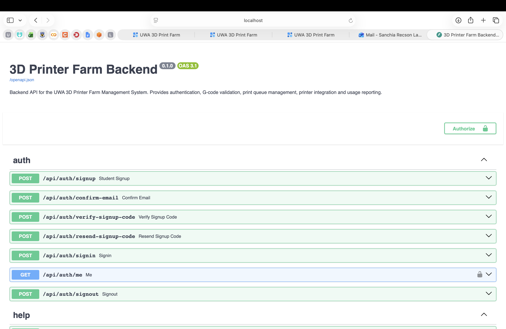

# Installation, Operations and Maintenance Guide

**UWA 3D Printer Farm Interface — Group 16**

| Document control | Details |
| --- | --- |
| Project team | Group 16 |
| Document | 03 — Installation, Operations and Maintenance Guide |
| Version | 1.3 |
| Document date and repository review date | 6 October 2026 |
| Reviewed branch | `main` |
| Reviewed commit | `019cc9945961afd3ef90e3568c7a1409b7b995a8` |
| Repository | [SanchiaLakkarvi/3D-printer-farm-interface](https://github.com/SanchiaLakkarvi/3D-printer-farm-interface) |

## Contents

1. [Scope and verification status](#1-scope-and-verification-status)
2. [Architecture and operating modes](#2-architecture-and-operating-modes)
3. [Prerequisites and clean checkout](#3-prerequisites-and-clean-checkout)
4. [Configuration reference](#4-configuration-reference)
5. [Normal Supabase configuration](#5-normal-supabase-configuration)
6. [Local demo configuration](#6-local-demo-configuration)
7. [Authentication and staff provisioning](#7-authentication-and-staff-provisioning)
8. [Database administration](#8-database-administration)
9. [Printer configuration and dispatch](#9-printer-configuration-and-dispatch)
10. [Uploaded files and storage](#10-uploaded-files-and-storage)
11. [Routine operations and troubleshooting](#11-routine-operations-and-troubleshooting)
12. [Backup and restore recommendations](#12-backup-and-restore-recommendations)
13. [Updates and rollback recommendations](#13-updates-and-rollback-recommendations)
14. [Maintenance responsibilities and deployment prerequisites](#14-maintenance-responsibilities-and-deployment-prerequisites)
15. [API, database and implementation references](#15-api-database-and-implementation-references)

## 1. Scope and verification status

This guide is for the technical operator receiving Group 16's UWA 3D Printer Farm Interface. It covers the supplied Docker setup, supported configuration paths and the operational work needed to retain accounts, jobs and uploaded files. For portal instructions, see the [User Manual](02-user-manual.md).

**The supplied Compose configuration is a development/demonstration setup. It is not a completed production deployment.** “Normal Supabase configuration” means that Supabase supplies PostgreSQL and authentication; the base Compose file still starts mock printers.

| Verification category | Evidence available |
| --- | --- |
| Verification evidence | Execution records for the previously listed syntax checks and ConfigParser diagnostic are not attached. These results remain unverified in this handover pack. |
| Installation procedures | Docker, database, authentication and printer setup instructions require verification in the receiving environment. |
| Local API documentation | The screenshot in Section 11.1 shows the backend API documentation page available locally. It does not establish that all endpoints work correctly. |
| Backup, restore and rollback | These procedures are recommendations. Successful execution has not been recorded in this guide. |
| Physical printers | Physical-printer integration and operation remain unverified for the documented version. |

### 1.1 Installation issues to resolve or account for

1. **Outdated migration smoke assertion:** `backend/tests/test_alembic_smoke.py` expects `0007_merge_queue_upload`; the reviewed graph's head is `0008_job_pause_notifications`. Its assertion needs updating before it can confirm the current release. The test also drops the database's `public` schema and must only run against a disposable test database.
2. **Percent encoding in Alembic URLs:** `backend/alembic/env.py` passes `DATABASE_URL` to ConfigParser without escaping `%`. Correctly encoded passwords containing reserved URL characters can therefore fail during migration configuration. Fix that handling in a reviewed code change; do not remove required password encoding or print the connection string while diagnosing it.

Long migration IDs are **not** a verified fresh-install defect at this commit: migration `0002` already widens `alembic_version.version_num` to `VARCHAR(255)` before recording its long revision ID. Section 8 explains that implemented control. A live clean migration run is still required.

## 2. Architecture and operating modes

| Component | Responsibility | Supplied runtime |
| --- | --- | --- |
| Frontend | Role selection, registration and verification forms, authenticated screens, uploads, queue/history, notifications, staff controls and analytics. Calls the API from the browser. | Node `22.14-bookworm-slim`; Vite/Vinext development server on port 5173. |
| Backend | FastAPI routes, account/profile checks, validation, pricing, queue scheduling, notifications, reporting and printer synchronisation. | Python `3.12-slim`; Uvicorn on port 8000. |
| PostgreSQL | Application profiles, materials, printers, jobs, validation records, notifications, collection records and maintenance records. | External Supabase database in the normal setup; PostgreSQL 16 service `db` in the demo overlay. |
| Authentication provider | Email/password authentication, registration email and code verification in the normal setup. | Supabase Auth; in-memory fake adapter in the local demo. |
| Backend storage | Accepted G-code files needed to dispatch jobs. | Host `backend/storage` bind-mounted to container `/app/storage`. |
| Mock printer service | Simulated printer states, PrusaLink-compatible commands, operator controls and monitor. | Python 3.12; service `mockserver` on port 8080. |
| Help service | General student help grounded in `Docs/help/student-help.md`. | Backend calls Anthropic; API key remains server-side. |
| BGCode converter | Enables full `.bgcode` validation by converting executable content for inspection. | Official Prusa libbgcode CLI compiled during the backend image build. |

The browser uses `NEXT_PUBLIC_API_BASE_URL`; it must reach that address itself. `http://backend:8000` is a container-network address and is not the correct API origin for a browser on the host.

The backend reads application data through SQLAlchemy, not through frontend Supabase database calls. Authentication credentials live in Supabase Auth; the application's `users` table supplies profile data and the authoritative role. Background polling reads connected printers and can dispatch waiting jobs.

The frontend contains Cloudflare/Vinext scaffolding and a Drizzle SQLite schema, but the current hosting configuration has no D1 or R2 binding. `npm run db:generate` is not the PostgreSQL migration command. The application's database migration system is backend Alembic.

### 2.1 Choose one mode

| Mode | Compose files | Database/authentication | Important boundary |
| --- | --- | --- | --- |
| Normal Supabase | `docker-compose.yml`, plus an operator override when needed | Supabase PostgreSQL and `AUTH_ADAPTER=supabase` | Base Compose still provides mock printers, demo seeding and local browser origins. |
| Local demo | `docker-compose.yml` followed by `docker-compose.demo.yml` | Container PostgreSQL and `AUTH_ADAPTER=fake` | Disposable demonstration identities; no genuine email verification. |
| Optional generated queue demo | Both files above followed by `docker-compose.queue-demo.yml` | Fake authentication and generated submissions | Adds traffic, changes demo accounts and simulation speed. Not required for basic installation. |

Do not run normal and demo copies concurrently with the supplied names and ports: the files set fixed container names `backend`, `frontend` and `mockserver`. Use separate working directories and controlled overrides if separate installations are needed. Switching database modes in the same checkout also reuses `backend/storage`; keep environment data separated deliberately.

## 3. Prerequisites and clean checkout

### 3.1 Required for the Docker route

- Git and Docker Engine/Desktop with the Compose v2 command `docker compose`.
- A running Docker daemon and permission to use it.
- Free host ports 5173, 8000 and 8080, or reviewed port/origin overrides.
- Internet access to pull container images and fetch npm, Python, Prusa and native-build dependencies.
- Writable space for the checkout, `backend/storage`, build caches and the demo database volume.
- For normal authentication, access to the chosen Supabase project, its connection settings and email configuration.
- For chatbot operation, an authorised Anthropic API account/key and outbound HTTPS connectivity.

Host Python and Node installations are not required to run the Docker route. Native development requires Python 3.12 and Node at least 22.13.0, as specified by the image/manifests. Native binary builds also need Git, CMake and a compiler toolchain. The frontend's supplied `install:ci` helper requires Linux `flock`, GNU `timeout`, `curl` and `sha256sum`; it is not a portable macOS installation script.

On macOS or Windows, open Docker Desktop and wait until its engine is running. Then check the required tools and Docker connection:

```bash
git --version
docker --version
docker compose version
docker info

### 3.2 Obtain the reviewed revision

Run from a directory where the new checkout can be created:

```bash
git clone https://github.com/SanchiaLakkarvi/3D-printer-farm-interface.git
cd 3D-printer-farm-interface
git checkout --detach 019cc9945961afd3ef90e3568c7a1409b7b995a8
git rev-parse HEAD
```

The detached checkout makes the documented version reproducible. Use a separate working branch for later changes. It does not delete another checkout or update an existing deployment.

Create the backend environment file only if it does not already exist:

```bash
cp -n backend/.env.example backend/.env
mkdir -p backend/storage
```

Edit `backend/.env` for the chosen mode. The supplied example defaults to **fake authentication**, so copying it alone does not enable Supabase authentication. Do not overwrite a configured file with the example during an update.

The frontend `.env.example` currently repeats backend-style settings and does not supply the required browser API variable. Do not copy database credentials or privileged keys into frontend configuration. Compose already supplies the browser API origin. For native frontend development, create a frontend `.env.local` containing only the required public setting, for example:

```dotenv
NEXT_PUBLIC_API_BASE_URL=http://localhost:8000
```

## 4. Configuration reference

### 4.1 Configuration locations and precedence

| Location | Purpose |
| --- | --- |
| `backend/.env` | Backend values loaded through Compose `env_file`; also read by Pydantic when running natively from `backend/`. |
| Repository-root `.env` or operator shell | Compose interpolation, notably the demo overlay's `DEMO_ACCOUNTS` expression. It is not automatically a backend environment file. |
| Compose `environment` blocks | Override values loaded from `backend/.env`. |
| Frontend environment | Public API origin; the current frontend Compose block sets it explicitly. |
| Mock YAML/environment | Simulator profiles, identities, storage and speed; distinct from backend printer database records. |

The base Compose file explicitly overrides `FILE_STORAGE_ROOT`, `RUN_MIGRATIONS`, `CORS_ORIGINS`, `MOCK_PRINTER_BASE_URL`, `PRINTER_POLL_INTERVAL_S`, `HELP_DOCS_ROOT` and `RUN_SEED`. Changing those values only in `backend/.env` will not change the effective base Compose settings.

The demo overlay additionally overrides database connection, auth mode and demo accounts. Use an explicit final override file when a Compose-defined value must change. Container recreation, not a simple restart, is required after environment changes.

All angle-bracket values below are placeholders to replace through private configuration. Do not commit filled environment files, credentials, database dumps or print files.

### 4.2 Backend application, database and authentication

| Variable | Default or placeholder | Meaning |
| --- | --- | --- |
| `APP_NAME` | `3D Printer Farm Backend` | API display name. |
| `APP_ENV` | `development` | Environment label; changing it does not add TLS, enforce production security or select a production server. |
| `API_PREFIX` | `/api` | Backend route prefix. The frontend clients currently expect `/api`; keep them aligned. |
| `DATABASE_URL` | `postgresql+psycopg://<db-user>:<encoded-password>@<db-host>:<port>/<database>?sslmode=require` | SQLAlchemy connection. Copy host, port and username from the provider; the `+psycopg` driver prefix is required for this configuration. |
| `AUTH_ADAPTER` | `fake`; set `supabase` for normal auth | Selects the authentication adapter. Use the two implemented values exactly. |
| `SUPABASE_URL` | `https://<project-ref>.supabase.co` | Supabase Auth project origin. |
| `SUPABASE_ANON_KEY` | `<supabase-anon-key>` | Used in the provider's signup, signin, verification and token-validation requests. |
| `SUPABASE_SERVICE_ROLE_KEY` | `<supabase-service-role-key>` | Required by adapter construction; privileged server-side provider operations use it. Never expose it to the browser. |
| `DEMO_ACCOUNTS` | `<student-email>:<demo-password>:student,<staff-email>:<demo-password>:farmer,<admin-email>:<demo-password>:admin` | Fake-auth startup identities; optional fourth field is department. Passwords/fields must not contain the format's separators `:` or `,`. |
| `JWT_SECRET_KEY` | `<random-secret-placeholder>` | Declared setting; the reviewed fake/Supabase authentication flows do not mint application JWTs with it. |
| `JWT_ALGORITHM` | `HS256` | Declared setting; does not change Supabase's signing algorithm. |
| `ACCESS_TOKEN_EXPIRE_MINUTES` | `60` | Declared setting; does not set Supabase token lifetime or an expiry for the fake tokens. |
| `CORS_ORIGINS` | `http://localhost:5173,http://localhost:3000` | Comma-separated browser origins. Base Compose fixes these local values. The first origin is also used to derive the email redirect URL. |

For an IPv4-only Docker network, use the provider's **Session pooler** connection if its direct address is unreachable. Do not guess a pooler host from the region. Use proper URL encoding for credentials, and resolve the Alembic interpolation issue in Section 1 before migrating a URL containing `%`.

### 4.3 Storage, printing and help

| Variable | Current default/effective value | Meaning |
| --- | --- | --- |
| `FILE_STORAGE_ROOT` | Native `./storage`; Compose `/app/storage` through working directory `/app` | Backend upload root. Base Compose fixes the relative setting and binds the host directory. |
| `MAX_UPLOAD_BYTES` | `52428800` | 50 MiB; messages describe it as a 50 MB limit. |
| `PRINTER_ADAPTER` | `mock` | Declared setting; the reviewed factory actually selects the PrusaLink adapter from each printer row's URL. This variable alone does not switch to physical printers. |
| `PRINTER_POLL_INTERVAL_S` | Native `0`; base/demo Compose `2` | Positive values enable background synchronisation/dispatch; `0` disables it. Actual cycle spacing also includes work performed during the cycle. |
| `MOCK_PRINTER_BASE_URL` | Native `http://localhost:8080`; Compose `http://mockserver:8080` | Used when seeding mock connection URLs. Changing it does not rewrite existing printer rows. |
| `BGCODE_BIN` | `<path-to-bgcode>` if explicitly set | Converter override read directly from process environment; otherwise searches `PATH` and the local `.tools/bin` build. Native `.env` loading alone does not export this variable to `os.environ`. |
| `ANTHROPIC_API_KEY` | `<anthropic-api-key>` or empty | Server-only chatbot key. An empty value leaves the UI entry visible but makes help unavailable. |
| `ANTHROPIC_MODEL` | `claude-haiku-4-5-20251001` | Configured provider model; access/availability must be checked with the provider. |
| `HELP_DOCS_ROOT` | Native `../Docs/help`; Compose `/app/help` | Directory containing `student-help.md`. Base Compose mounts this directory read-only. |
| `HELP_MAX_MESSAGE_CHARS` | `1000` | Backend message limit; frontend also limits questions to 1,000 characters. |
| `HELP_MAX_HISTORY_MESSAGES` | `6` | Backend history bound; frontend also sends at most its recent six messages. |
| `HELP_MAX_OUTPUT_TOKENS` | `400` | Maximum configured provider output. |
| `HELP_RATE_LIMIT_REQUESTS` | `10` | Requests allowed per client IP within the configured window. |
| `HELP_RATE_LIMIT_WINDOW_SECONDS` | `60` | In-memory rate-limit window. |
| `HELP_PROVIDER_TIMEOUT_S` | `10` | External help request timeout. |
| `RUN_MIGRATIONS` | Base `0`; demo `1` | Entrypoint runs `alembic upgrade head` only for `1`. |
| `RUN_SEED` | Base/demo `1` | Entrypoint runs the demo material/printer seed. It is not a general inventory synchronisation routine. |

The frontend's matching limits and backend limits must be updated together if the chatbot's accepted message/history size changes. Rate limiting and help-reference caching are process-local; restart the backend after changing the help reference so cached content is reloaded.

### 4.4 Mock and build settings

| Setting | Current behaviour |
| --- | --- |
| `MOCK_PRINTER_CONFIG` | Mock process environment; default `config/printers.yaml` inside its working directory. |
| `MOCK_SIMULATION_SPEED` | Optional mock process override applied to all configured printers. Defaults in the runnable YAML are 120 for XL and 60 for CORE One. |
| `BGCODE_BUILD_DIR` | Optional native converter-build directory override. Not a backend application setting. |
| Frontend `HOST` / `PORT` | Image values are `0.0.0.0` / `5173`; the command also explicitly supplies host and port. |
| Frontend build helper settings | `SITES_BUILD_TIMEOUT` defaults to `3m`; install helper defaults to an `8m` timeout. The scripts also expose kill-delay/cache settings. These control development tooling, not portal roles or application storage. |

Mock environment values belong on the `mockserver` service or its native process; setting them only in `backend/.env` does not configure the separate mock container. Its YAML is copied into the image, with no supplied live bind mount, so rebuild/recreate it after editing that file.

## 5. Normal Supabase configuration

This route uses the base Docker images with a selected Supabase project. It does not establish production hosting or a physical-printer connection.

### 5.1 Set private backend values

Edit `backend/.env` with the project's actual private values. A minimal reference is:

```dotenv
APP_ENV=development
API_PREFIX=/api
AUTH_ADAPTER=supabase
DATABASE_URL=postgresql+psycopg://<db-user>:<encoded-password>@<db-host>:<port>/<database>?sslmode=require
SUPABASE_URL=https://<project-ref>.supabase.co
SUPABASE_ANON_KEY=<supabase-anon-key>
SUPABASE_SERVICE_ROLE_KEY=<supabase-service-role-key>
ANTHROPIC_API_KEY=<anthropic-api-key-or-leave-empty>
```

Replace or remove placeholder values before running. An unused chatbot key may be left empty. Keep `DATABASE_URL` and the Auth project aligned; profile UUIDs must correspond to identities in that Auth project.

### 5.2 Use a controlled operator override

**Recommended configuration, not a supplied file:** create `compose.operations.yml` in the repository root to prevent automatic seeding and dispatch while inspecting a client database:

```yaml
services:
  backend:
    environment:
      RUN_MIGRATIONS: "0"
      RUN_SEED: "0"
      PRINTER_POLL_INTERVAL_S: "0"
```

This changes startup behaviour without altering the tracked base file. All commands in this section include that override. Retain it privately with the deployment configuration.

### 5.3 Build and prepare the database

```bash
docker compose -f docker-compose.yml -f compose.operations.yml config --quiet
docker compose -f docker-compose.yml -f compose.operations.yml build
docker compose -f docker-compose.yml -f compose.operations.yml run --rm --no-deps --entrypoint alembic backend heads
docker compose -f docker-compose.yml -f compose.operations.yml run --rm --no-deps --entrypoint alembic backend current
```

`config --quiet` validates Compose without printing the resolved secret-bearing environment. The image build downloads dependencies and compiles the converter. `--entrypoint alembic` bypasses the normal startup script, so it does not run seeding or start Uvicorn.

Follow Section 8 to handle a fresh database or an existing database correctly. **Schema-changing command, reviewed only:** once the database state and migration issues have been addressed:

```bash
docker compose -f docker-compose.yml -f compose.operations.yml run --rm --no-deps --entrypoint alembic backend upgrade head
docker compose -f docker-compose.yml -f compose.operations.yml run --rm --no-deps --entrypoint alembic backend current
```

The migration target is the database specified by this configuration. It is not limited to a local container. Do not run it against a shared database without its owner's migration plan and recovery point.

### 5.4 Configure authentication, inventory and polling

1. Complete Supabase email/code configuration and staff provisioning in Section 7.
2. Create or review materials and printers through the supported administrator API in Section 9. A blank inventory is expected if seeding was deliberately disabled.
3. Keep polling disabled during recovery, inventory changes or physical-integration preparation.
4. When ready for the intended mock or tested printer connections, change the override's `PRINTER_POLL_INTERVAL_S` to `"2"` and recreate the backend.

For a disposable Supabase-backed mock demonstration only, demo inventory can be inserted explicitly after migration:

```bash
docker compose -f docker-compose.yml -f compose.operations.yml run --rm --no-deps --entrypoint python backend -m app.scripts.seed_printers
```

**Database write:** this adds synthetic materials and mock-connected printer records. It does not discover or register physical printers. The seed stops immediately if the materials table is non-empty; it does not repair a partially populated inventory or update existing connection URLs.

### 5.5 Start and check

```bash
docker compose -f docker-compose.yml -f compose.operations.yml up -d
docker compose -f docker-compose.yml -f compose.operations.yml ps
docker compose -f docker-compose.yml -f compose.operations.yml logs --tail=100 backend
```

Use the URLs and functional checks in Section 11. Record the actual startup, migration, email, upload and printer-control results for the deployment rather than treating the code review as an installation test.

## 6. Local demo configuration

The demo overlay supplies PostgreSQL 16, fake authentication and startup demo accounts. It still requires `backend/.env` because that `env_file` is inherited from the base file; real Supabase credentials are unnecessary for this mode.

### 6.1 Prepare and start

1. Complete the clean checkout and environment-file creation in Section 3.
2. Leave Supabase keys empty for this isolated demo. Supply an Anthropic key only if demonstrating the chatbot.
3. Review database preparation and migration-state handling in Section 8 before treating first startup as successful.
4. Validate, build and start with both files, in this order:

```bash
docker compose -f docker-compose.yml -f docker-compose.demo.yml config --quiet
docker compose -f docker-compose.yml -f docker-compose.demo.yml up -d --build
docker compose -f docker-compose.yml -f docker-compose.demo.yml ps
docker compose -f docker-compose.yml -f docker-compose.demo.yml logs --tail=100 backend db
```
Once the services are running, open:

- Portal: http://localhost:5173
- Backend API reference: http://localhost:8000/docs
- Mock-printer monitor: http://localhost:8080/monitor

Use the demonstration accounts in [User Manual, Section 6](02-user-manual.md#6-demo-environment-only). Check both service status and the application workflow; a running container alone does not confirm successful installation.

On startup, the demo database health check runs `pg_isready`. The backend entrypoint then migrates and seeds; its shell exits on either command's failure. A failed migration can prevent the API from starting.

If first startup fails, inspect the migration logs and actual schema/revision before retrying. Migration `0002` already widens the version column; no additional manual width workaround is prescribed for the normal migration path.

### 6.2 Demo authentication

Default synthetic accounts are defined in `docker-compose.demo.yml`; their user instructions are in the User Manual's demo section. This guide uses placeholders for credentials.

To choose your own synthetic identities, put the following in the repository-root `.env` for Compose interpolation, replacing every placeholder:

```dotenv
DEMO_ACCOUNTS=<student-id>@student.uwa.edu.au:<demo-password>:student,<farmer-email>:<demo-password>:farmer,<admin-email>:<demo-password>:admin
```

The format supports `email:password:role[:department]`; permitted roles are `student`, `farmer` and `admin`. Values must not contain the separators. The overlay's default expression takes precedence over a value placed only in `backend/.env`.

The fake adapter does not send mail. Its signup verification code is fixed by the implementation; it demonstrates the form flow, not email delivery. Fake identities and tokens are in memory. Configured startup accounts are recreated with existing profile IDs and roles when possible; an unseeded registration can lose its ability to sign in after a restart even though its profile remains in PostgreSQL. The database's named `demo-db` volume persists until deliberately removed.

### 6.3 Optional traffic generator

The optional queue overlay adds generated submissions and changes the demo accounts and simulation speed. It is not required for the basic demonstration.

At the reviewed commit, its `queue-demo` build context does not match the backend Dockerfile's expected paths. Correct and test this configuration before using the optional generator.

## 7. Authentication and staff provisioning

### 7.1 Supabase email/password and signup codes

For the chosen project:

1. Enable email/password authentication and email confirmation in Supabase Auth.
2. Set the Auth Site URL and permitted redirect origins for the actual frontend. For local Compose use `http://localhost:5173`; base Compose derives the redirect from its first CORS origin.
3. Configure **Confirm sign up** email content to display Supabase's `{{ .Token }}` six-digit code. The current frontend expects code entry and calls `/api/auth/verify-signup-code`.
4. Configure a suitable provider email/SMTP service in Supabase if required for the intended recipients and volume. The backend has no SMTP host/user/password settings of its own.
5. Test real registration, receipt of the code, resend, verification and password sign-in with an authorised test student email.

A minimal recommended email body is:

```html
<h2>Verify your Print Farm email</h2>
<p>Enter this code in the Print Farm verification screen:</p>
<p><strong>{{ .Token }}</strong></p>
<p>If you did not register, contact your account administrator.</p>
```

The backend retains a legacy `/api/auth/confirm-email` endpoint. Older link-template comments in `config.py` do not establish a connected confirmation-link screen in the current frontend. Use the code template for this interface and do not assume merely opening a custom `token_hash` link completes the current user flow.

Student self-registration accepts the `@student.uwa.edu.au` domain. It records metadata in Auth; the application creates the Student profile on first confirmed sign-in. This is email/password authentication backed by Supabase, not implemented UWA single sign-on.

### 7.2 Provision Farmer and Administrator accounts

**Manual operator procedure, reviewed against the application schema and provider capability; not an implemented portal workflow.** The current application has no staff-creation CLI or staff-user API. **Users & access** is a placeholder. An Auth identity alone is insufficient for a staff email: the application needs a matching `users` row.

1. An authorised Supabase project administrator creates an email/password identity using the project's Auth administration interface or supported server-side Auth administration API. Complete the provider's confirmation requirements; do not assume an unimplemented invitation-acceptance screen exists in this portal.
2. Record that identity's actual Auth UUID privately.
3. Insert the application profile using that exact UUID. Do not let the table generate an unrelated UUID. Review the email, names, role and department before committing.
4. Sign in through the matching **Printer Farmer** or **Administrator** access option.
5. Check `/api/auth/me` and, where appropriate, `/api/rbac/farmer` or `/api/rbac/admin` using the issued bearer token. Do not paste tokens into documentation or shared logs.

Example profile insertion through an authorised database session:

```sql
BEGIN;
INSERT INTO public.users
  (id, email, first_name, last_name, student_number, role, department)
VALUES
  ('<auth-user-uuid>'::uuid, '<staff-email>', '<first-name>', '<last-name>',
   NULL, 'farmer'::user_role, '<department>');
COMMIT;
```

For an Administrator, use `admin` instead of `farmer`. **Privileged database write:** this grants application access to the chosen identity. It is not an upsert or a role-change script; stop and inspect an existing UUID/email rather than blindly replacing it. Passwords belong in Auth, never in `public.users`.

Role authorisation comes from the stored application profile. A frontend role choice or an Auth metadata field alone does not provision an application role.

### 7.3 Account operation limits

The frontend stores its access token for the browser session and checks `/api/auth/me` when restoring access. Logout discards that local token. `/api/auth/signout` does not revoke a Supabase token server-side, and the frontend has no refresh-token or password-reset workflow. Provider account recovery/revocation and staff deprovisioning therefore need an operator-owned process. Avoid deleting profiles with related jobs or staff records without reviewing foreign-key dependencies and record-retention requirements.

## 8. Database administration

### 8.1 Migration graph and current target

Alembic reads `DATABASE_URL` through `backend/alembic/env.py`. The two `0005` branches converge at `0007_merge_queue_upload`; the single reviewed head is **`0008_job_pause_notifications`**. Do not infer order from filenames alone.

From the normal Docker route, use the commands in Section 5. For a native backend with its dependencies installed, run from `backend/`:

```bash
alembic heads
alembic history
alembic current
```

These inspect the migration graph/database version. Applying `alembic upgrade head` changes the configured database schema. The backend does not create application tables automatically on API startup unless its entrypoint is explicitly told to run migrations.

### 8.2 Empty database and version-table width

For a genuinely empty database, the intended route is `alembic upgrade head`. The baseline creates application tables and enum types; later revisions adapt profiles, add timing, upload and connection fields, then pause notifications.

Several revision IDs exceed Alembic's standard 32-character version column. The supplied `0002_queue_indexes_drop_queue_position` migration already executes `ALTER TABLE alembic_version ALTER COLUMN version_num TYPE VARCHAR(255)` before Alembic records that revision. This is an implemented control, not an outstanding width defect or a proposed manual workaround. The baseline ID fits the initial column.

If an existing database reports truncation, inspect its actual metadata column, recorded revision and whether the supplied migrations were applied normally. Do not assume that a historical failure still affects this checkout or stamp a long revision over an unchanged metadata table. The full PostgreSQL upgrade has not been executed in this review.

For read-only inspection in the local demo, an operator can enter the database session with:

```bash
docker compose -f docker-compose.yml -f docker-compose.demo.yml exec db psql -U printfarm -d printfarm
```

Use inspected migration/schema information to choose the correct migration route, then exit with `\q`. Do not alter a persistent client database merely to suppress an unexplained error.

### 8.3 Existing schema

The baseline explicitly creates tables and is not safe to rerun over an existing unversioned schema. Compare the actual schema and enum values with the migrations before deciding its starting revision.

**Migration metadata write, not schema repair:** only if the database already matches the baseline exactly, an authorised operator can record that baseline:

```bash
docker compose -f docker-compose.yml -f compose.operations.yml run --rm --no-deps --entrypoint alembic backend stamp 0001_baseline_existing_schema
```

Then apply the reviewed later migrations. Do not stamp `head` just to suppress errors: stamping changes the recorded version without creating columns or converting existing data. Existing databases already beyond the baseline require their own schema comparison and appropriate version recording.

Migration `0004` drops historical `auth_hash` and old profile columns during conversion. Several downgrades drop columns/tables and cannot restore original credentials or safely remove PostgreSQL enum values. They are not a guaranteed rollback mechanism.

### 8.4 Database reference

| Table | Operational data |
| --- | --- |
| `users` | Auth-corresponding UUID, unique email, names, student number, role and department. |
| `materials` | Material name, type and colour; no remaining-stock balance. |
| `printers` | Machine configuration/state, current material, validator profile and PrusaLink connection fields. |
| `print_jobs` | Owner, selected printer/material, file path, status, estimates, actual values and lifecycle timestamps. |
| `job_validations` | Checks recorded for accepted submissions. |
| `notifications` | Account-addressed lifecycle messages and read status. |
| `collection_records` | Staff removal/readiness confirmation; a `collected_at` column exists but the current portal does not record student pickup. |
| `maintenance_logs` | Maintenance data model; the current Maintenance screen has no connected editor. |
| `alembic_version` | Recorded migration revision; include it in application backups. |

The current SQLAlchemy models and migrations are the database reference. Historical schema Markdown may omit later changes. Migrations do not install a complete Row Level Security policy set; review database privileges and any provider Data API exposure independently of FastAPI role checks.

## 9. Printer configuration and dispatch

### 9.1 Mock connections

The base stack starts `mockserver` and seeds connection URLs of the form:

```text
http://mockserver:8080/prusalink/<mock-printer-id>
```

The seed uses `mock-coreone-01` and `mock-xl-01`, synthetic connection credentials and validator-profile IDs `core_one_hf04` / `xl_5t_is_04`. These backend IDs differ from the mock YAML's approved-profile IDs; do not substitute one naming system for the other.

The runnable mock YAML also points its SDK telemetry at `http://host.docker.internal:9000`. Base Compose supplies no service on port 9000. The application's connected route is its PrusaLink-compatible API; a missing Connect-compatible telemetry receiver must not be described as a delivered external Prusa Connect integration.

Mock state is in memory. Mock storage directories are inside its container with no supplied persistent bind mount/volume; recreation loses them. Restart can reset job/simulation state even when the application's database still contains jobs. Reconcile demo state rather than assuming a restart resumes a mock print accurately.

### 9.2 Configure inventory through the supported API

With an Administrator token, the backend supports:

- `GET`, `POST` and `PATCH` material routes at `/api/materials` and `/api/materials/{material_id}`.
- `GET`, `POST`, `PATCH` and `DELETE` printer routes at `/api/printers` and `/api/printers/{printer_id}`.

Use `/docs` to inspect the current request schemas. Example printer-create body, with private placeholders:

```json
{
  "model": "<printer-model>",
  "bed_size": "<bed-width>x<bed-depth>",
  "location": "<printer-location>",
  "status": "maintenance",
  "locked_profile": {"validator_profile": "core_one_hf04"},
  "current_material_id": "<material-uuid>",
  "prusalink_url": "<reachable-prusalink-base-url>",
  "prusalink_username": "<printer-username>",
  "prusalink_password": "<printer-password>"
}
```

Use the XL validator ID where appropriate. Create a record in `maintenance` until its connection, profile and material are verified. When ready, an authorised operator can update its status through the API. **Maintenance** and **Users & access** frontend pages are placeholders, so they cannot perform these administrative operations.

Printer credentials are stored as text in the application database and omitted from the public printer response schema. Protect database access and backups accordingly. **Destructive API action:** deleting a printer removes its configuration record; related foreign keys can reject the deletion. Prefer taking a machine out of service with its status instead of deleting records needed by history.

### 9.3 Physical integration prerequisites

The adapter uses PrusaLink HTTP Digest authentication and each printer's configured URL. Physical operation requires network reachability from the backend, correct credentials/API behaviour, the actual machine/nozzle matching its validator profile, a prepared bed/material and verified lifecycle handling. The disabled `uwa-printers.template.yaml` is a simulator configuration template; enabling it does not connect this application to physical hardware.

There is no release-specific physical-printer execution evidence in this review. Before enabling dispatch to real machines, validate status, upload/start, pause/resume, faults, reconnects, successful completion and removal confirmation with trained staff. A file-format validation pass does not constitute physical-machine commissioning.

### 9.4 Dispatch and maintenance boundaries

Positive `PRINTER_POLL_INTERVAL_S` enables the backend poller. It dispatches the oldest eligible waiting job for a ready connected printer. A `completed` job blocks the next job until staff select **Collect** after removing the print; that action records `ready_for_collection`. It does not await student pickup. Failed jobs do not create the same completed-print removal hold.

Maintenance-status printers are skipped by synchronisation. Polling is created in each backend process; no cross-process leader election is supplied. Keep one dispatching backend process/instance until concurrency and deployment behaviour are explicitly designed and tested. Stopping the API does not send pause/stop commands to a physical printer.

## 10. Uploaded files and storage

### 10.1 Connected frontend submission route

| Action | File behaviour |
| --- | --- |
| `POST /api/jobs/validate` | Reads and validates in temporary storage; does not create a queued job or retain the uploaded file in the upload root. Temporary converter output is cleaned up. |
| `POST /api/jobs` | Revalidates, writes the accepted file under `FILE_STORAGE_ROOT/uploads/<job-uuid>/<normalised-filename>`, then commits the queued job and validation records. A database commit failure attempts to remove its file/directory. |
| Queue dispatch | Reads that stored file and uploads it to the selected printer. Database rows alone cannot supply missing G-code bytes. |
| Staff **Collect** | Commits removal/readiness and a notification, then attempts to delete the accepted file and empty job directory. Deletion is best-effort; an OS error is ignored and readiness remains recorded. |

Under Compose, the corresponding host path is `backend/storage/uploads/<job-uuid>/...`. Keep the `/app` working directory/storage mapping consistent on recovery because stored paths depend on it. History retains job metadata after a file is deleted; the frontend does not provide a one-click reprint/download archive.

### 10.2 Other retained files and gaps

The backend-only `/api/jobs/upload` route uses a different layout, `FILE_STORAGE_ROOT/<user-uuid>/<job-uuid>.gcode` or `.gco`, and creates `pending_selection`. Its content-validation hook is currently a no-op. It is not the frontend's fully validated submission route and should not be advertised as an equivalent printing workflow.

Its relative storage keys also differ from the path handling used by dispatch/collection. Do not assume that legacy-route files receive the connected route's successful cleanup. Back up the whole storage root, not just `uploads/`.

No scheduled expiry, orphan-file reconciliation, failed-job cleanup or storage quota beyond the per-upload size limit is supplied. Monitor disk usage, inspect failed/pending files and define a client-approved retention policy before deleting them. Do not delete files referenced by waiting/running jobs. A readiness status does not prove physical file deletion succeeded.

## 11. Routine operations and troubleshooting

### 11.1 URLs and health checks

For the supplied local ports:

| URL | Purpose and limit |
| --- | --- |
| [http://localhost:5173](http://localhost:5173) | Browser portal on the host running Compose. |
| [http://localhost:8000/health](http://localhost:8000/health) | Static backend liveness response: `status: ok`, `service: 3d-print-farm-backend`. Does not check database, Auth, help or printer readiness. |
| [http://localhost:8000/docs](http://localhost:8000/docs) | FastAPI interactive API schema. |
| [http://localhost:8000/redoc](http://localhost:8000/redoc) | Alternative API reference. |
| [http://localhost:8000/openapi.json](http://localhost:8000/openapi.json) | Machine-readable backend API contract. |
| [http://localhost:8080/health](http://localhost:8080/health) | Mock response containing `ok` and configured worker count; not physical-printer readiness. |
| [http://localhost:8080/monitor](http://localhost:8080/monitor) | Mock printer monitor. |
| [http://localhost:8080/docs](http://localhost:8080/docs) | Mock API, including operator controls. |

Read-only checks:

```bash
curl --fail --show-error http://localhost:8000/health
curl --fail --show-error http://localhost:8080/health
```

Also check sign-in and `/api/auth/me`, material/printer listings, one authorised test upload, queue/history, lifecycle notifications and the required reporting views. Test chatbot and real verification email separately. Base Compose has startup dependencies but no backend/frontend/mock Docker health checks or restart policies; only the demo database has a health check.



*Interactive backend API reference in the local environment. This screen shows the available API documentation; it does not confirm that every endpoint has been tested.*

### 11.2 Logs

Normal mode:

```bash
docker compose -f docker-compose.yml -f compose.operations.yml logs --tail=100 backend frontend mockserver
docker compose -f docker-compose.yml -f compose.operations.yml logs -f backend
```

Demo mode:

```bash
docker compose -f docker-compose.yml -f docker-compose.demo.yml logs --tail=100 backend db mockserver
```

Check entrypoint migration/seed messages, Uvicorn errors, `Printer sync cycle failed`, connection errors and demo account seeding failures. `Could not seed DEMO_ACCOUNTS` can be logged while API startup continues; a liveness response therefore does not prove demo sign-in is ready. Redact secrets and personal data before sharing logs. There is no supplied central logging, log-retention or alerting configuration.

### 11.3 Stop, restart and apply changed configuration

Arrange a maintenance window and reconcile active printer jobs first. Stopping these services interrupts monitoring and dispatch; it does not automatically stop a physical print.

Normal mode:

```bash
docker compose -f docker-compose.yml -f compose.operations.yml stop
docker compose -f docker-compose.yml -f compose.operations.yml start
docker compose -f docker-compose.yml -f compose.operations.yml restart backend
```

For changed environment settings, recreate the service:

```bash
docker compose -f docker-compose.yml -f compose.operations.yml up -d --force-recreate backend
```

For source/dependency changes, rebuild as well:

```bash
docker compose -f docker-compose.yml -f compose.operations.yml up -d --build
```

Use the same `-f docker-compose.yml -f docker-compose.demo.yml` pair for demo lifecycle commands. Ordinary `restart` uses the existing container environment. Backend restart also reloads cached settings/help reference and resets fake-auth sessions. Mock restart/recreation resets simulation state and requires job reconciliation.

To remove stopped demo containers/network while retaining the named database volume and host uploads:

```bash
docker compose -f docker-compose.yml -f docker-compose.demo.yml down
```

This still removes the mock container's unmounted storage. **Destructive reset — disposable demo only:**

```bash
docker compose -f docker-compose.yml -f docker-compose.demo.yml down --volumes
```

This removes this Compose project's named demo database volume as well as its containers/network. It does not delete the host's `backend/storage` bind-mounted files, and it does not erase an external Supabase database. Never use it as an update or backup command.

### 11.4 Common problems

| Problem | Check/action |
| --- | --- |
| Cannot connect to the Docker daemon or `docker.sock` is missing | Open Docker Desktop and wait for the engine to start. Run `docker info` to check the connection, then retry the Compose command for your selected mode. |
| Missing `backend/.env` | Create it from the example without overwriting existing values. The demo overlay still inherits this file requirement. |
| Container-name or port collision | Identify the existing installation before stopping it. A different Compose project name alone does not remove the supplied fixed-name collision. |
| Backend exits during first demo startup | Read migration/seed logs. Check database health, configured URL and actual schema/revision before retrying. |
| Unexpected `value too long for type character varying(32)` | Migration `0002` already widens the column to 255. Inspect whether this checkout and its migrations were used normally and whether an existing database was stamped inconsistently; do not stamp `head` to hide it. |
| `invalid interpolation syntax` during Alembic configuration | Percent-encoded credentials can trigger the reviewed ConfigParser issue. Correct URL handling in the migration configuration; retain safe credential encoding. |
| Duplicate table/column/enum migration errors | Existing schema and recorded revision may disagree. Inspect both; do not drop tables or stamp revisions blindly. |
| Database unreachable from Docker | Verify actual host/port/user, provider access and IPv4/IPv6 route. Use the provider Session pooler where appropriate. |
| Health is OK but login fails | Check auth mode, all Supabase values, provider reachability, email confirmation and matching profile UUID. Liveness does not validate these. |
| Email contains a link but no code | Align the Supabase Confirm sign up template with `{{ .Token }}` and the six-digit UI. |
| Verification email does not arrive | Check provider email limits/configuration and delivery logs. Fake mode sends no email. |
| Frontend cannot reach API/CORS failure | Use a browser-reachable API origin; keep CORS and UI origin aligned. Compose literals can override the `.env` change. |
| No inventory after seed | The seed returns immediately when the materials table already has rows. Create/reconcile records through the authorised API; do not empty the table to force seeding. |
| Jobs never start | Check effective polling interval, printer URL/state, stored G-code and completed-print removal hold. `0` polling deliberately disables dispatch. |
| Printer URL change in `.env` has no effect | Existing database rows retain their connection URLs. Update the intended row through the administrator API. |
| `.bgcode` cannot be fully validated | Check the converter exists/is executable and build dependencies completed. Native use can export `BGCODE_BIN`; do not bypass full validation. |
| Upload fails or disk fills | Inspect host storage ownership, free space and upload limit. Retention/deletion is not fully automated. |
| Help returns unavailable | Check Anthropic key/model access, outbound HTTPS, timeout and readable non-empty `student-help.md`. Restart after reference edits. |
| Native frontend build/helper fails | Check Node version and the scripts' Linux/GNU utility requirements. Docker's frontend build installs with `npm ci` and runs a development server; it does not execute `npm run build`. |
| Queue traffic generator image fails to build | Its overlay context does not match the current backend Dockerfile copy layout. Reconcile and test the optional overlay before use. |

## 12. Backup and restore recommendations

**No automated application backup, restore or recovery drill is supplied.** The procedures below are recommendations reviewed against the data layout and PostgreSQL utilities. They have not been executed or accepted as a client recovery plan. Agree backup frequency, retention, recovery-point and recovery-time targets with the owner.

### 12.1 What a recoverable handover needs

| Asset | Recovery requirement |
| --- | --- |
| Application database | Schema, enum types, data and `alembic_version`, including all eight application tables. |
| Supabase Auth identities | Preserve the identities/UUIDs corresponding to `users.id`, together with an appropriate provider recovery process. A `public` schema dump does not include them. |
| Backend storage | Entire `backend/storage` or configured equivalent, captured consistently with the database. |
| Release/configuration | Commit/image identity, migrations, operator overrides, effective storage mapping, Auth/email settings, mock configuration where required and help reference. |
| Secrets | Recover through approved private credential storage, separately from public repository artifacts. Database backups can also contain printer passwords. |
| Printer state | Reconcile physically running jobs and bed state after recovery; a database restore is not a printer-state restore. |

Wait for jobs to settle or manage them under the lab procedure, block new submissions and stop backend writes/dispatch before a paired database/file snapshot. Stopping the frontend alone does not prevent direct API requests. Do not delete the mock container before capturing any mock files you deliberately need to retain.

### 12.2 Recommended local-demo backup

Run from the repository root after agreeing downtime. These commands stop the demo frontend/backend, leave `db` running and export its database:

```bash
umask 077
BACKUP_DIR="<private-backup-directory>"
mkdir -p "$BACKUP_DIR"
git rev-parse HEAD > "$BACKUP_DIR/reviewed-commit.txt"
docker compose -f docker-compose.yml -f docker-compose.demo.yml stop frontend backend
docker compose -f docker-compose.yml -f docker-compose.demo.yml exec -T db \
  pg_dump -U printfarm -d printfarm --format=custom \
  > "$BACKUP_DIR/demo-db.dump"
tar -czf "$BACKUP_DIR/backend-storage.tar.gz" -C backend storage
```

Check each exit status. A created or non-empty file alone does not prove a valid backup. Keep the directory outside the public repository, encrypt/off-host retain it as required, and record capture time and scope. Inspect archive contents without restoring:

```bash
docker compose -f docker-compose.yml -f docker-compose.demo.yml exec -T db \
  pg_restore --list < "$BACKUP_DIR/demo-db.dump"
tar -tzf "$BACKUP_DIR/backend-storage.tar.gz"
```

Resume the required services only after the paired capture is complete. Fake-auth registrations/tokens are not in this database dump; keep the configured synthetic seed-account definition privately if needed to recreate access.

### 12.3 Recommended Supabase-backed backup

Use the project owner's provider-managed backup/recovery facilities for the database and Auth identities, and verify what they actually cover. Separately capture the backend files and deployment configuration. The repository does not configure those provider facilities or back up their email settings/secrets.

For an additional application-schema export, an authorised operator can use PostgreSQL tools with connection details supplied privately through a protected service/password configuration:

```bash
pg_dump --host="<db-host>" --port="<port>" --username="<db-user>" \
  --dbname="<database>" --schema=public --format=custom \
  --file="<private-backup-directory>/app-public.dump"
```

Use SSL and a client version compatible with the server. Do not paste a password in the command or a shared transcript. **Scope:** this supplements the application recovery set; it omits Supabase Auth and other provider schemas/global settings. It is not a complete Supabase backup or a proven cross-project restore procedure.

### 12.4 Recommended recovery drill

Restore first into an isolated target, with backend dispatch and seeding disabled. Use a clean checkout of the captured release and a private copy of the required configuration.

For a local-demo database drill, create a separate database in the running demo `db` service:

```bash
docker compose -f docker-compose.yml -f docker-compose.demo.yml exec -T db \
  createdb -U printfarm printfarm_recovery
```

**Destructive to the isolated target's matching objects:** the following restore uses `--clean --if-exists` to replace objects described by the archive. It must target the deliberately created `printfarm_recovery`, not a live/shared database:

```bash
docker compose -f docker-compose.yml -f docker-compose.demo.yml exec -T db \
  pg_restore -U printfarm -d printfarm_recovery --exit-on-error \
  --clean --if-exists --no-owner --no-privileges \
  < "$BACKUP_DIR/demo-db.dump"
```

In the separate clean recovery checkout, restore storage before starting the backend:

```bash
tar -xzf "$BACKUP_DIR/backend-storage.tar.gz" -C backend
```

**File overwrite scope:** extraction replaces matching paths under that checkout's `backend/storage`; it does not erase unrelated leftovers. Use a clean recovery directory and inspect archive members first. Do not extract over an active installation.

Create a private final Compose override pointing `DATABASE_URL` to the recovery database, with `RUN_MIGRATIONS=0`, `RUN_SEED=0` and `PRINTER_POLL_INTERVAL_S=0`. The demo overlay's hard-coded URL overrides `backend/.env`, so edit a final override rather than assuming an `.env` change will select the recovery target. Stop the old stack before launching another with the supplied fixed container names.

Check the captured revision, application table counts/relationships, profile access, required files, queue/history, reports and settings. Investigate missing files and running jobs before re-enabling dispatch. On Supabase recovery, preserve Auth UUID correspondence and test access in the recovered provider project; a restored application `users` row alone does not create an Auth identity.

Record an actual successful drill and its recovery timings before claiming backups are operationally verified.

## 13. Updates and rollback recommendations

### 13.1 Software and configuration updates

**Recommended release process; no supplied automated rollout:**

1. Record the running commit/image, effective configuration and Alembic revision. Capture database/files and confirm a recovery point.
2. Prepare a separate checkout/branch for the chosen target commit. Inspect changed manifests, migrations, APIs, configuration and storage assumptions before applying it.
3. Validate Compose and build images using the same mode/override files as the deployment.
4. Test against a disposable database and required external services. The backend image excludes `backend/tests`, so do not assume `docker compose exec backend pytest` exercises the repository tests. Use an appropriate checkout/test environment.
5. Run migrations under a controlled window, accounting for the known issues in Section 1.
6. Rebuild/recreate affected containers. Check authentication, validation, submission, notifications, staff controls, reports and external dependencies.
7. Record the result and release identity; update the handover documents if labels, behaviour or commands changed.

Use the frontend's actual manifest directory `frontend/UWA-3D-Print-Farm`, not the repository root, for npm commands. Native development can use `npm ci` for the committed lockfile and `npm run dev`; `npm test` invokes a build before the test files. The current `npm run build`/`start` scripts are development tooling references, not an executed production hosting recipe in this guide.

A configuration change requires recreation of its affected container. Mock YAML edits require a rebuild/recreation unless an operator has deliberately supplied a bind mount. Updating the help text requires backend restart to invalidate its cache. Check frontend and backend contracts together when changing the API prefix, public origin or help limits.

### 13.2 Dependencies

Frontend `package-lock.json` pins the npm resolution used by `npm ci`; the reviewed root dependency sections match `package.json`. Backend Python requirements use version ranges and have no complete lockfile. Mock requirements also use ranges, with libbgcode and Prusa SDK sources pinned to specific Git commits. Docker base image tags are not pinned by digest.

A rebuild can therefore resolve newer Python/system/base-image dependencies even at the same application commit. Record resolved versions and image digests for a deployment. Propose upgrades through reviewed changes, regenerate the frontend lockfile when appropriate and test affected workflows. Avoid treating an untested `npm update`, broad `pip` upgrade or newly rebuilt image as the previous release.

### 13.3 Rollback

**Recommendation only:** no automatic rollback, immutable release registry or tested rollback runbook is supplied. Retain prior images/commit and their matching configuration. Before rollback, determine whether the previous code can read the migrated database and file layout.

Returning to an earlier Git commit does not undo schema changes or restore deleted files. An Alembic downgrade can drop columns/tables and leave enum labels; it is not a safe default recovery command. Where compatibility is unknown, restore the paired database/file snapshot into an isolated target and validate it before switching service. Reconcile physical printer state separately. The client/operator must approve a tested deployment and rollback strategy before relying on this process.

## 14. Maintenance responsibilities and deployment prerequisites

### 14.1 Responsibilities to assign at handover

| Responsibility | Work to own |
| --- | --- |
| Application/release maintainer | Code review, dependency control, API compatibility, release verification and current manuals. |
| Deployment operator | Hosts, domains, TLS, effective configuration, process supervision, logs/alerts, storage permissions/capacity and service recovery. |
| Database/Auth administrator | Migrations, least-privilege access, staff provisioning/deprovisioning, provider email configuration and identity-consistent recovery. |
| Print Farm operator | Machine readiness/materials, completed-print removal, fault handling, safe maintenance status and pickup arrangements. |
| Service/account owner | Repository/project ownership, private credentials, Supabase and Anthropic access/billing, provider renewal and staff access transfer. |
| Backup owner | Scheduled paired backups, protected retention, recovery targets and documented restore drills. |

Assign named owners and access through the client's handover process; no contacts, hosting accounts or approvals are established by this repository review.

Regular checks should cover failed/offline printers, waiting/completed jobs, disk space and retained files, service/provider errors, backup completion and new dependency/security fixes. Agree the frequency according to use and recovery requirements rather than claiming an existing automated schedule.

### 14.2 Before a persistent client deployment

- Choose and test the hosting platform, frontend production runtime, reachable API origin, domains and TLS/reverse-proxy configuration. The supplied frontend image runs a development server.
- Restrict exposed services and operator endpoints. Base Compose publishes ports on host interfaces; mock controls/docs are not a public production administration service.
- Configure actual browser origins and Vite/hosting host rules; do not use `localhost` as a remote client's API destination.
- Resolve migration URL interpolation and smoke-test issues; verify a clean migration and an existing-database upgrade, including `0002`'s version-column widening.
- Separate client and demo data; disable synthetic seeding/fake authentication for real accounts.
- Establish private secret handling and database credential protection, including the stored printer passwords.
- Review database privileges/RLS/Data API exposure alongside backend role checks.
- Establish persistent file storage, a retention policy, paired recovery and a successful restore drill.
- Commission physical printers and test fault/reconnect/removal gating before enabling real dispatch.
- Design single-owner polling or distributed dispatch before adding workers/instances.
- Supply process restart/health supervision, bounded logs, alerts and availability responsibilities.
- Test provider email delivery, token/session lifecycle and staff access administration; the portal lacks password reset, refresh-token and server-side logout revocation flows.
- Record verified release results and client acceptance separately; code review and liveness checks are not those approvals.

## 15. API, database and implementation references

### 15.1 Current contracts

Use the running [OpenAPI schema](http://localhost:8000/openapi.json) and [interactive API reference](http://localhost:8000/docs) for installed request/response fields. Local URLs apply only to the supplied port mapping.

| Route group | Responsibility |
| --- | --- |
| `/api/auth` | Student signup, code verification/resend, legacy confirmation, signin, current profile and local-discard signout response. |
| `/api/rbac` | Role/capability probes; does not create users or assign roles. |
| `/api/materials`, `/api/printers` | Authenticated inventory reads and authorised backend administration. |
| `/api/jobs` | Connected validation/submission, queue/history, staff controls and the separate legacy upload route. |
| `/api/notifications` | Current user's lifecycle messages/read state. |
| `/api/reports` | Staff usage, printer, material, user and department reporting. |
| `/api/help/chat` | Public, bounded student-help requests. |

### 15.2 Pinned implementation sources

All project links below refer to reviewed commit `019cc9945961afd3ef90e3568c7a1409b7b995a8`.

| Area | Source |
| --- | --- |
| Compose modes | [Base](https://github.com/SanchiaLakkarvi/3D-printer-farm-interface/blob/019cc9945961afd3ef90e3568c7a1409b7b995a8/docker-compose.yml), [demo](https://github.com/SanchiaLakkarvi/3D-printer-farm-interface/blob/019cc9945961afd3ef90e3568c7a1409b7b995a8/docker-compose.demo.yml), [optional queue overlay](https://github.com/SanchiaLakkarvi/3D-printer-farm-interface/blob/019cc9945961afd3ef90e3568c7a1409b7b995a8/docker-compose.queue-demo.yml) |
| Backend build/start/settings | [Dockerfile](https://github.com/SanchiaLakkarvi/3D-printer-farm-interface/blob/019cc9945961afd3ef90e3568c7a1409b7b995a8/backend/Dockerfile), [entrypoint](https://github.com/SanchiaLakkarvi/3D-printer-farm-interface/blob/019cc9945961afd3ef90e3568c7a1409b7b995a8/backend/docker-entrypoint.sh), [settings](https://github.com/SanchiaLakkarvi/3D-printer-farm-interface/blob/019cc9945961afd3ef90e3568c7a1409b7b995a8/backend/app/core/config.py), [environment example](https://github.com/SanchiaLakkarvi/3D-printer-farm-interface/blob/019cc9945961afd3ef90e3568c7a1409b7b995a8/backend/.env.example) |
| Dependency manifests | [Backend requirements](https://github.com/SanchiaLakkarvi/3D-printer-farm-interface/blob/019cc9945961afd3ef90e3568c7a1409b7b995a8/backend/requirements.txt), [mock requirements](https://github.com/SanchiaLakkarvi/3D-printer-farm-interface/blob/019cc9945961afd3ef90e3568c7a1409b7b995a8/mockserver/requirements.txt), [frontend package](https://github.com/SanchiaLakkarvi/3D-printer-farm-interface/blob/019cc9945961afd3ef90e3568c7a1409b7b995a8/frontend/UWA-3D-Print-Farm/package.json), [frontend lockfile](https://github.com/SanchiaLakkarvi/3D-printer-farm-interface/blob/019cc9945961afd3ef90e3568c7a1409b7b995a8/frontend/UWA-3D-Print-Farm/package-lock.json) |
| Frontend runtime/tooling | [Dockerfile](https://github.com/SanchiaLakkarvi/3D-printer-farm-interface/blob/019cc9945961afd3ef90e3568c7a1409b7b995a8/frontend/UWA-3D-Print-Farm/Dockerfile), [Vite configuration](https://github.com/SanchiaLakkarvi/3D-printer-farm-interface/blob/019cc9945961afd3ef90e3568c7a1409b7b995a8/frontend/UWA-3D-Print-Farm/vite.config.ts), [scripts](https://github.com/SanchiaLakkarvi/3D-printer-farm-interface/tree/019cc9945961afd3ef90e3568c7a1409b7b995a8/frontend/UWA-3D-Print-Farm/scripts) |
| Auth and startup | [Auth service](https://github.com/SanchiaLakkarvi/3D-printer-farm-interface/blob/019cc9945961afd3ef90e3568c7a1409b7b995a8/backend/app/services/auth_service.py), [provider adapter](https://github.com/SanchiaLakkarvi/3D-printer-farm-interface/blob/019cc9945961afd3ef90e3568c7a1409b7b995a8/backend/app/adapters/auth/supabase.py), [demo accounts](https://github.com/SanchiaLakkarvi/3D-printer-farm-interface/blob/019cc9945961afd3ef90e3568c7a1409b7b995a8/backend/app/services/demo_accounts.py), [application lifecycle](https://github.com/SanchiaLakkarvi/3D-printer-farm-interface/blob/019cc9945961afd3ef90e3568c7a1409b7b995a8/backend/app/main.py) |
| Database | [Models](https://github.com/SanchiaLakkarvi/3D-printer-farm-interface/tree/019cc9945961afd3ef90e3568c7a1409b7b995a8/backend/app/models), [migrations](https://github.com/SanchiaLakkarvi/3D-printer-farm-interface/tree/019cc9945961afd3ef90e3568c7a1409b7b995a8/backend/alembic/versions), [Alembic environment](https://github.com/SanchiaLakkarvi/3D-printer-farm-interface/blob/019cc9945961afd3ef90e3568c7a1409b7b995a8/backend/alembic/env.py), [migration smoke test](https://github.com/SanchiaLakkarvi/3D-printer-farm-interface/blob/019cc9945961afd3ef90e3568c7a1409b7b995a8/backend/tests/test_alembic_smoke.py) |
| Storage and lifecycle | [Submission](https://github.com/SanchiaLakkarvi/3D-printer-farm-interface/blob/019cc9945961afd3ef90e3568c7a1409b7b995a8/backend/app/services/submission_service.py), [storage helpers](https://github.com/SanchiaLakkarvi/3D-printer-farm-interface/blob/019cc9945961afd3ef90e3568c7a1409b7b995a8/backend/app/services/storage_service.py), [legacy upload](https://github.com/SanchiaLakkarvi/3D-printer-farm-interface/blob/019cc9945961afd3ef90e3568c7a1409b7b995a8/backend/app/services/upload_service.py), [collection controls](https://github.com/SanchiaLakkarvi/3D-printer-farm-interface/blob/019cc9945961afd3ef90e3568c7a1409b7b995a8/backend/app/services/job_control_service.py) |
| Printer integration | [Factory](https://github.com/SanchiaLakkarvi/3D-printer-farm-interface/blob/019cc9945961afd3ef90e3568c7a1409b7b995a8/backend/app/adapters/printer/factory.py), [PrusaLink adapter](https://github.com/SanchiaLakkarvi/3D-printer-farm-interface/blob/019cc9945961afd3ef90e3568c7a1409b7b995a8/backend/app/adapters/printer/prusalink.py), [synchronisation](https://github.com/SanchiaLakkarvi/3D-printer-farm-interface/blob/019cc9945961afd3ef90e3568c7a1409b7b995a8/backend/app/services/printer_sync_service.py), [seed](https://github.com/SanchiaLakkarvi/3D-printer-farm-interface/blob/019cc9945961afd3ef90e3568c7a1409b7b995a8/backend/app/scripts/seed_printers.py), [mock YAML](https://github.com/SanchiaLakkarvi/3D-printer-farm-interface/blob/019cc9945961afd3ef90e3568c7a1409b7b995a8/mockserver/config/printers.yaml) |

### 15.3 External operator references

- [Supabase email templates](https://supabase.com/docs/guides/auth/auth-email-templates) — signup code template variables.
- [Supabase Auth admin user creation](https://supabase.com/docs/reference/javascript/auth-admin-createuser) — provider administration capability; not a portal feature.
- [Supabase PostgreSQL connections](https://supabase.com/docs/guides/database/connecting-to-postgres) — exact endpoints, pooling and SSL.
- [Docker Compose environment precedence](https://docs.docker.com/compose/how-tos/environment-variables/envvars-precedence/) and [restart behaviour](https://docs.docker.com/reference/cli/docker/compose/restart/).
- [PostgreSQL 16 pg_dump](https://www.postgresql.org/docs/16/app-pgdump.html) and [pg_restore](https://www.postgresql.org/docs/16/app-pgrestore.html) — proposed database export/recovery commands.
- [Alembic 1.13.3 migration context](https://github.com/sqlalchemy/alembic/blob/rel_1_13_3/alembic/runtime/migration.py) and [current default DDL implementation](https://github.com/sqlalchemy/alembic/blob/main/alembic/ddl/impl.py) — background on the standard version column, widened by the repository's `0002` migration.
