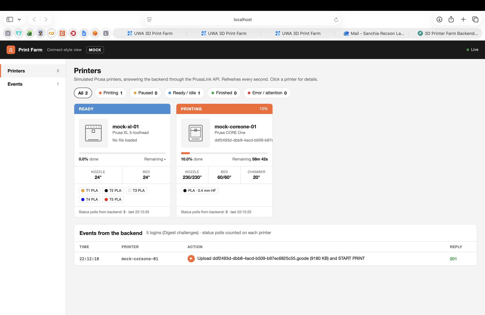
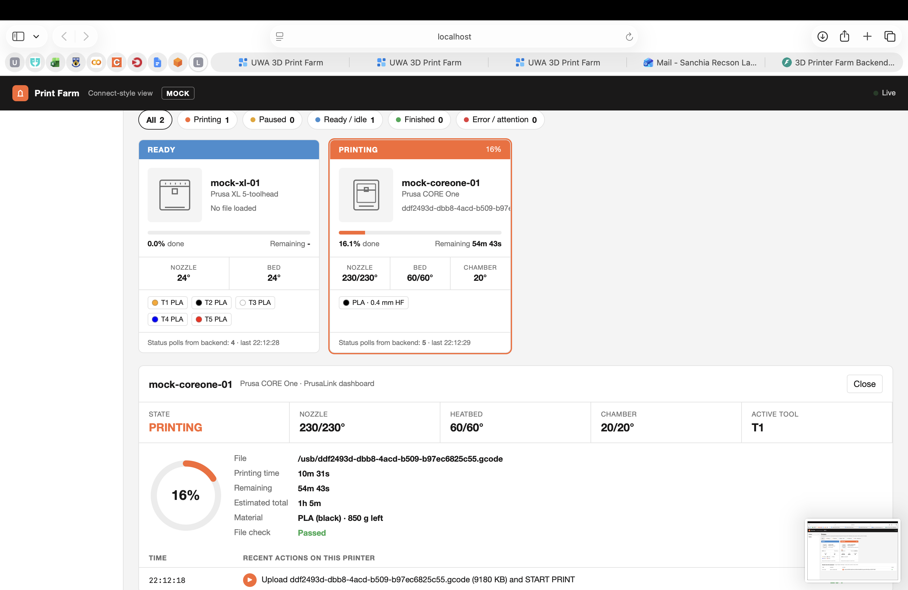
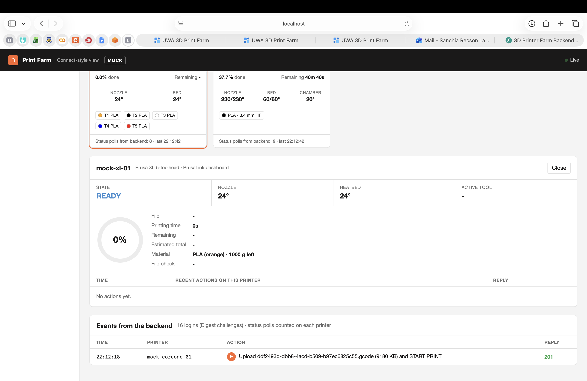
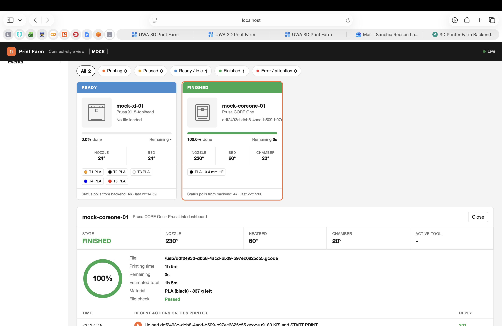
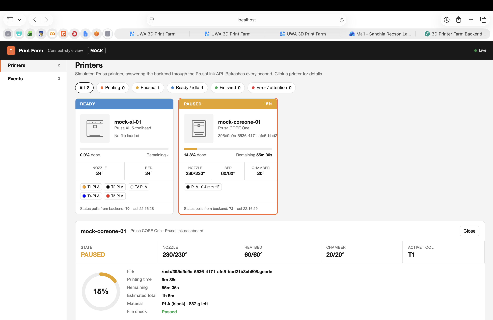
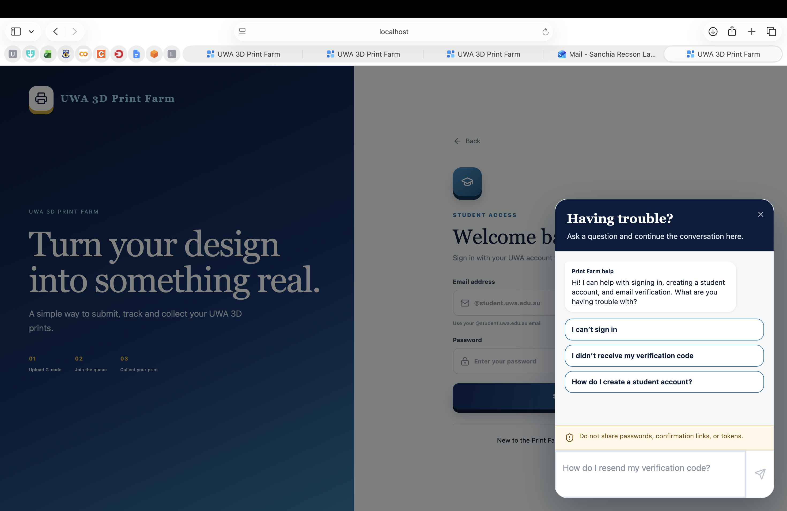
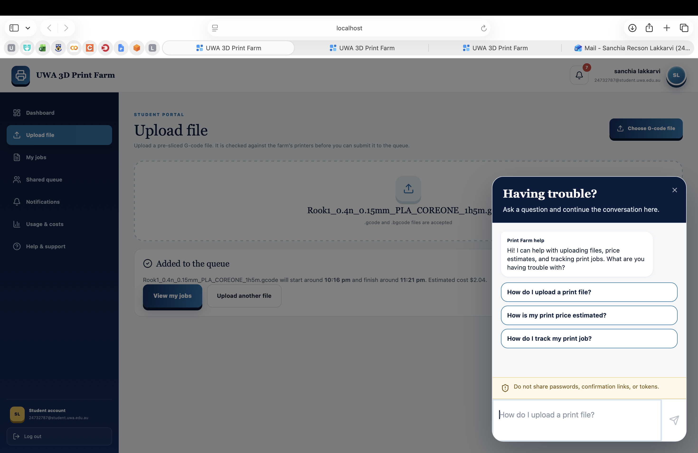
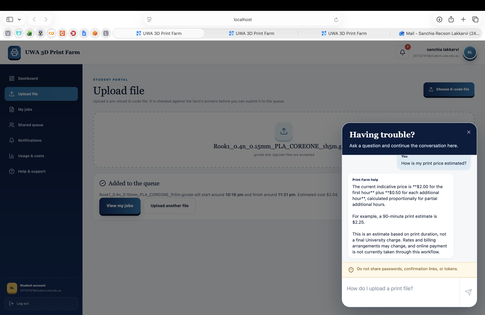

# Mock Printer and Chatbot Guide

**UWA 3D Printer Farm Interface — Group 16**

| Document control | Details |
| --- | --- |
| Project team | Group 16 |
| Document | 04 — Mock Printer and Chatbot Guide |
| Version | 1.0 |
| Document date and repository review date | 6 October 2026 |
| Reviewed branch | `main` |
| Reviewed commit | `019cc9945961afd3ef90e3568c7a1409b7b995a8` |
| Repository | [SanchiaLakkarvi/3D-printer-farm-interface](https://github.com/SanchiaLakkarvi/3D-printer-farm-interface) |

This guide explains how to demonstrate the mock printers and operate the student help chatbot. Part A is for demonstrators, technical operators and print-farm staff. Part B covers student use and chatbot administration.

This guide describes the implementation and configuration at the recorded commit. The included screenshots show locally observed mock-monitor states: printing, ready, finished and paused. They provide evidence of those displayed states, but do not by themselves verify the complete queue and removal workflow, physical-printer compatibility or a live chatbot provider response.

Use the [User Manual](02-user-manual.md) for full portal instructions and the [Installation, Operations and Maintenance Guide](03-installation-operations-maintenance.md) for database preparation, authentication, backups and deployment controls. The supplied stack is a development/demonstration setup.

## Contents

- [Part A — Mock Printers](#part-a--mock-printers)
  - [A1. Purpose and limits](#a1-purpose-and-limits)
  - [A2. Models, configuration and connection flow](#a2-models-configuration-and-connection-flow)
  - [A3. Start the stack and use the monitor](#a3-start-the-stack-and-use-the-monitor)
  - [A4. Demonstrate submission, completion and removal](#a4-demonstrate-submission-completion-and-removal)
  - [A5. Faults, disconnection, recovery and reset](#a5-faults-disconnection-recovery-and-reset)
  - [A6. What mock testing establishes](#a6-what-mock-testing-establishes)
  - [A7. Real-printer integration and acceptance checks](#a7-real-printer-integration-and-acceptance-checks)
- [Part B — Chatbot](#part-b--chatbot)
  - [B1. Access and supported questions](#b1-access-and-supported-questions)
  - [B2. Capabilities and boundaries](#b2-capabilities-and-boundaries)
  - [B3. Provider configuration](#b3-provider-configuration)
  - [B4. Knowledge source and updates](#b4-knowledge-source-and-updates)
  - [B5. Limits, secret detection and rate limiting](#b5-limits-secret-detection-and-rate-limiting)
  - [B6. Data flow, storage and logging](#b6-data-flow-storage-and-logging)
  - [B7. Errors and troubleshooting](#b7-errors-and-troubleshooting)
  - [B8. Cost ownership, monitoring and escalation](#b8-cost-ownership-monitoring-and-escalation)
  - [B9. Chatbot acceptance checks](#b9-chatbot-acceptance-checks)
- [Implementation references](#implementation-references)

## Part A — Mock Printers

### A1. Purpose and limits

The mock service supplies virtual Prusa printers so the portal can exercise file submission, printer polling, queue dispatch, pause/resume, completion, notifications and staff removal confirmation without communicating with physical hardware.

It combines a Prusa Connect SDK worker, local file validation and a time-based print simulator. The portal's connected printing route uses a **PrusaLink-compatible HTTP API**, not a completed Prusa Connect cloud integration. The monitor resembles a printer-farm dashboard but shows simulated values.

The simulator does not move a machine, extrude material, produce a part or detect a physical bed being cleared. Temperatures, progress, tool changes and filament remaining are computed from configuration and file metadata. They cannot establish dimensional quality, adhesion, thermal safety, hardware compatibility or actual material consumption.

The mock `/control` endpoints, monitor and request log have no application login requirement. The PrusaLink facade uses synthetic HTTP Digest credentials. Keep the mock service within the intended demonstration environment; these controls are not a production access-control system.

### A2. Models, configuration and connection flow

#### A2.1 Runnable printer configuration

The default file is `mockserver/config/printers.yaml`. Both configured printers are enabled.

| Setting | CORE One mock | XL mock |
| --- | --- | --- |
| Mock identifier | `mock-coreone-01` | `mock-xl-01` |
| Configured model | `PRUSA_CORE_ONE` | `PRUSA_XL_5T_INPUT_SHAPER` |
| G-code metadata model | `COREONE` | `XL5IS` |
| Mock approved-profile ID | `uwa-coreone-hf04` | `uwa-xl5is-04` |
| Backend validator-profile ID | `core_one_hf04` | `xl_5t_is_04` |
| Configured build volume | 250 × 220 × 270 mm | 360 × 360 × 360 mm |
| Tools | One tool, slot `0` | Five tools, slots `0`–`4` |
| Nozzles | 0.4 mm, high flow | 0.4 mm, non-high-flow on each tool |
| Chamber simulation | Enabled | Disabled |
| Default simulation speed | `60` | `120` |
| Initial synthetic spools | PLA black, 850 g | PLA orange, black, white, blue and red; 1,000 g each |
| Mock file directory | `./storage/mock-coreone-01` | `./storage/mock-xl-01` |

The backend and mock use different profile-ID namespaces. A database printer's `locked_profile.validator_profile` must use the **backend** ID; the mock YAML's `approved_profile_id` must use the **mock** ID.

The backend seed creates `Prusa CORE One` at `Lab A — Bench 1` with PLA Black and `Prusa XL` at `Lab B — Large Format` with PLA White. These are synthetic records. The XL mock's tool-zero spool is orange, so the backend material colour and mock spool colour are not synchronised. The seed also inserts PETG Blue. Changing a backend material record does not update the simulator's spools, and changing mock consumables does not update the application's material inventory.

The seed exits if **any materials already exist**. It does not repair missing printers or rewrite existing connection URLs. Inspect the actual inventory before demonstrating an existing database.

#### A2.2 Connection flow

| Stage | Current implementation |
| --- | --- |
| Student validation | Frontend calls `POST /api/jobs/validate`. The backend validates the selected file and returns compatible printers and estimates. This does not queue the file. |
| Submission | Frontend calls `POST /api/jobs` with the file, printer UUID and material UUID. The backend validates again, stores the file and creates a queued job. |
| Connection selection | The printer adapter factory reads the database printer's `prusalink_url`, username and password. A row without a URL is not polled. `PRINTER_ADAPTER=mock` alone does not select or redirect a connection. |
| Polling | A positive `PRINTER_POLL_INTERVAL_S` enables the backend loop. Base/demo Compose sets `2`; actual spacing includes the work performed by each cycle. Native default `0` disables it. |
| Status request | Backend requests `/api/v1/status` beneath the configured printer URL using HTTP Digest authentication. |
| Dispatch | For a ready printer, the backend selects its oldest eligible submitted/queued job, provided no completed job is awaiting removal. It uploads and starts that file. |
| Mock validation | The mock checks its own configured profile, executable commands and synthetic stock. An accepted HTTP upload can still produce an `ATTENTION` state if mock validation fails. |
| Lifecycle | Backend polling translates printer states into job status and notifications. Staff removal confirmation updates the application separately. |

The seeded container URLs are:

```text
http://mockserver:8080/prusalink/mock-coreone-01
http://mockserver:8080/prusalink/mock-xl-01
```

The backend appends routes such as `/api/v1/status` and `/api/v1/files/usb/<job-uuid>.gcode`. The dispatcher currently uses a `.gcode` remote name for every job; that name does not convert binary contents. The mock parser detects BGCode by its `GCDE` magic and uses its `pybgcode` dependency, while backend full BGCode validation uses the compiled converter. Demonstrate text `.gcode` first and test binary submission/dispatch separately.

`MOCK_PRINTER_BASE_URL` supplies URLs during seeding. Changing it later does not alter existing printer rows; update those records through the authorised printer API.

The YAML's SDK telemetry target is `http://host.docker.internal:9000`. The supplied Compose stack has no service on that port. An unavailable telemetry receiver does not by itself prove that the portal's PrusaLink route is broken. The disabled `uwa-printers.template.yaml` is a simulator template; enabling it does not connect real printers.

#### A2.3 Synthetic credentials and timings

The following are published **mock-only** credentials, not physical-printer credentials:

| Mock | Digest username | Synthetic password |
| --- | --- | --- |
| CORE One | `maker` | `mock-core-token` |
| XL | `maker` | `mock-xl-token` |

Mock serial numbers, fingerprints, SDK identities, spool balances, lab locations and demo users are also synthetic. Do not reuse them for a client deployment.

Simulation speed scales simulated time relative to elapsed wall time. For example, a 60-minute metadata estimate at speed `60` has approximately one minute of simulated printing wall time, plus preheating, scheduling and polling effects. This is an illustration, not a promised completion time. Pause handling suspends simulated progress.

Reported elapsed/remaining times are synthetic. Backend `actual_duration_min` is updated from reported printing time when available; on successful completion, `actual_filament_g` is assigned the job's estimate. Neither is an independent physical measurement. Queue estimates, indicative prices and analytics from this data must be presented as demonstration values.

`MOCK_SIMULATION_SPEED` can override every configured mock's speed. `MOCK_PRINTER_CONFIG` selects another YAML file. These variables belong on the **mockserver** service, not only in `backend/.env`. Mock YAML is copied into its image; rebuild/recreate that service after editing the file unless an operator has supplied a deliberate bind mount.

### A3. Start the stack and use the monitor

#### A3.1 Before startup

Use a local, disposable demonstration database and writable `backend/storage`. Git, Docker with Compose v2, free ports 5173/8000/8080 and access to build dependencies are required. Follow document 03 for a clean checkout and database preparation.

Document 03 explains database preparation and the migration checks. Migration 0002 widens the Alembic version column to accommodate longer revision identifiers. The migration smoke test references an older head; check the expected head against the current migration chain before interpreting its result. Do not stamp migrations to bypass unresolved errors.

From the checkout, confirm the documented revision:

```bash
git rev-parse HEAD
```

For a new checkout only, create the environment file without overwriting existing configuration:

```bash
cp -n backend/.env.example backend/.env
mkdir -p backend/storage
```

The demo overlay inherits that environment-file requirement. It supplies local PostgreSQL and fake authentication; Supabase credentials are unnecessary in this mode. An Anthropic key is needed only for live chatbot answers.

#### A3.2 Start the local demo

Run from the repository root, after database issues have been addressed:

```bash
docker compose -f docker-compose.yml -f docker-compose.demo.yml config --quiet
docker compose -f docker-compose.yml -f docker-compose.demo.yml up -d --build
docker compose -f docker-compose.yml -f docker-compose.demo.yml ps
docker compose -f docker-compose.yml -f docker-compose.demo.yml logs --tail=100 backend db mockserver
```

The overlay starts PostgreSQL, waits for its health check, then runs backend migrations and inventory seeding. Failure during migration/seeding can prevent API startup. `config --quiet` checks the effective Compose configuration without printing its resolved secret-bearing environment.

For Supabase-backed mock use, follow document 03's normal configuration. Base Compose still includes mock printers, but skips automatic migrations and enables synthetic inventory seeding. A shared client database needs deliberate seeding and dispatch controls.

The optional `docker-compose.queue-demo.yml` adds generated traffic, different accounts and speed `1`. Its `queue-demo` build context is `./backend`, while the current backend Dockerfile expects repository-root copy paths. It is not a verified clean-build shortcut; correct and test that configuration before using the optional generator.

#### A3.3 Open the services

| Address on the Docker host | Use |
| --- | --- |
| [http://localhost:5173](http://localhost:5173) | Student and staff portal. |
| [http://localhost:8000/health](http://localhost:8000/health) | Backend liveness; does not verify database/Auth/printer/provider readiness. |
| [http://localhost:8000/docs](http://localhost:8000/docs) | Application API contract. |
| [http://localhost:8080/monitor](http://localhost:8080/monitor) | Mock Printer Farm monitor. |
| [http://localhost:8080/health](http://localhost:8080/health) | Mock liveness and configured worker count. |
| [http://localhost:8080/docs](http://localhost:8080/docs) | Mock status, fault, reset, validation and consumables APIs. |

Read-only checks:

```bash
curl --fail --show-error http://localhost:8000/health
curl --fail --show-error http://localhost:8080/health
curl --fail --show-error http://localhost:8080/control/printers
```

The mock health response should identify two configured workers for the default YAML. Confirm actual responses and portal access; container creation alone is not a successful demonstration.

#### A3.4 Read the monitor

The monitor polls once per second. Filters are **All**, **Printing**, **Paused**, **Ready / idle**, **Finished** and **Error / attention**. Select a printer tile to open its detail panel; select **Close** to dismiss it.



**Figure 1 — Mock monitor overview.** The CORE One is printing while the XL is ready. The request log shows upload and start requests for the simulated CORE One job.

Tiles show state, file, progress, remaining time, temperatures, configured tools/material and backend status-poll counts. Details include **Printing time**, **Estimated total**, **Material**, **File check** and recent PrusaLink actions. **Passed** under **File check** is the mock validator's result, not the portal's entire submission validation result.



**Figure 2 — CORE One printing details.** The monitor displays simulated progress, printing time, estimated remaining time, temperatures and material information. The displayed File check result belongs to the mock validator.



**Figure 3 — XL ready state.** The XL has no active print in this capture. Its detail panel shows the configured material and the printer's simulated ready state.

The request log retains up to 100 non-status events in process memory. Status reads are counted, and HTTP 401 Digest challenges are counted separately. A challenge is a normal first stage of Digest authentication; persistent rejected credentials need investigation. Fault/reset requests under `/control` are not recorded as PrusaLink action events.

The monitor has no fault/reset/print-control buttons. Use staff portal controls for pause/resume/removal and the mock API for test fault/reset actions. If polling stops, the monitor shows **Cannot reach the mock server**; previously displayed values may remain on screen.

### A4. Demonstrate submission, completion and removal

#### A4.1 Accounts and sample file

In the default local demo overlay, select the role matching the configured synthetic account:

| Access card | Default synthetic account | Default synthetic password |
| --- | --- | --- |
| **Student** | `00000002@student.uwa.edu.au` | `demo-password-1` |
| **Printer Farmer** | `farmer.demo@uwa.edu.au` | `demo-password-1` |
| **Administrator** | `00000001@student.uwa.edu.au` | `demo-password-1` |

These accounts apply only to fake authentication with the default overlay. A repository-root `DEMO_ACCOUNTS` override or the optional queue overlay changes them. Fake mode sends no genuine verification email. Backend restart resets its in-memory authentication sessions; sign in again using the configured startup accounts.

Use text G-code sliced for the configured CORE One HF0.4 profile with Input Shaper and PLA. The repository includes a candidate demonstration file at:

```text
backend/app/validation/data/Rook1_0.4n_0.15mm_PLA_COREONE_1h5m.gcode
```

The current validation tests and queue generator reference this file. Validate it through the running portal and record the actual result before relying on it for a demonstration. Do not send repository fixtures or altered demonstration files to physical hardware without separate authorised review.

The small files under `mockserver/tests/` are synthetic mock-validator fixtures. They do not contain the full safe-end sequence required by the portal validator and are not interchangeable with a complete portal submission sample. Do not bypass portal validation to make the demonstration proceed.

#### A4.2 End-to-end demonstration

1. Open the monitor in one browser tab. Sign in as **Student** in the portal.
2. Open **Upload file** and choose the prepared `.gcode`. Wait for validation. Read its stages, estimated duration/filament/cost and compatible printer/material options. Selecting the file alone does not create a job.
3. Select the compatible **Prusa CORE One** and a matching PLA material. Choose **Submit to print queue**. Record the job ID and the **Added to the queue** confirmation.
4. Open **My jobs**. Expect **In queue**, then **Printing** after successful dispatch. The monitor should show the upload/start request and simulated progress. Failed mock validation can instead produce an attention/failure path; inspect **File check** and logs.
5. To demonstrate removal gating, submit a second valid job for the **same printer** before the first finishes. Keep the job IDs distinct. Jobs for another printer have a separate dispatch path.
6. Sign in as **Printer Farmer**, preferably in a separate browser session. Open **Shared queue** or **Farm operations**. During a sufficiently long running job, select **Pause**, wait for the state to become **Paused**, then select **Resume**. Backend polling records pause/resume notifications; the UI update is not instantaneous.
7. Wait for the first print to finish. The mock reports `FINISHED`; the application records **Completed** in **History**, and notifies the student and Farmer accounts. The next same-printer job must remain waiting while a completed job is awaiting removal.
8. In staff **History**, select **Collect** on the completed job only when demonstrating the removal confirmation. Its tooltip is **Confirm the print has been removed**. In real use, staff must first safely remove the part and prepare the bed. The interface has no separate confirmation dialog or bed sensor check.
9. Expect **Ready to collect** and the student readiness notification. The next eligible same-printer job can dispatch on a later poll. Confirm that ordering in the monitor and queue, rather than assuming a successful response proves it occurred.
10. Check the student's **Notifications** and **My jobs**. Record the actual submission, pause/resume, completion, hold and readiness results for the demonstration.

The queue polls about every five seconds and its history about every fifteen seconds. Completion processing also has a 15-second start grace: a very fast mock can finish before the backend considers a `FINISHED` reading conclusive. Allow for these delays; accelerated printing does not imply instant portal updates.



**Figure 4 — Simulated print finished.** The CORE One reports FINISHED with 100% progress for the job shown in Figure 2. This capture shows simulator completion; staff removal and student collection are separate actions.



**Figure 5 — Paused simulated print.** The CORE One reports PAUSED during another job. This capture uses a different file from Figures 2 and 4 and illustrates a separate paused state.

#### A4.3 Three distinct events

| Event | Meaning | Effect on the next same-printer job |
| --- | --- | --- |
| **Completed** / `completed` | Printer reports that printing finished. No physical removal is established. | Blocks dispatch until the completed record is cleared by the staff removal/readiness action. |
| Staff **Collect** → **Ready to collect** / `ready_for_collection` | Records the staff member and removal/readiness timestamps, and notifies the owner. The mock demonstration substitutes for physical handling. | Releases this completed-job hold. |
| Student pickup | Student receives the item under the farm's collection arrangements. | No connected pickup-recording action is implemented; it is not required by the dispatcher. |

Staff **Collect** calls `POST /api/jobs/{job_id}/collect`. It does not send a mock reset command. The monitor may continue to show the previous file/finished state until another job starts. It also attempts to delete the backend's successful uploaded file after the database commit; deletion is best-effort. The mock's uploaded copy is separate.

### A5. Faults, disconnection, recovery and reset

Use these procedures only in the disposable mock environment. They change simulator or database behaviour and can invalidate a running demonstration.

#### A5.1 Inject an error or attention state

Use `mock-coreone-01` or `mock-xl-01`, not the application's printer UUID. For an active-job failure demonstration, pause a running job through the staff portal first so its state remains observable, then inject a fault:

```bash
curl --fail --show-error -X POST \
  http://localhost:8080/control/printers/mock-coreone-01/fault \
  -H 'Content-Type: application/json' \
  --data '{"state":"ERROR","reason":"Synthetic demonstration fault"}'
```

Use `"ATTENTION"` in the same body to demonstrate that state. These are the only accepted fault states. A missing/invalid request body or unknown mock ID is rejected; inspect the mock API schema for current fields.

Expected implementation behaviour:

- The mock transport reports the injected state and emits a failure event. Its `reason` is synthetic test text.
- On a successful poll, the backend marks that printer **Error**. If a job is recorded as printing, it becomes **Failed** and the owner receives a generic printer-error/attention notification. The custom reason is not copied into that notification.
- Queued jobs are not dispatched while the reported state is error/attention. Failed jobs do not create the completed-print removal hold.

**Important simulator limit:** injection does not stop or pause the simulation thread. An unpaused simulation can continue and eventually overwrite the injected state with `FINISHED`. It is not a latched hardware fault or emergency stop. A fault must be observed by the backend before it can affect application state; rapid changes may be missed between polls.

After confirming the intended failure result, reset the mock:

```bash
curl --fail --show-error -X POST \
  http://localhost:8080/control/printers/mock-coreone-01/reset
```

This stops its simulation and returns it to `READY`. Once polling observes readiness, another waiting job can start unless a separate completed-job hold remains. A failed job is not automatically retried. If a new attempt is needed, first reconcile the previous simulation/job, then submit a new job deliberately.

#### A5.2 Demonstrate transport disconnection

There is no per-printer network-disconnect control in the mock API. Stop the mock service to make **both** mock endpoints unavailable while leaving the backend running:

```bash
docker compose -f docker-compose.yml -f docker-compose.demo.yml stop mockserver
```

Wait for backend polling. Transport failures set the database printers to **Offline**. The current printing job is not immediately failed merely because the connection is unreachable; that branch returns without a job-state transition. Staff pause/resume requests can return **Cannot reach the printer.** Waiting jobs are not dispatched through the unreachable endpoint.

Restart the stopped service:

```bash
docker compose -f docker-compose.yml -f docker-compose.demo.yml start mockserver
```

The mock is recreated in memory at process startup and does not resume a previous simulated print. If an old application job still says printing, a subsequent ready/idle reading after the start grace can mark it failed because the printer is no longer running it. Check job history and notifications before resubmitting.

This tests loss of the simulator process, not a real printer continuing a print while its network connection is lost. Physical reconnect/reconciliation must be tested separately.

#### A5.3 Reset scope

| Operation | What it resets | What it does not establish |
| --- | --- | --- |
| Per-printer `/reset` | Stops that simulation, clears its progress/temperature snapshot and returns transport state to `READY`. | Does not remove database jobs, clear completed-job holds, delete stored files, restore spool balances, clear the last validation or wipe the monitor request log. |
| Mock process restart | Reloads YAML and creates new workers, spool values, in-memory job/state/validation data and request log. | Does not reconcile the application's persisted jobs. Container-local file copies ordinarily survive a restart of the same container. |
| Mock container recreation/removal | Creates a fresh process and loses unmounted container-local files. | Does not delete host backend uploads or PostgreSQL records. |
| Backend restart | Restarts polling and cached configuration/help; fake-auth sessions are lost. | Does not clear persisted jobs/uploads or send a stop command to a physical printer. |

For consumables demonstrations, `PATCH /control/printers/{printer_id}/consumables` accepts `slot`, and optional `material`, `colour`, `remaining_g`. Use the schema at the mock `/docs`. This updates in-memory mock spool data; it is not connected application inventory management. Successful simulated completion subtracts configured metadata-derived consumption from those balances.

#### A5.4 Full disposable-demo reset

**Destructive — local demonstration only.** Capture evidence/backups first and confirm that the selected checkout and Compose project contain no required client data. The following removes this project's containers/network and named demo PostgreSQL volume:

```bash
docker compose -f docker-compose.yml -f docker-compose.demo.yml down --volumes
```

This deletes demo database jobs, profiles and records, and removes mock container-local files. It does **not** delete the host's `backend/storage` bind mount or an external Supabase database.

If a completely empty host upload root is also required, the following is a separate destructive file deletion. Run only from the intended repository root after the stack is down:

```bash
rm -rf -- backend/storage
mkdir -p backend/storage
```

**Scope:** every file beneath that checkout's `backend/storage` is deleted, including pending, failed and legacy-route uploads. This is not a routine cleanup or update command. Follow Document 03's database preparation steps when starting a fresh stack, and confirm that migrations complete successfully.

### A6. What mock testing establishes

| A recorded successful mock test can support | It cannot establish |
| --- | --- |
| Portal/API request flow and the configured mock endpoint contract. | Compatibility with the installed printer firmware or every PrusaLink version. |
| Queue ordering and removal gating for the tested scenario. | Safe physical bed clearing, unattended operation or distributed-dispatch safety. |
| Status-to-job transitions, notifications and role-authorised staff actions. | Complete handling of every hardware fault or recovery sequence. |
| File/profile validation for tested files and configured rules. | That an accepted file is physically safe, manufacturable or high quality on a particular machine. |
| Simulated pause/resume, temperatures, progress and completion. | Real execution duration, thermal performance, filament consumption or tool-change reliability. |
| API transport error handling in the demonstrated setup. | Real network resilience or a printer's behaviour during loss of connectivity. |

Repository tests exist for the simulator, validator, PrusaLink facade, queue synchronisation, job controls and help service. Their presence is evidence of implemented checks, not proof that the whole current release passes. Record exact commands, commit, environment and actual outcomes in the Testing and Acceptance Report.

### A7. Real-printer integration and acceptance checks

The current adapter is designed around PrusaLink HTTP Digest authentication. The reviewed code does not certify physical compatibility. Assign a qualified print-farm operator and technical owner before enabling dispatch.

Prerequisites:

- Reach the actual printer's API from the **backend host/container**, including site network/VPN/firewall access.
- Confirm the real model, nozzle/high-flow configuration, installed tools, firmware/API, storage name and supported upload/control operations. The adapter defaults to `usb` storage; do not assume it exists on every machine.
- Create/update the database printer's private URL and credentials through supported administrator methods. Keep it in maintenance with dispatch disabled during setup. Changing `PRINTER_ADAPTER` or the simulator YAML is insufficient.
- Match the backend validator profile and selected material to the commissioned hardware. Extend and verify profiles where the hardware differs from the two reviewed profiles.
- Establish staff responsibility for cooling, removal, bed preparation, faults and collection. A database action cannot verify those physical conditions.
- Use one dispatching backend process until coordination between workers/instances has been designed and tested; the current poller has no shared leader election.

The following are **acceptance checks to perform**, not recorded passes:

| Check | Evidence required before accepting physical integration |
| --- | --- |
| Connection and identity | Correct authenticated status from the intended machine; rejected credentials and unreachable endpoint handled correctly. |
| File/storage compatibility | Reviewed small file accepted through the actual upload API and correct storage; text and binary formats assessed separately. |
| Controlled start | Exactly one intended job starts with the verified material/profile and safe machine preparation. |
| Pause/resume | Actual machine response, application state and notifications agree. |
| Completion/removal gate | Successful completion records correctly; a second job waits until staff remove the part and confirm readiness. |
| Fault/stop behaviour | Real faults and stopped jobs are recorded appropriately; safe clearance of failed parts is defined. Failed jobs currently have no completed-print removal hold. |
| Disconnect/reconnect | A printing machine's state is reconciled after network loss without duplicate starts or false completion. |
| Restart and recovery | Backend interruption does not lead to an unsafe dispatch; persisted files/job IDs and actual printer state are reconciled. |
| Records and acceptance | Actual durations, notifications, collection records and documented exceptions reviewed by the responsible client/operator. |

Until those checks are recorded against a specific machine/firmware/network setup, describe the delivered printing integration as demonstrated with mock printers and physical integration as outstanding.

## Part B — Chatbot

### B1. Access and supported questions

The button is **Ask Print Farm help**. It appears on role-specific sign-in forms, student registration, email-code verification and authenticated Student portal screens. Staff sign-in forms also show the general authentication help. The authenticated Farmer and Administrator portal shells do not include a separate staff help chatbot.

Select the button to open **Having trouble?**. Choose a suggested question or type one, then use **Send question**. **Finding an answer…** is displayed while a request is pending. The chat warns: **Do not share passwords, confirmation links, or tokens.**

Authentication suggestions are:

- **I can’t sign in**
- **I didn’t receive my verification code**
- **How do I create a student account?**

Student portal suggestions are:

- **How do I upload a print file?**
- **How is my print price estimated?**
- **How do I track my print job?**

Other questions supported by the current help source include why an STL cannot be uploaded directly, what to do after validation failure, why no compatible printer/material is offered, how the per-printer queue works, where notifications appear and why **Completed** does not yet mean ready for collection.

Use general questions such as “What should I check if my queued job appears stuck?” instead of sharing account identifiers, a file or credentials. The chat has no file attachment input and cannot examine the user's current job.

#### Context-specific welcome messages and suggested questions

The help dialog presents different welcome messages and suggested questions for authentication and student printing contexts. On Student sign-in, the suggestions cover signing in, verification codes and account creation. In the captured Student Upload file view, they cover uploading files, price estimates and tracking print jobs.

Students can select a suggested question or type their own. These suggestions provide starting points; they do not indicate that the chatbot has inspected the student's account, uploaded file or current job.



**Figure 6 — Student sign-in help.** The welcome message and suggested questions focus on signing in, creating a student account and email verification.



**Figure 7 — Student printing help.** The dialog is open on the Upload file page, with suggested questions about uploading, price estimates and tracking a print job.



**Figure 8 — Example pricing response.** The displayed reply explains indicative duration-based pricing and distinguishes an estimate from a final University charge. This capture records one response, rather than a comprehensive assessment of chatbot accuracy.

### B2. Capabilities and boundaries

| It is intended to explain | It cannot perform |
| --- | --- |
| Registration, sign-in, code verification and resend instructions. | Authenticate a person, check an account, reset a password or resend a code itself. |
| Supported upload formats and documented validation troubleshooting. | Inspect, slice, repair, validate or submit a print file. |
| Indicative price calculation and queue/history navigation. | Look up a queue position, access live job data, apply credit, take payment or change a price. |
| Notifications and completion/collection meanings. | Read/change notifications, mark removal, record pickup or alter job status. |
| General next steps contained in the help source. | Control/diagnose a physical printer, approve a print, create a staff account or contact staff on the user's behalf. |

The backend sends a prompt instructing the model to answer only from the reference document, keep answers concise and refer undocumented questions to the Print Farm team. This is an instruction to the provider, not a guarantee. There is no second-stage check proving an answer is accurate or fully supported, no live account lookup and no generated source-citation feature. A stale reference can produce stale advice.

Use the manuals, actual portal status and authorised staff for decisions about account access, failed jobs and safe collection. Do not use a chatbot answer as physical-printer acceptance or operational approval.

### B3. Provider configuration

The backend calls Anthropic's Messages API at `https://api.anthropic.com/v1/messages`. The configured default model is `claude-haiku-4-5-20251001`; confirm access to that identifier in the selected provider account. No alternate provider or local-answer fallback is implemented.

| Backend environment variable | Reviewed default | Purpose |
| --- | --- | --- |
| `ANTHROPIC_API_KEY` | Empty | Server-side provider credential. Missing value makes normal provider-backed answers unavailable. |
| `ANTHROPIC_MODEL` | `claude-haiku-4-5-20251001` | Provider model identifier. |
| `HELP_DOCS_ROOT` | Native `../Docs/help`; Compose `/app/help` | Directory containing `student-help.md`. |
| `HELP_MAX_MESSAGE_CHARS` | `1000` | Limit for the question and each history message. |
| `HELP_MAX_HISTORY_MESSAGES` | `6` | Maximum prior messages accepted per request. |
| `HELP_MAX_OUTPUT_TOKENS` | `400` | Provider output-token bound. |
| `HELP_RATE_LIMIT_REQUESTS` | `10` | Allowed requests per client-IP key in the window. |
| `HELP_RATE_LIMIT_WINDOW_SECONDS` | `60` | Rate-limit window length. |
| `HELP_PROVIDER_TIMEOUT_S` | `10` | HTTP client timeout setting for the provider request; not an end-to-end response-time guarantee. |

Edit `backend/.env` privately, for example:

```dotenv
ANTHROPIC_API_KEY=<authorised-anthropic-api-key>
ANTHROPIC_MODEL=claude-haiku-4-5-20251001
```

Replace the placeholder; do not commit the key. Keep it out of browser variables, screenshots, print files, chat messages and shared logs. The frontend sends its question to FastAPI and does not receive the configured provider key. `HELP_DOCS_ROOT` is overridden explicitly by base Compose, so changing that value only in `backend/.env` does not change the Compose path.

Apply environment changes by recreating the backend, using the same Compose mode/overrides as the running installation. For the local demo:

```bash
docker compose -f docker-compose.yml -f docker-compose.demo.yml up -d --force-recreate backend
```

An ordinary restart retains the old container environment. Recreation can also reset fake-auth sessions and rerun the entrypoint's migrations/seeding; arrange the demonstration accordingly. Do not rotate a key by publishing it in this guide.

The public `POST /api/help/chat` endpoint does not require a bearer token. Enabling it creates provider usage independently of successful login. The UI button remains visible if the key is absent.

### B4. Knowledge source and updates

#### B4.1 Actual source and caching

The only loaded reference is `student-help.md` beneath `HELP_DOCS_ROOT`, normally `Docs/help/student-help.md` in the checkout. Other README, handover documents, database rows and printer telemetry are not automatically included.

The backend reads the entire UTF-8 document, strips surrounding whitespace and places it inside the provider's system prompt. It does not use a search index or retrieve selected passages. The loader is an `lru_cache(maxsize=8)` keyed by root path; a successfully loaded document remains cached in that backend process. It does not watch file changes or check modification times on every question.

Compose mounts `./Docs/help` at `/app/help:ro`, and the backend Dockerfile also packages that help directory. Editing the host source updates the mounted file, but does not invalidate an already cached document.

#### B4.2 Update procedure

1. Review the intended wording against the final implementation. Confirm exact screen labels, registration rules, file limits, pricing and printing/removal/collection meanings. Do not add secrets, private contacts or policies that the client has not established.
2. Edit **`Docs/help/student-help.md`**, retaining that filename and readable UTF-8 text. Updating a different document does not change chatbot knowledge.
3. Review the change in the project's normal version-control process. Retain the previous approved text/commit for recovery.
4. In the supplied Compose installation, restart the backend to clear its process-local reference cache:

```bash
docker compose -f docker-compose.yml -f docker-compose.demo.yml restart backend
```

5. Start a new browser conversation by reloading the portal, then ask representative questions about the changed content and an unsupported question. Prior displayed answers/history otherwise remain in the component state and can be included in a later request.
6. Confirm the actual answers and record the reference/release version and check results. A successful API response alone does not establish answer correctness.

Use the normal-mode Compose file pair/overrides instead of the demo pair where appropriate. For an image-only deployment without the help bind mount, rebuild/redeploy the backend image containing the new source; restarting an old image cannot supply updated bytes. Native processes must be restarted too. There is no supplied administrative cache-clear endpoint. Tests call `load_help_document.cache_clear()` internally; that is not a portal control.

Missing, unreadable, invalid UTF-8 or empty reference content makes help unavailable before a normal provider request is made. There is no fallback to older Markdown or general model knowledge. To revert an update, restore the chosen previous file/image and restart/redeploy; then repeat the representative checks.

### B5. Limits, secret detection and rate limiting

#### B5.1 Messages and conversation history

| Control | Current behaviour |
| --- | --- |
| Browser input | Textarea limits the question to 1,000 characters; blank trimmed questions cannot be sent. |
| Backend question | Rejects empty or over-limit text. |
| Prior conversation | Browser sends up to the latest six individual messages, including user and assistant messages. These are not six complete question/answer pairs. Backend rejects a history list above its configured limit. |
| History contents | Only `user` and `assistant` roles are accepted. Each history message must be non-empty and at most 1,000 characters after trimming. |
| Provider output | Configured maximum 400 tokens. Tokens are not characters, and the backend does not truncate a returned answer to 1,000 characters. |
| Pending request | Send/suggestion controls are disabled while waiting. No automatic retry or streaming response is implemented. |

The frontend's limits are constants in `auth-help-chat.tsx`; changing backend settings alone does not change them. Update and verify both sides if adjusting the contract.

A long provider reply can exceed the backend's per-history-message character limit and cause the next question to fail when that reply is sent back as history. The UI has no dedicated **Clear conversation** button; reloading creates fresh component state. Closing and reopening the dialog alone does not explicitly clear the conversation.

#### B5.2 Secret checks

Before loading the reference or calling the provider, the service checks the question **and every submitted history message** for selected regular-expression patterns:

- labelled passwords such as `password is ...` or `password: ...`;
- labelled token hashes/access/refresh/confirmation tokens and certain token-bearing URLs;
- labelled `verification code` or `otp` followed by six to eight digits; and
- strings shaped like the JWT pattern used by the detector.

If any pattern matches, the service returns this local refusal instead of calling Anthropic:

> For your security, do not share passwords, confirmation links, or tokens here. Remove the sensitive information and ask again.

This is a pattern-based safeguard, not comprehensive secret detection or redaction. An unlabelled code/password, an API key or an unexpected link format may not match. The browser has already transmitted submitted text to the backend before this check, and the UI can retain/display the user's refused message. Never test with a real secret.

If a sensitive message was submitted, stop sending follow-ups and reload to clear the component history. A new question can still be refused while a matching previous message is included in history. Handle any real exposure through the credential owner's private incident process; the chat cannot revoke credentials.

#### B5.3 Public-endpoint rate limiting

The default is ten requests per client-IP key within the preceding sixty seconds. The implementation removes expired timestamps and checks the remaining requests. The limiter runs in one backend process, uses memory and resets on restart. Requests reaching that handler consume allowance even when subsequent validation, secret refusal or provider availability prevents an answer.

This is not a per-account quota, durable usage ledger or shared budget control. Users behind the same observed IP can share the allowance; multiple processes have separate allowances. Confirm the actual client-IP key under the chosen proxy/network configuration. The code does not implement a cross-instance rate limiter, provider-spend cap or automatic abuse-blocking workflow.

### B6. Data flow, storage and logging

| Step | Data handled by the current implementation |
| --- | --- |
| Browser → backend | JSON containing the question and selected prior messages. The help client supplies `Content-Type`; it does not attach the application's login token or account profile. Ordinary network metadata is still present. |
| Backend safeguards | Trims/validates text, checks limits, checks configured secret patterns and loads the reference. The limiter keeps client-IP keys and request timestamps in memory. |
| Backend → Anthropic | Model identifier, output-token limit, system instructions containing the **full help reference**, and the trimmed history/question. The API key is sent in the server-side request header. Any personal information typed by a user can be part of this content if it is not blocked. |
| Provider → backend | Text blocks are combined into a reply. Other returned fields, including usage metadata, are not recorded by this adapter. |
| Backend → browser | A `message` string or a bounded application error. The frontend renders text in the chat component. |

No conversation table, transcript file writer, chat-specific database persistence or browser local/session-storage writer is present in the reviewed help route/client/component. Conversation state is held in React memory and supplied by the browser for each request. The backend does not maintain a user conversation session. The reference cache and rate-limit memory are separate from conversation content.

The reviewed chatbot code does not explicitly log prompt or response bodies. Standard application/access logs may still record endpoint requests/statuses, and infrastructure logging can differ from repository code. Do not infer that every deployment is free of request-body logging or that closing a dialog erases all copies.

**Provider retention and data-use settings are unknown from this repository.** The code neither establishes nor guarantees Anthropic retention, deletion, regional handling or account-specific processing terms. The service owner must verify those requirements against the actual provider account and intended users before persistent deployment. Keep the help reference free of secrets because it is sent on each provider-backed request.

### B7. Errors and troubleshooting

| Condition | Current user/API behaviour | Operator action |
| --- | --- | --- |
| Missing key | Normal questions receive HTTP `503`, code `HELP_UNAVAILABLE`, and **Help chat is temporarily unavailable. Please try again later.** The local secret-refusal path can still respond without a key. | Configure a valid server-side key and recreate the backend. |
| Invalid key, unavailable model, provider rejection or outage | Provider HTTP errors are mapped to the same structured `503`; raw provider details are not returned by the adapter. | Check account/model access, billing/usage and service availability privately. The UI cannot distinguish these causes. |
| Provider timeout | Mapped to the structured unavailable response. | Check outbound connectivity and provider response behaviour; review the timeout setting. There is no automatic retry. |
| Missing/empty/unreadable help source | Structured unavailable response; normal request does not proceed to the provider. | Check the mounted path, filename, permissions and UTF-8 contents; restart after correction. |
| Browser cannot reach FastAPI | **Help chat is unavailable. Please try again later.** | Check backend availability, browser-reachable API origin and CORS. |
| Blank or long question | Backend `400`: `HELP_MESSAGE_REQUIRED` or `HELP_MESSAGE_TOO_LONG`; normal UI prevents these inputs. | Ask a concise non-empty question; check changed client/backend limits. |
| Too much/invalid history | `400` with `HELP_HISTORY_TOO_LONG`, `HELP_HISTORY_INVALID` or `HELP_HISTORY_MESSAGE_TOO_LONG`. Invalid schema roles can produce `422`. | Reload to start a fresh conversation and review any oversized prior reply. |
| Matching secret pattern | HTTP `200` with the refusal text, without a provider call. | Remove sensitive information and clear affected browser history; never use a real secret for diagnosis. |
| Rate limit reached | HTTP `429`, code `RATE_LIMITED`, **Too many requests. Please try again shortly.** | Allow older requests to age out of the window; check shared-IP and proxy behaviour. No retry countdown/header is implemented here. |
| Empty/malformed provider content | Mapped to structured unavailable response where the adapter's checks handle it. | Inspect the integration privately; do not publish provider payloads containing user text. |

Errors do not hide the rest of the portal. A failed user message remains in component state, so the next request can include it as history. The component does not automatically restore the failed text to the input or retry it.

For the local demo, inspect bounded logs:

```bash
docker compose -f docker-compose.yml -f docker-compose.demo.yml logs --tail=100 backend
```

A benign API check, after configuring the service, is:

```bash
curl --show-error --include \
  http://localhost:8000/api/help/chat \
  -H 'Content-Type: application/json' \
  --data '{"message":"How do I track my print job?","history":[]}'
```

This call can incur provider usage and consumes the rate allowance. Inspect the actual status/body; the command is a check to run, not a recorded successful provider response. Do not use `curl` with a key or real account secret in a shared transcript.

### B8. Cost ownership, monitoring and escalation

No named provider-account owner, approved budget, billing agreement or monitoring dashboard is established by this repository. Assign responsibility for the Anthropic account, key access/rotation, charges, availability, reference accuracy and privacy requirements at handover. Chatbot API charges are separate from the portal's indicative print-price calculation.

**Recommended operational controls; not supplied automated features:**

- Set account-level spending controls/alerts available under the chosen provider arrangement and confirm their actual behaviour.
- Monitor help request volume, `429`/`503` rates, latency and provider usage/costs without collecting secrets or unnecessary question content.
- Check model access after configuration/dependency changes and run representative answer reviews after source updates.
- Test the rate limiter behind the chosen proxy; design shared limiting before adding instances.
- Agree provider outage handling, key rotation and a human support channel. Monitor backend/provider availability separately from the static `/health` response.

The current adapter ignores provider usage metadata and supplies no token/cost ledger or spend-enforcement dashboard. Rate and output limits reduce individual request scope but do not guarantee a monthly budget or answer quality.

The source directs students to the **UWA Print Farm team** for account recovery, repeated validation failures, unavailable printers/materials, stuck queues, printer faults, unclear collection instructions and questions outside the guide. It supplies no verified email, phone number or ticket link. Confirm the client's preferred contact route and add it to the help source/manuals through an approved change; do not invent one.

Escalation is an instruction to the user, not an implemented staff-message or ticket-creation action. Students should provide a brief issue description and an appropriate job ID through that agreed channel, while keeping passwords, verification codes, tokens and confirmation links private. Printer faults and safe physical handling require trained staff regardless of the chatbot's wording.

### B9. Chatbot acceptance checks

These checks remain to be executed for the installed release; they are not an acceptance record:

| Check | Expected evidence |
| --- | --- |
| Access points | Button works on sign-in, registration, verification and Student portal screens. |
| Reference questions | Registration, supported uploads, indicative prices, queues and completion/removal answers agree with the reviewed source and current UI. |
| Unsupported question | Response refers the user to staff without inventing policy or claiming to inspect an account/job. Review the text; prompt instructions alone are insufficient evidence. |
| Secret-pattern checks | Harmless synthetic test values in both question and history produce local refusal; no real secret is used. Verify provider suppression through an isolated test provider/request capture, not by exposing a key. |
| Limits | Oversized question/history and rate-limit responses match the contract; actual proxy-IP behaviour is understood. |
| Availability | Missing key, unavailable source and simulated provider errors produce bounded errors while the portal remains usable. |
| Source update | A changed source is loaded after backend restart/redeployment and fresh browser conversation; old cached content is not relied on. |
| Ownership/privacy/cost | Provider-account owner, handling requirements, budget controls and human escalation route are recorded by the client. |

## Implementation references

Project links below are pinned to reviewed commit `019cc9945961afd3ef90e3568c7a1409b7b995a8`.

| Area | Primary evidence |
| --- | --- |
| Stack and demo | [Base Compose](https://github.com/SanchiaLakkarvi/3D-printer-farm-interface/blob/019cc9945961afd3ef90e3568c7a1409b7b995a8/docker-compose.yml), [demo overlay](https://github.com/SanchiaLakkarvi/3D-printer-farm-interface/blob/019cc9945961afd3ef90e3568c7a1409b7b995a8/docker-compose.demo.yml), [optional queue overlay](https://github.com/SanchiaLakkarvi/3D-printer-farm-interface/blob/019cc9945961afd3ef90e3568c7a1409b7b995a8/docker-compose.queue-demo.yml) |
| Mock models/configuration | [Runnable YAML](https://github.com/SanchiaLakkarvi/3D-printer-farm-interface/blob/019cc9945961afd3ef90e3568c7a1409b7b995a8/mockserver/config/printers.yaml), [configuration loader](https://github.com/SanchiaLakkarvi/3D-printer-farm-interface/blob/019cc9945961afd3ef90e3568c7a1409b7b995a8/mockserver/app/config.py), [models](https://github.com/SanchiaLakkarvi/3D-printer-farm-interface/blob/019cc9945961afd3ef90e3568c7a1409b7b995a8/mockserver/app/models.py), [disabled simulator template](https://github.com/SanchiaLakkarvi/3D-printer-farm-interface/blob/019cc9945961afd3ef90e3568c7a1409b7b995a8/mockserver/config/uwa-printers.template.yaml) |
| Mock controls/monitor | [Control routes](https://github.com/SanchiaLakkarvi/3D-printer-farm-interface/blob/019cc9945961afd3ef90e3568c7a1409b7b995a8/mockserver/app/main.py), [monitor and request log](https://github.com/SanchiaLakkarvi/3D-printer-farm-interface/blob/019cc9945961afd3ef90e3568c7a1409b7b995a8/mockserver/app/monitor.py), [PrusaLink facade](https://github.com/SanchiaLakkarvi/3D-printer-farm-interface/blob/019cc9945961afd3ef90e3568c7a1409b7b995a8/mockserver/app/prusalink.py) |
| Simulation and validation | [Simulator](https://github.com/SanchiaLakkarvi/3D-printer-farm-interface/blob/019cc9945961afd3ef90e3568c7a1409b7b995a8/mockserver/app/simulator.py), [SDK worker](https://github.com/SanchiaLakkarvi/3D-printer-farm-interface/blob/019cc9945961afd3ef90e3568c7a1409b7b995a8/mockserver/app/sdk_worker.py), [mock validator](https://github.com/SanchiaLakkarvi/3D-printer-farm-interface/blob/019cc9945961afd3ef90e3568c7a1409b7b995a8/mockserver/app/validator.py), [binary/text parsing](https://github.com/SanchiaLakkarvi/3D-printer-farm-interface/blob/019cc9945961afd3ef90e3568c7a1409b7b995a8/mockserver/app/gcode_metadata.py) |
| Connection and dispatch | [Adapter factory](https://github.com/SanchiaLakkarvi/3D-printer-farm-interface/blob/019cc9945961afd3ef90e3568c7a1409b7b995a8/backend/app/adapters/printer/factory.py), [PrusaLink adapter](https://github.com/SanchiaLakkarvi/3D-printer-farm-interface/blob/019cc9945961afd3ef90e3568c7a1409b7b995a8/backend/app/adapters/printer/prusalink.py), [synchronisation/dispatcher](https://github.com/SanchiaLakkarvi/3D-printer-farm-interface/blob/019cc9945961afd3ef90e3568c7a1409b7b995a8/backend/app/services/printer_sync_service.py), [inventory seed](https://github.com/SanchiaLakkarvi/3D-printer-farm-interface/blob/019cc9945961afd3ef90e3568c7a1409b7b995a8/backend/app/scripts/seed_printers.py) |
| Submission and staff lifecycle | [Job API](https://github.com/SanchiaLakkarvi/3D-printer-farm-interface/blob/019cc9945961afd3ef90e3568c7a1409b7b995a8/backend/app/api/v1/jobs.py), [submission service](https://github.com/SanchiaLakkarvi/3D-printer-farm-interface/blob/019cc9945961afd3ef90e3568c7a1409b7b995a8/backend/app/services/submission_service.py), [staff controls/removal](https://github.com/SanchiaLakkarvi/3D-printer-farm-interface/blob/019cc9945961afd3ef90e3568c7a1409b7b995a8/backend/app/services/job_control_service.py), [live queue UI](https://github.com/SanchiaLakkarvi/3D-printer-farm-interface/blob/019cc9945961afd3ef90e3568c7a1409b7b995a8/frontend/UWA-3D-Print-Farm/components/farm/live-queue.tsx) |
| Samples and checks | [Validation data](https://github.com/SanchiaLakkarvi/3D-printer-farm-interface/tree/019cc9945961afd3ef90e3568c7a1409b7b995a8/backend/app/validation/data), [portal validator](https://github.com/SanchiaLakkarvi/3D-printer-farm-interface/blob/019cc9945961afd3ef90e3568c7a1409b7b995a8/backend/app/validation/gcode_validator.py), [mock tests](https://github.com/SanchiaLakkarvi/3D-printer-farm-interface/tree/019cc9945961afd3ef90e3568c7a1409b7b995a8/mockserver/tests), [backend tests](https://github.com/SanchiaLakkarvi/3D-printer-farm-interface/tree/019cc9945961afd3ef90e3568c7a1409b7b995a8/backend/tests) |
| Chatbot access and client | [Portal entry points](https://github.com/SanchiaLakkarvi/3D-printer-farm-interface/blob/019cc9945961afd3ef90e3568c7a1409b7b995a8/frontend/UWA-3D-Print-Farm/app/page.tsx), [chat component](https://github.com/SanchiaLakkarvi/3D-printer-farm-interface/blob/019cc9945961afd3ef90e3568c7a1409b7b995a8/frontend/UWA-3D-Print-Farm/components/auth-help-chat.tsx), [public API client](https://github.com/SanchiaLakkarvi/3D-printer-farm-interface/blob/019cc9945961afd3ef90e3568c7a1409b7b995a8/frontend/UWA-3D-Print-Farm/lib/help/client.ts) |
| Chatbot service and provider | [Public route](https://github.com/SanchiaLakkarvi/3D-printer-farm-interface/blob/019cc9945961afd3ef90e3568c7a1409b7b995a8/backend/app/api/v1/help.py), [limits/prompt/cache/secret checks](https://github.com/SanchiaLakkarvi/3D-printer-farm-interface/blob/019cc9945961afd3ef90e3568c7a1409b7b995a8/backend/app/services/help_service.py), [Anthropic adapter](https://github.com/SanchiaLakkarvi/3D-printer-farm-interface/blob/019cc9945961afd3ef90e3568c7a1409b7b995a8/backend/app/adapters/help/anthropic.py), [request schema](https://github.com/SanchiaLakkarvi/3D-printer-farm-interface/blob/019cc9945961afd3ef90e3568c7a1409b7b995a8/backend/app/schemas/help.py) |
| Help reference and settings | [Student help source](https://github.com/SanchiaLakkarvi/3D-printer-farm-interface/blob/019cc9945961afd3ef90e3568c7a1409b7b995a8/Docs/help/student-help.md), [backend settings](https://github.com/SanchiaLakkarvi/3D-printer-farm-interface/blob/019cc9945961afd3ef90e3568c7a1409b7b995a8/backend/app/core/config.py), [application errors](https://github.com/SanchiaLakkarvi/3D-printer-farm-interface/blob/019cc9945961afd3ef90e3568c7a1409b7b995a8/backend/app/core/exceptions.py), [chatbot tests](https://github.com/SanchiaLakkarvi/3D-printer-farm-interface/blob/019cc9945961afd3ef90e3568c7a1409b7b995a8/backend/tests/test_help_chat.py) |
