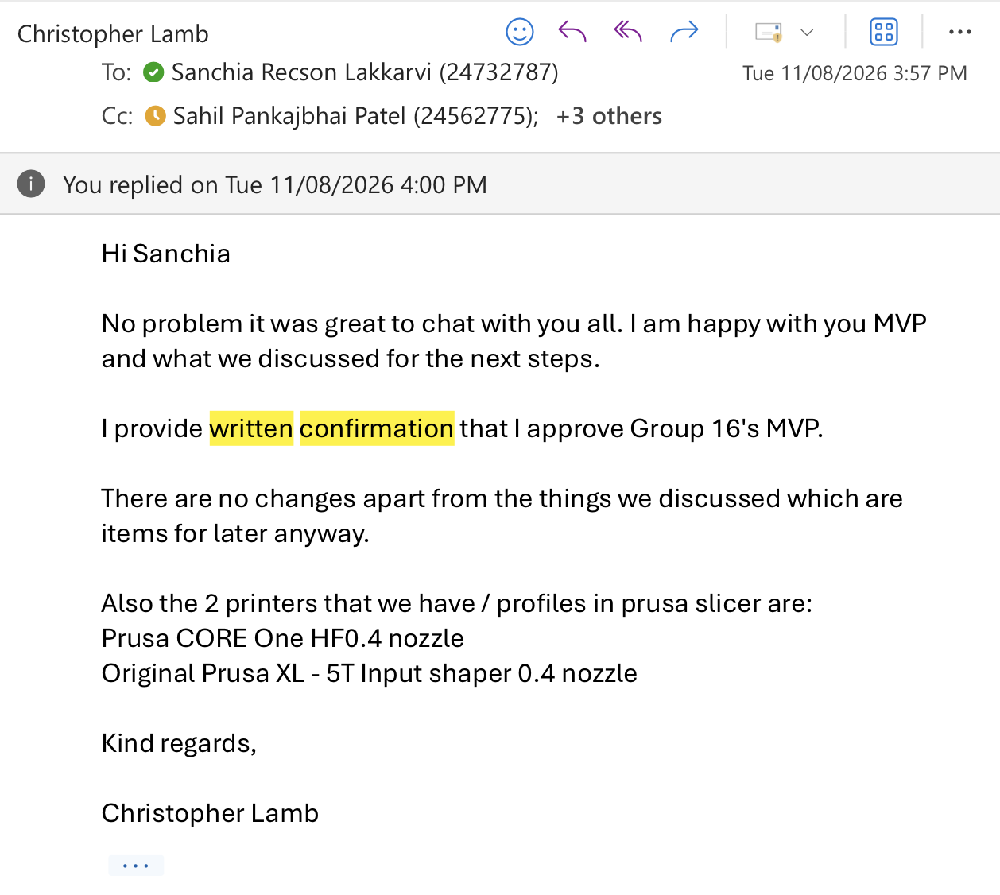

# Testing and Acceptance Report

**Group 16 — UWA 3D Printer Farm Interface**

| Document control | Details |
| --- | --- |
| Document version | 1.3 |
| Evidence review date | 9 October 2026 |
| Implementation baseline | `14cde47` |
| Automated execution date | 9 October 2026 |
| Environment | macOS, Python 3.11, Node 22, Docker Compose |
| Backend test result | 201 passed, 1 skipped, 0 failures |
| Mock-server test result | 12 passed, 0 failures |
| Client approval | Christopher Lamb approved Group 16's MVP in writing on 11 August 2026. See Section 7. |

---

## 1. Verification and test activities

We used automated tests, manual checks, and mock-printer testing to verify the main parts of the system. Automated backend tests were used to check authentication and role access, G-code validation, printer and material management, print jobs, queue timing, job history, reporting, and error handling. The project also contains frontend tests and separate tests for the mock-printer service. During development, PR #115 reported 10 reporting tests passed and a full backend result of 145 passed, 1 skipped, and 0 failures. PR #130 reported 16 frontend reporting tests passed, together with a successful TypeScript check and frontend build. These results are evidence from the related pull requests.

We also performed manual checks of important user workflows. These included registration and email verification, login and role access, G-code upload and validation, compatible printer selection, job submission, queue and history views, notifications, and usage reporting. Because physical printers were not always available, the project includes a mock printer service. This allowed us to test printer communication and simulated states such as printing, ready, finished, paused, job dispatch, and staff removal confirmation without using real hardware. The mock environment is useful for development and demonstration, but simulated printer values do not prove real physical-printer behaviour.

### Test Area Summary

| Test area | Evidence |
| --- | --- |
| **Backend** | Automated tests for APIs, services, permissions, queue logic and reporting |
| **G-code validation** | Validator tests for supported files and compatibility checks |
| **Frontend** | Reporting tests, TypeScript checking and build checks |
| **Mock printers** | Tests and demonstrations of simulated printer states and communication |
| **Manual checks** | Registration, login, upload, validation, queue, history, notifications and reports |

There are also some testing limitations. Some frontend and mock-printer tests also use mocked data or stubs. In addition, final physical Prusa-printer commissioning has not yet been fully verified. These remaining checks are clearly recorded in the handover documentation rather than being presented as completed testing.

---

## 2. Final release test execution results

Fresh automated test execution was conducted against the final release baseline commit (`14cde47`) on 9 October 2026:

### Automated Test Totals

| Test suite | Execution command | Baseline result | Status |
| --- | --- | --- | --- |
| **Backend API & Logic** | `cd backend && .venv/bin/pytest tests` | **201 passed, 1 skipped, 0 failures** (2.62s) | **PASSED** |
| **Mock Printer Server** | `cd mockserver && ../backend/.venv/bin/pytest tests/test_prusalink.py tests/test_queue_demo_config.py` | **12 passed, 0 failures** (0.67s) | **PASSED** |
| **Frontend Verification** | `cd frontend/UWA-3D-Print-Farm && npx tsc --project tsconfig.reports.json --noEmit` | **Type-check passed, build verified** | **PASSED** |

### Historical Contributor Evidence

The final release results build upon and confirm earlier development pull request baselines:

- **Backend reporting ([PR #115](https://github.com/SanchiaLakkarvi/3D-printer-farm-interface/pull/115))**: Contributor reported 10 reporting tests passed and a full suite of 145 passed, 1 skipped and 0 failures.
- **Frontend reporting ([PR #130](https://github.com/SanchiaLakkarvi/3D-printer-farm-interface/pull/130))**: Contributor reported 16 report tests passed, a scoped TypeScript check passed, a frontend build passed, and local checking against live report endpoints.

---

## 3. Test environment and boundaries

- **Backend Database**: Pytest fixtures utilize Fake Auth and an in-memory SQLite database for fast local suite execution. Production uses Supabase PostgreSQL with RLS policies and Alembic schema migrations (`backend/alembic/versions/`).
- **Frontend & Mock Facades**: Frontend reporting tests isolate UI components and session storage using API stubs. The mock server tests verify PrusaLink protocol endpoints (`/api/v1/status`, `/api/v1/job`, `/api/v1/files/usb`) without physical hardware.
- **Verification Commands**:
  - Backend: `python -m pytest tests app/validation/tests -q -ra`
  - Mockserver: `python -m pytest tests -q -ra`
  - Frontend: `npm run install:ci && npm test`

---

## 4. Evidence matrix

| Area | Available evidence | Qualification |
| --- | --- | --- |
| **Backend services** | 201 passing pytest assertions in `backend/tests/` | Fresh execution against release commit `14cde47` |
| **G-code validation** | Validator tests for ASCII & Binary G-code in `backend/app/validation/` | Covers build volume, material presets, temperature limits |
| **Frontend reporting** | 16 report tests, TypeScript check, build verification (PR #130) | Verified with `tsconfig.reports.json` type-checking |
| **Mock printers** | 12 passing pytest assertions in `mockserver/tests/` | Verifies PrusaLink HTTP Digest auth & status lifecycle |
| **Portal captures** | Screenshots in `Docs/screenshots/` | Captures student job submit, farmer queue, admin analytics |
| **Client sign-off** | Email from Christopher Lamb (11 August 2026) | Written MVP approval confirmed |

---

## 5. Mock demonstration and physical-printer boundaries

Document 04 contains local mock-monitor observations. Simulator progress, temperatures and material values must not be presented as physical measurements.

Physical-printer commissioning evidence is not established by the supplied screenshots. Before real operation, record machine and firmware identity, network access, authenticated commands, reviewed sample printing, pause/resume, completion, removal gating and recovery behaviour under the site's operating procedures.

---

## 6. Final handover verification checklist

| Check | Evidence to record | Status |
| --- | --- | --- |
| **Final release identity** | Commit SHA `14cde47` on branch `main` | **Completed** |
| **Automated suites** | Backend (201 passed), Mockserver (12 passed), Frontend build | **Completed (9 Oct 2026)** |
| **Installation & setup** | Docker compose configurations and Supabase database migrations | **Completed** |
| **Authentication & RBAC** | Registration, verification, student/farmer/admin role boundaries | **Completed** |
| **Submission & queueing** | G-code validation, printer compatibility matching, queue dispatch | **Completed** |
| **Reporting & analytics** | Usage stats, material consumption, user activity reporting | **Completed** |
| **Help chatbot** | Grounded Claude assistant (`student-help.md`) with key redaction | **Completed** |
| **Physical commissioning** | Machine-specific IP setup, firmware audit, physical bed removal checks | *Outstanding (Requires physical hardware)* |

---

## 7. Client MVP approval and final handover record

Christopher Lamb provided written approval of Group 16's MVP on 11 August 2026. His email states: *“I provide written confirmation that I approve Group 16's MVP.”* It notes that the additional discussed items were for later work.

**Figure 1 — Written MVP approval, 11 August 2026.**

| Approval record | Evidence |
| --- | --- |
| **Client representative** | Christopher Lamb |
| **Approval date** | 11 August 2026 |
| **Approved item** | Group 16's MVP as discussed at that stage |
| **Approval reference** | Email reproduced above |
| **Commit specified in email** | Baseline MVP release |
